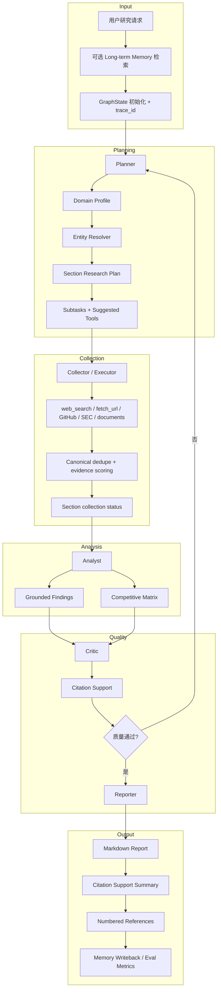
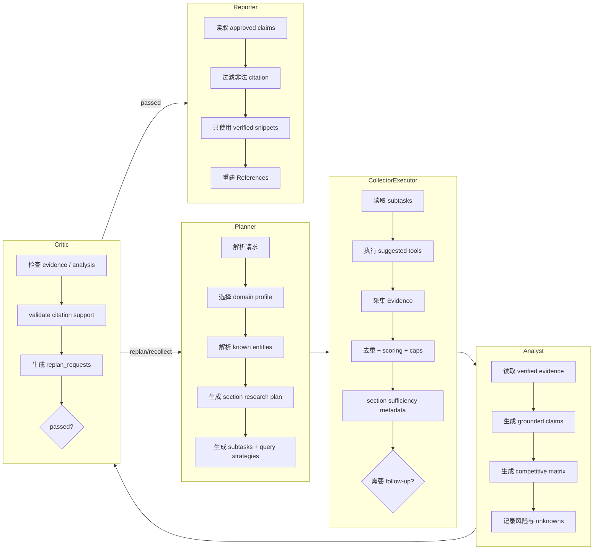
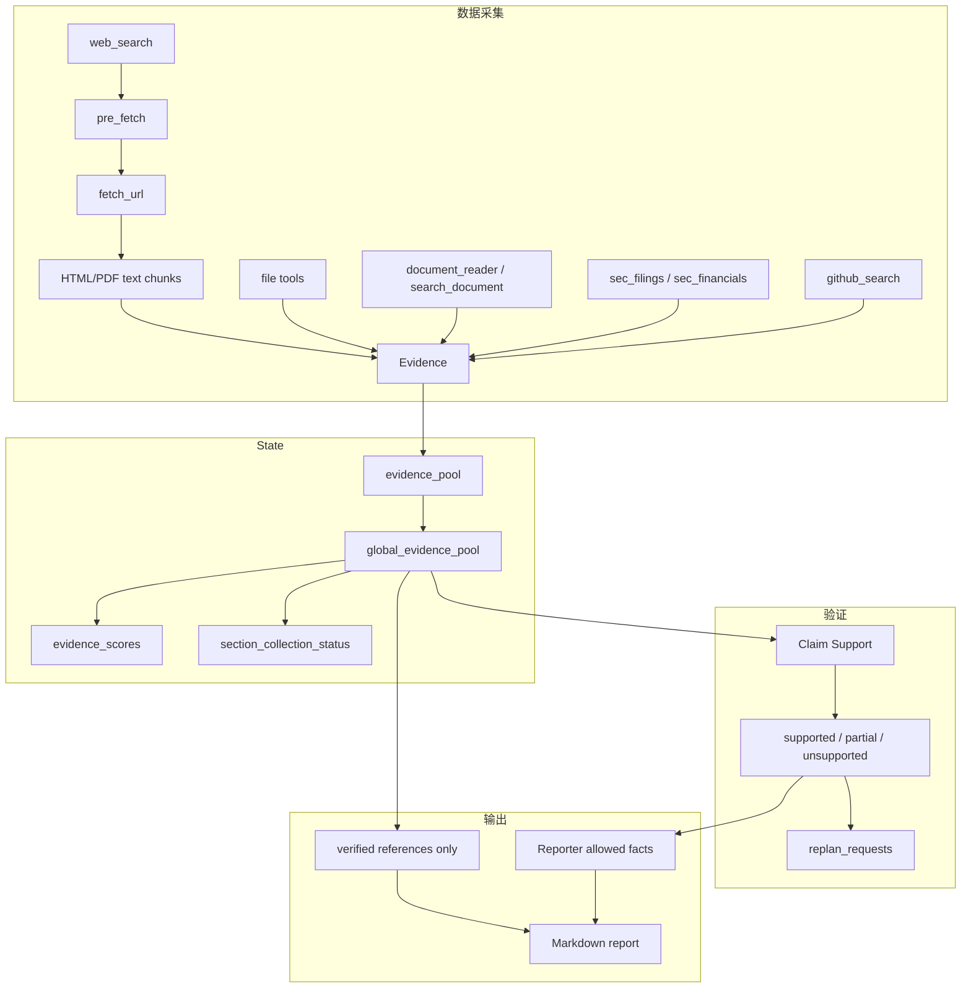

# InsightGraph

基于 LangGraph 的多智能体深度研究引擎，面向竞品分析、技术趋势、公司研究、产业洞察和市场机会识别。InsightGraph 通过 Planner、Collector/Executor、Analyst、Critic、Reporter 协作完成任务分解、多源证据采集、引用支撑校验和结构化 Markdown 研报生成。

项目目标是生成高质量、可验证深度研究报告。主产品路径是 `live-research`：联网搜索、URL/PDF 抓取、GitHub/SEC 证据、LLM 分析/报告、URL validation、citation support 和 long-term memory 都围绕可验证报告质量服务。Offline deterministic 是测试/CI fallback；网络、LLM、数据库、外部 embeddings、full trace payload、live benchmark 等能力均需显式 opt-in。

---

## 项目结构

```text
src/insight_graph/
├── agents/                         # 多智能体核心
│   ├── planner.py                  # 领域识别、实体解析、section plan、工具选择
│   ├── collector.py                # Collection 阶段入口
│   ├── executor.py                 # 多轮工具执行、证据去重、预算控制、evidence scoring
│   ├── analyst.py                  # Grounded findings 与 competitive matrix
│   ├── critic.py                   # Citation support、missing evidence、replan request
│   └── reporter.py                 # Verified-only Markdown report 与 References 重建
├── report_quality/                 # 报告质量增强层
│   ├── domain_profiles.py          # 领域检测、source policy、报告 section 模板
│   ├── domains/                    # Markdown-backed 可插拔领域配置
│   ├── entity_resolver.py          # 实体消歧、别名、source hints
│   ├── research_plan.py            # Section-aware research plan
│   ├── evidence_scoring.py         # Authority / relevance / overall score
│   └── citation_support.py         # Claim-to-snippet support metadata
├── tools/                          # 内置工具集
│   ├── web_search.py               # DuckDuckGo-backed live search
│   ├── pre_fetch.py                # Search candidate bounded pre-fetch
│   ├── fetch_url.py                # HTML/PDF fetch、正文提取、chunk/page metadata
│   ├── search_document.py          # 本地文档 query/page/section 检索
│   ├── document_reader.py          # cwd 内 TXT/Markdown/HTML/PDF reader
│   ├── github_search.py            # GitHub REST Search + README/release evidence
│   ├── sec_filings.py              # SEC EDGAR filings + optional filing content snippets
│   ├── sec_financials.py           # SEC companyfacts 财务 evidence
│   └── file_tools.py               # cwd 内 read/list/create-only write
├── llm/                            # OpenAI-compatible LLM config、router、trace controls
├── memory/                         # Long-term research memory adapters/writeback
├── persistence/                    # Checkpoint stores and migration runner
├── api.py                          # FastAPI REST + WebSocket research jobs API
├── dashboard.py                    # Zero-build Dashboard
├── eval.py                         # Offline Eval Bench + memory comparison proof
├── graph.py                        # LangGraph StateGraph 编排
├── research_jobs.py                # Job lifecycle、events、response shaping
├── research_jobs_sqlite_backend.py # SQLite jobs backend with worker leasing
└── state.py                        # GraphState、Evidence、Finding、Critique 等模型
```

---

## 核心特性

| 特性 | 说明 |
|------|------|
| **多智能体编排** | Planner → Collector/Executor → Analyst → Critic → Reporter，支持 Critic replan/recollect 闭环 |
| **领域自适应** | Code-backed + Markdown-backed domain profiles、实体消歧、source hints、section research plan |
| **多源联网研究** | `--preset live-research` 启用 DuckDuckGo、GitHub、SEC filings/financials、多源采集、URL validation 和 LLM Analyst/Reporter |
| **证据溯源链** | Evidence 从 search、URL/PDF、GitHub、SEC、本地文档进入 pool；Reporter 只重建 verified References |
| **大文档检索** | 本地 TXT/Markdown/HTML/PDF 支持 chunk、page、section metadata；`search_document` 支持 query/page/section retrieval |
| **Citation 安全** | LLM 输出不得保留未知 evidence ID；claim support 记录 supported/partial/unsupported 状态 |
| **质量评审闭环** | Critic 生成 missing evidence、unsupported claims、tried strategies 和 replan request metadata |
| **持久化与记忆** | PostgreSQL checkpoint、pgvector memory、memory writeback/API、JSON/SQLite jobs 均为 opt-in |
| **API + Dashboard** | 同步 `/research`、异步 `/research/jobs`、WebSocket stream、Markdown/HTML export、Dashboard evidence/citation/quality panels |
| **全链路可观测** | `trace_id`、tool/LLM logs、token summary、redacted trace controls；full prompt/completion payload 需显式 opt-in |
| **质量门** | pytest、ruff、offline Eval Bench、memory comparison proof、manual live benchmark、deployment smoke |

---

## 技术架构

```text
┌───────────────────────────────────────────────────────────────────────┐
│                    CLI / FastAPI / Dashboard                           │
│       insight-graph, /research, /research/jobs, WebSocket stream        │
└───────────────────────────────┬───────────────────────────────────────┘
                                │
┌───────────────────────────────▼───────────────────────────────────────┐
│                       LangGraph StateGraph                             │
│                                                                       │
│  ┌──────────┐   ┌────────────────────┐   ┌─────────┐   ┌──────────┐  │
│  │ Planner  │──▶│ Collector/Executor │──▶│ Analyst │──▶│  Critic  │  │
│  │ domain   │   │ tools + scoring    │   │ claims  │   │ support  │  │
│  │ entities │   │ budgets + dedupe   │   │ matrix  │   │ replan   │  │
│  └────┬─────┘   └────────────────────┘   └─────────┘   └────┬─────┘  │
│       ▲                                                      │        │
│       └────────────── missing-evidence replan ───────────────┘        │
│                                                              │        │
│                                                     ┌────────▼────────┐
│                                                     │    Reporter     │
│                                                     │ verified-only   │
│                                                     └─────────────────┘
└───────────────────────────────┬───────────────────────────────────────┘
                                │
┌───────────────────┬───────────▼───────────┬───────────────────────────┐
│ Evidence Tools    │ Persistence / Memory   │ Observability / Eval      │
│ web/fetch/pdf     │ PostgreSQL checkpoint  │ trace_id + LLM logs       │
│ GitHub / SEC      │ pgvector memory        │ Dashboard + Eval Bench    │
│ local documents   │ JSON / SQLite jobs     │ live benchmark            │
└───────────────────┴───────────────────────┴───────────────────────────┘
```

---

## 整体执行流程



---

## 多智能体协作流程



---

## 数据流与证据链路



Evidence 保留 title、source URL、canonical URL、snippet、source type、verified、reachable、source_trusted、claim_supported、chunk/page/section、search candidate、fetch status 和 error kind。抓取失败或无内容会生成 unverified diagnostic evidence，方便诊断 live run，但不会进入最终 References。

---

## 技术栈

| 层级 | 技术 |
|------|------|
| **语言** | Python 3.11+ |
| **编排** | LangGraph、LangChain Core |
| **数据模型** | Pydantic |
| **CLI** | Typer、Rich |
| **API** | FastAPI、WebSocket |
| **前端** | Zero-build static HTML/CSS/JS Dashboard |
| **HTML/PDF** | BeautifulSoup、pypdf |
| **搜索** | DuckDuckGo via `ddgs`，默认测试路径 deterministic/offline |
| **GitHub / SEC** | GitHub REST Search、SEC submissions/companyfacts JSON |
| **LLM** | OpenAI-compatible/local/self-hosted providers、rules router |
| **向量/记忆** | Deterministic embeddings、external embedding boundary、opt-in pgvector |
| **持久化** | In-memory、JSON、SQLite、PostgreSQL adapters + migrations |
| **质量门** | pytest、ruff、Eval Bench、live benchmark、smoke CLI |

---

## 内置工具

| 工具 | 用途 | 运行方式 |
|------|------|----------|
| `mock_search` | 稳定测试 evidence | deterministic/offline |
| `web_search` | 搜索引擎查询 | DuckDuckGo live provider；无证据时不自动 fallback mock |
| `pre_fetch` | 对 search candidate 做 bounded URL 抓取 | 跟随候选 URL，受 fetch budget 约束 |
| `fetch_url` | 抓取 HTTP/HTTPS HTML/PDF 并生成 Evidence | bounded fetch，rendered fetch 需 opt-in |
| `search_document` | cwd 内本地文档 query/page/section 检索 | opt-in，本地文件，不读 URL |
| `document_reader` | 读取 cwd 内 TXT/Markdown/HTML/PDF | opt-in，不读 cwd 外路径 |
| `github_search` | GitHub repository/README/release evidence | live provider 需显式启用 |
| `sec_filings` | SEC EDGAR filings and optional filing content snippets | opt-in，known ticker/company name |
| `sec_financials` | SEC companyfacts 财务 evidence | opt-in，结构化 revenue/net income/assets |
| `news_search` | 新闻/产品公告风格 evidence | deterministic/offline |
| `read_file` / `list_directory` | cwd 内安全只读文件/目录工具 | opt-in，只读 |
| `write_file` | cwd 内安全文本文件创建 | opt-in，create-only，不覆盖 |

真实 sandboxed Python/code execution 暂不启用。MCP runtime invocation 暂不启用。两者都属于高风险能力，已放入后续路线最后阶段。

---

## 执行链路详解

### 1. Planner

- **输入**：`user_request`、memory context、tried strategies 和当前 `GraphState`。
- **输出**：`subtasks`、`query_strategies`、`section_research_plan` 和 suggested tools。
- **领域增强**：注入 `domain_profile`、`resolved_entities`、source hints 和 required source types。
- **Replan 支持**：Critic 打回时，根据 missing evidence 和 tried-strategy metadata 生成 follow-up 查询。

### 2. Collector / Executor

- **多源采集**：执行 Planner 指定工具，支持 web、URL/PDF、GitHub、SEC、本地文档和文件工具。
- **Pre-fetch**：live research 下对 web search 候选 URL 做 bounded fetch，并传播 retrieval query。
- **去重与预算**：按 canonical URL 去重，执行 per-tool/per-section/per-run evidence caps 和 token/tool budgets。
- **Live failure policy**：live provider 失败或无证据时记录诊断信息，不混入 mock evidence。

### 3. Analyst

- **Grounded findings**：只从当前 verified evidence 生成发现。
- **Competitive matrix**：输出定位、优势、功能、集成、风险和 evidence IDs。
- **LLM 约束**：LLM Analyst 必须引用当前 verified evidence ID，否则 fallback。

### 4. Critic

- **质量评审**：检查 evidence 数量、section coverage、citation support 和 missing evidence。
- **Citation support**：记录 claim-level support metadata，标记 supported/partial/unsupported。
- **Replan metadata**：生成 missing section/source/entity hints，避免重复失败策略。

### 5. Reporter

- **Verified-only 输出**：最终 References 由系统从 verified evidence 重建，不信任模型自造引用。
- **长文报告**：按 domain sections 输出 Executive Summary、Background/Market/Company Analysis、Competitive Landscape、Risks、Outlook、Citation Support 和 References。
- **URL validation**：live-research 可启用 Reporter URL revalidation，失败不伪造替代 URL。

### 6. 持久化、记忆与可观测

- **Checkpoint**：memory/PostgreSQL backends；API jobs 可用 checkpoint resume。
- **Jobs**：in-memory、JSON、SQLite backends；SQLite 支持 worker claim、lease、heartbeat、expired running requeue。
- **Memory**：in-memory/pgvector store，支持 search/list/delete、report writeback、offline memory-on/off eval proof。
- **Trace**：`trace_id` 贯穿同步/异步 research；LLM trace 默认 metadata-only，full payload 需 `INSIGHT_GRAPH_LLM_TRACE_FULL=1`。

---

## 示例输出

联网研究命令：

```bash
python -m insight_graph.cli research "Compare Cursor, OpenCode, and GitHub Copilot" --preset live-research
```

典型报告结构：

| 章节 | 内容 |
|------|------|
| Executive Summary | 结论、证据强度、关键风险 |
| Background / Market Context | 研究对象、市场背景、source coverage |
| Product / Company Analysis | 产品定位、功能、商业模式、生态 |
| Competitive Matrix | 多实体结构化对比，行级 evidence IDs |
| Risks and Unknowns | 缺失证据、冲突信息、未验证判断 |
| Citation Support | claim support 状态、原因和 supporting evidence |
| References | 系统重建的 numbered verified references |

Manual live benchmark 可输出 URL validity、citation precision proxy、source diversity、report depth、runtime、LLM call count 和 token totals：

```bash
python scripts/benchmark_live_research.py --allow-live --output reports/live-benchmark.json
```

---

## 效果与亮点

- **面向高质量报告**：后续优化路线以生成高质量、可验证深度研究报告为主线。
- **可验证引用**：关键事实可追溯到具体 URL/PDF/document evidence snippet。
- **闭环纠错**：Critic 可基于 citation support 和 missing evidence 触发 replan/recollect。
- **大文档友好**：本地和远程 PDF/HTML 保留 chunk、page、section metadata。
- **领域可扩展**：新增领域可通过 `report_quality/domains/*.md` 和 code-backed profiles 扩展。
- **资源可控**：search limit、fetch budget、tool rounds、token budget、evidence caps 均有边界。
- **安全默认**：Offline deterministic 是测试/CI fallback；live、LLM、DB、trace payload 均 opt-in。
- **可观测**：Dashboard 展示 jobs、events、evidence、citations、quality、LLM logs 和 raw JSON。

---

## 快速开始

### 环境要求

- Python 3.11+
- pip

### 安装和运行

```bash
# 1. 克隆项目
git clone https://github.com/Caser-86/InsightGraph.git
cd InsightGraph

# 2. 安装开发依赖
python -m pip install -e ".[dev]"

# 3. 运行测试
python -m pytest -v

# 4. 执行一次联网研究
python -m insight_graph.cli research "Compare Cursor, OpenCode, and GitHub Copilot" --preset live-research
```

### 常用命令

```bash
# Markdown report with networked research path
python -m insight_graph.cli research "Compare Cursor, OpenCode, and GitHub Copilot" --preset live-research

# CLI/API aligned JSON
python -m insight_graph.cli research "Compare Cursor, OpenCode, and GitHub Copilot" --preset live-research --output-json

# Offline Eval Bench
insight-graph-eval --case-file docs/evals/default.json --markdown --output reports/eval.md

# CI-ready Eval Gate
insight-graph-eval --case-file docs/evals/default.json --min-score 85 --fail-on-case-failure

# Manual live benchmark, may incur network/LLM cost
python scripts/benchmark_live_research.py --allow-live --output reports/live-benchmark.json
python scripts/benchmark_live_research.py --allow-live --output reports/live-benchmark.json --case-file docs/benchmarks/live-research-cases.json
```

---

## API 和 Dashboard

启动本地 API server：

```bash
python -m pip install "uvicorn[standard]"
uvicorn insight_graph.api:app --reload
```

访问：

- **Dashboard**：http://127.0.0.1:8000/dashboard
- **Health check**：http://127.0.0.1:8000/health
- **API docs**：http://127.0.0.1:8000/docs

异步 research jobs：

```bash
curl -X POST http://127.0.0.1:8000/research/jobs \
  -H "Content-Type: application/json" \
  -d '{"query":"Compare Cursor, OpenCode, and GitHub Copilot","preset":"live-research"}'

curl http://127.0.0.1:8000/research/jobs
curl http://127.0.0.1:8000/research/jobs/summary
curl http://127.0.0.1:8000/research/jobs/<job_id>
curl http://127.0.0.1:8000/research/jobs/<job_id>/report.md
curl http://127.0.0.1:8000/research/jobs/<job_id>/report.html
```

设置 `INSIGHT_GRAPH_API_KEY` 后，除 `/health` 和 `/dashboard` 外的 API endpoint 会要求 `Authorization: Bearer <key>` 或 `X-API-Key: <key>`。

---

## 配置说明

| 变量 | 说明 | 默认值 |
|------|------|--------|
| `INSIGHT_GRAPH_USE_WEB_SEARCH` | Planner collect subtask 使用 `web_search` | `live-research` preset 启用 |
| `INSIGHT_GRAPH_SEARCH_PROVIDER` | `web_search` provider：`mock` 或 `duckduckgo` | `mock` |
| `INSIGHT_GRAPH_USE_GITHUB_SEARCH` | Planner collect subtask 使用 `github_search` | `live-research` preset 启用 |
| `INSIGHT_GRAPH_GITHUB_PROVIDER` | `github_search` provider：`mock` 或 `live` | `mock` |
| `INSIGHT_GRAPH_USE_SEC_FILINGS` | 使用 SEC EDGAR filings evidence | `live-research` preset 启用 |
| `INSIGHT_GRAPH_USE_SEC_FINANCIALS` | 使用 SEC companyfacts financial evidence | `live-research` preset 启用 |
| `INSIGHT_GRAPH_USE_DOCUMENT_READER` | 使用 cwd 内 document reader | 未启用 |
| `INSIGHT_GRAPH_USE_SEARCH_DOCUMENT` | 使用 cwd 内 `search_document` 检索 | 未启用 |
| `INSIGHT_GRAPH_RELEVANCE_FILTER` | 启用 evidence relevance filtering | `live-research` preset 启用 |
| `INSIGHT_GRAPH_ANALYST_PROVIDER` | `deterministic` 或 `llm` | `deterministic` |
| `INSIGHT_GRAPH_REPORTER_PROVIDER` | `deterministic` 或 `llm` | `deterministic` |
| `INSIGHT_GRAPH_LLM_API_KEY` | OpenAI-compatible API key | - |
| `INSIGHT_GRAPH_LLM_BASE_URL` | OpenAI-compatible `/v1` endpoint | - |
| `INSIGHT_GRAPH_CHECKPOINT_BACKEND` | checkpoint backend：`memory` 或 `postgres` | `memory` |
| `INSIGHT_GRAPH_POSTGRES_DSN` | PostgreSQL DSN for `INSIGHT_GRAPH_CHECKPOINT_BACKEND=postgres` or pgvector memory | - |
| `INSIGHT_GRAPH_MEMORY_BACKEND` | memory backend：`memory` 或 `pgvector` | `memory` |
| `INSIGHT_GRAPH_MEMORY_BACKEND=pgvector` | opt-in pgvector memory mode | 未启用 |
| `INSIGHT_GRAPH_DOCUMENT_INDEX_BACKEND=pgvector` | opt-in pgvector document chunk index | 未启用 |
| `INSIGHT_GRAPH_DOCUMENT_PGVECTOR_DSN` | document pgvector DSN | - |
| `INSIGHT_GRAPH_RESEARCH_JOBS_BACKEND=sqlite` | SQLite jobs backend | 未启用 |
| `INSIGHT_GRAPH_RESEARCH_JOBS_SQLITE_PATH` | SQLite jobs database path | - |
| `INSIGHT_GRAPH_RESEARCH_JOBS_STARTUP_WORKER` | startup worker claims queued/expired jobs | 未启用 |
| `INSIGHT_GRAPH_RESEARCH_JOBS_TERMINAL_RETENTION_DAYS` | terminal job cleanup cutoff in days | 未启用 |
| `INSIGHT_GRAPH_LLM_TRACE` | metadata-only/full trace diagnostic switch; prompt/completion capture is opt-in | 未启用 |
| `INSIGHT_GRAPH_LLM_TRACE_PATH` | full trace JSONL path | - |

Deployment runbook: see `docs/deployment.md` for Storage Matrix, Trace Redaction, API key auth, SQLite/PostgreSQL/pgvector setup, live provider env, and benchmark cost notes.

更多配置见 `docs/configuration.md`。

---

## 脚本

| 脚本 | 用途 |
|------|------|
| `scripts/run_research.py` | 命令行执行研究任务 |
| `scripts/run_with_llm_log.py` | 执行任务并写入 LLM trace/token/call summary |
| `scripts/benchmark_research.py` | 运行 offline benchmark，支持 Markdown 输出 |
| `scripts/benchmark_live_research.py` | 手动 opt-in 运行 `live-research` benchmark；支持 `--case-file docs/benchmarks/live-research-cases.json`；可能产生 network/LLM cost |
| `scripts/summarize_eval_report.py` | 汇总 Eval JSON 报告 |
| `scripts/append_eval_history.py` | 追加 CI eval history artifact |
| `scripts/validate_document_reader.py` | 验证本地 document reader 行为 |
| `scripts/validate_pdf_fetch.py` | 离线验证 PDF fetch、retrieval 和 metadata |

Live benchmark artifact 只保存指标摘要，不提交生成的 live report 正文。Do not commit generated live benchmark reports。关键字段包括 `url_validation_rate`、`citation_precision_proxy`、`source_diversity_by_type`、`source_diversity_by_domain`、`section_coverage`、`runtime_ms`、`tool_call_count`、`llm_call_count` 和 `total_tokens`。
| `scripts/validate_github_search.py` | 验证 GitHub search provider 行为 |
| `scripts/validate_sources.py` | 验证 source URL / source data |

---

## 后续优化路线

后续任务以报告质量为前提，详细路线见 `docs/roadmap.md`。优先级顺序：Report Quality v3、Live Benchmark Case Profiles、Production RAG Hardening、Memory Quality Loop、Dashboard Productization、API/Operations Hardening。MCP runtime、真实 sandboxed Python/code execution、`/tasks` API aliases、release/deploy/force-push automation 放到最后，做完其他优化后再决定。

---

## License

MIT
