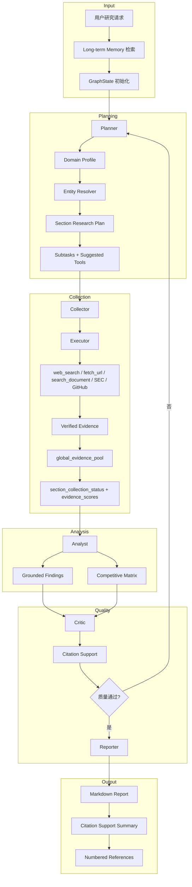
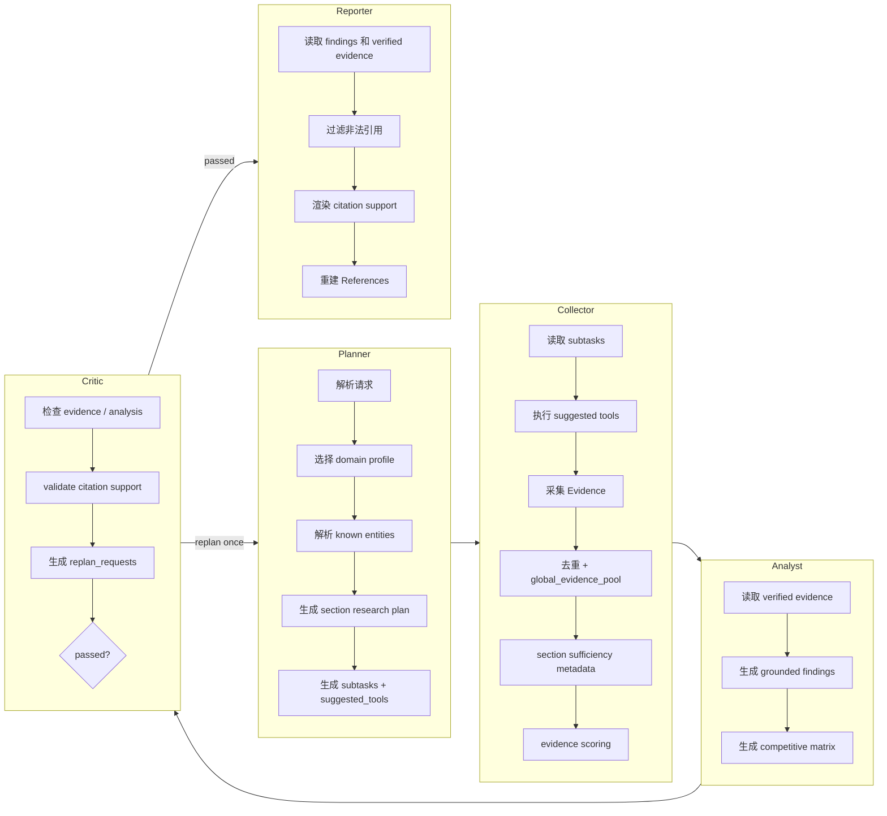
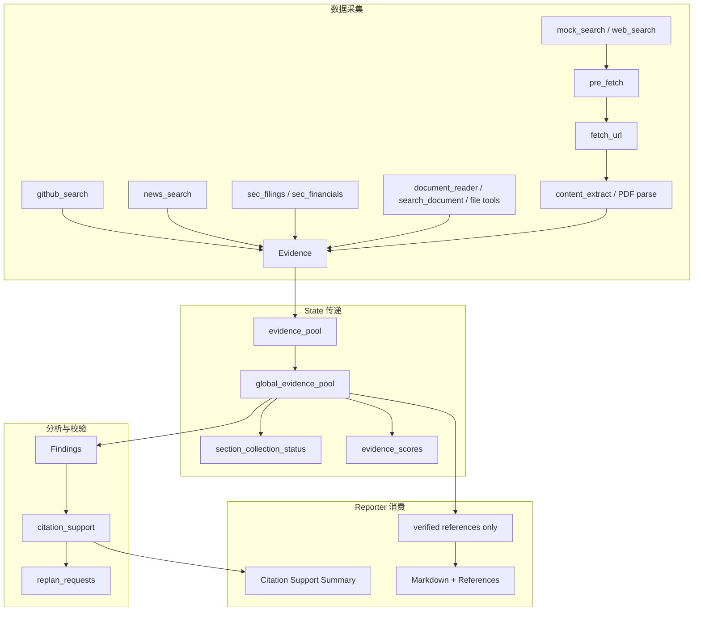

# InsightGraph

基于 LangGraph 的多智能体商业情报研究引擎，面向竞品分析、技术趋势、公司研究、产业洞察和市场机会识别。InsightGraph 通过 Planner、Collector、Analyst、Critic、Reporter 协作完成任务分解、证据采集、分析归纳、质量评审和带引用的 Markdown 报告生成。

目标运行模式是联网深度研究：通过搜索、URL/PDF 抓取、文档检索、证据校验和 Reporter 引用重建，生成可验证的结构化研报。当前实现保留 deterministic/offline 测试与 CI 基线，方便本地开发和回归；真实搜索、GitHub API、URL/PDF 抓取、LLM、PostgreSQL checkpoint、pgvector memory、full trace 等生产能力按配置显式开启。

---

## 项目结构

```text
src/insight_graph/
├── agents/                         # 多智能体核心
│   ├── planner.py                  # 任务分解、领域/实体/section plan 注入、工具选择
│   ├── collector.py                # Collection 阶段入口
│   ├── executor.py                 # 工具执行、证据去重、预算控制、evidence scoring
│   ├── analyst.py                  # Findings 与 competitive matrix 生成
│   ├── critic.py                   # 质量评审、citation support、replan request
│   └── reporter.py                 # Markdown 报告、References、citation support summary
├── report_quality/                 # 报告质量增强层
│   ├── domain_profiles.py          # 领域检测与 source policy baseline
│   ├── domains/                    # Markdown-backed 可插拔领域配置
│   ├── entity_resolver.py          # 实体识别、别名与 source hints
│   ├── research_plan.py            # section-aware research plan
│   ├── document_index.py           # 本地文档 chunk/index/ranking/vector boundary
│   ├── evidence_scoring.py         # authority / relevance / overall score
│   └── citation_support.py         # claim-to-snippet support metadata
├── tools/                          # 内置工具集
│   ├── mock_search.py              # 测试/CI deterministic evidence fallback
│   ├── web_search.py               # DuckDuckGo-backed web search
│   ├── pre_fetch.py                # search candidate 预抓取
│   ├── fetch_url.py                # HTML/PDF URL 抓取并生成 Evidence
│   ├── search_document.py          # 本地文档 query/page/section 检索
│   ├── document_reader.py          # cwd 内 TXT/Markdown/HTML/PDF reader
│   ├── github_search.py            # GitHub REST Search，测试 fallback 可 deterministic
│   ├── news_search.py              # deterministic news/product evidence
│   ├── sec_filings.py              # SEC EDGAR filings evidence
│   ├── sec_financials.py           # SEC companyfacts 财务 evidence
│   └── file_tools.py               # cwd 内安全 read/list/create-only write
├── llm/                            # OpenAI-compatible LLM config、router、observability
├── memory/                         # long-term research memory adapters
├── persistence/                    # checkpoint persistence adapters
├── api.py                          # FastAPI REST + WebSocket
├── dashboard.py                    # zero-build static Dashboard
├── eval.py                         # deterministic offline Eval Bench
├── graph.py                        # LangGraph StateGraph 编排
├── research_jobs.py                # research job lifecycle 和 response shaping
├── research_jobs_store.py          # JSON job persistence adapter
├── research_jobs_sqlite_backend.py # SQLite job metadata backend
├── smoke.py                        # deployment smoke CLI
└── state.py                        # GraphState、Evidence、Finding、Critique 等模型
```

---

## 核心特性

| 特性 | 说明 |
|------|------|
| **多智能体编排** | Planner → Collector → Analyst → Critic → Reporter，支持 Critic 打回一次 replan 闭环 |
| **领域自适应** | Markdown-backed domain profiles、实体消歧、source hints、section research plan |
| **证据溯源链** | Evidence 从搜索、URL、PDF、GitHub、SEC、本地文档进入 pool，Reporter 只重建 verified References |
| **大文档检索** | `document_reader` / `search_document` 支持本地 TXT、Markdown、HTML、PDF，保留 chunk/page/section metadata |
| **远程 URL/PDF 抓取** | `fetch_url` 支持 HTML 正文提取、远程 PDF 文本提取和 page metadata；rendered fetch 需 opt-in |
| **多源联网研究** | `--preset live-research` 启用 DuckDuckGo、GitHub live search、SEC filings、多源采集、bounded pre-fetch、LLM Analyst/Reporter 和 URL validation |
| **Citation 安全** | LLM 输出不得保留未知 evidence ID；References 由系统从 verified evidence 重建 |
| **质量评审闭环** | Critic 生成 citation support、unsupported claims、missing evidence 和 tried-strategy metadata |
| **可配置 LLM** | Analyst、Reporter、Relevance Judge 支持 OpenAI-compatible / local/self-hosted provider presets，可接入联网研报生成链路 |
| **持久化与记忆** | PostgreSQL checkpoint、pgvector memory、SQLite/JSON jobs 支持生产持久化，测试可用内存 backend |
| **API + Dashboard** | FastAPI 同步研究、异步 jobs、WebSocket stream、Markdown/HTML export、静态 Dashboard |
| **全链路可观测** | LLM metadata log 默认安全；`run_with_llm_log.py` 可 opt-in 输出 full JSONL trace 和 token/call summary |
| **质量门** | pytest、ruff、offline Eval Bench、CI Eval Gate、deployment smoke、validator scripts |

---

## 技术架构

```text
┌───────────────────────────────────────────────────────────────────────┐
│                    CLI / FastAPI / Dashboard                           │
│       insight-graph, /research, /research/jobs, WebSocket stream        │
└───────────────────────────────┬───────────────────────────────────────┘
                                │
┌───────────────────────────────▼───────────────────────────────────────┐
│                       LangGraph StateGraph                             │
│                                                                       │
│  ┌──────────┐   ┌───────────┐   ┌─────────┐   ┌──────────┐            │
│  │ Planner  │──▶│ Collector │──▶│ Analyst │──▶│  Critic  │            │
│  │ domain   │   │ tools     │   │ claims  │   │ support  │            │
│  │ entities │   │ scoring   │   │ matrix  │   │ replan   │            │
│  └────┬─────┘   └───────────┘   └─────────┘   └────┬─────┘            │
│       ▲                                            │                  │
│       └────────────── one retry / replan ──────────┘                  │
│                                                    │                  │
│                                           ┌────────▼────────┐         │
│                                           │    Reporter     │         │
│                                           │ verified-only   │         │
│                                           └─────────────────┘         │
└───────────────────────────────┬───────────────────────────────────────┘
                                │
┌───────────────────────────────▼───────────────────────────────────────┐
│                         Evidence Grounding Layer                       │
│ Domain Profile │ Entity Resolver │ Section Plan │ Evidence Scoring    │
│ Citation Support │ Replan Requests │ Eval Quality Metrics             │
└───────────────────────────────┬───────────────────────────────────────┘
                                │
┌───────────────────┬───────────▼───────────┬───────────────────────────┐
│ Built-in Tools    │ Persistence / Memory   │ Observability / Eval      │
│ web_search        │ PostgreSQL checkpoint  │ LLM metadata / full trace │
│ fetch_url         │ pgvector memory        │ Eval Bench / smoke        │
│ search_document   │ JSON / SQLite jobs     │ validator scripts         │
│ SEC / GitHub / FS │                       │                           │
└───────────────────┴───────────────────────┴───────────────────────────┘
```

---

## 整体执行流程



---

## 多智能体协作流程



---

## 数据流与证据链路



`Evidence` 是轻量结构，包含 title、source URL、canonical URL、snippet、source type、verified、verification metadata、chunk/page/section、search candidate 和 fetch status 等字段。search candidate metadata 会保留 provider、rank、query 和原始 snippet；抓取失败或无内容时会生成 unverified diagnostic evidence，记录稳定的 fetch error kind，方便诊断 live run，但不会进入最终 References。

---

## 技术栈

| 层级 | 技术 |
|------|------|
| **语言** | Python 3.11+ |
| **编排** | LangGraph、LangChain Core |
| **数据模型** | Pydantic |
| **CLI** | Typer、Rich |
| **API** | FastAPI、WebSocket endpoint |
| **前端** | zero-build static HTML/CSS/JS Dashboard |
| **HTML/PDF** | BeautifulSoup、pypdf |
| **搜索** | DuckDuckGo via `ddgs`；测试/CI 可显式使用 deterministic mock |
| **GitHub** | GitHub REST Search API；测试 fallback 使用 deterministic mock |
| **LLM** | OpenAI-compatible/local/self-hosted providers；测试 fallback 使用 deterministic 输出 |
| **向量/记忆** | deterministic embeddings；opt-in pgvector memory adapter |
| **持久化** | JSON、SQLite、PostgreSQL adapters；测试可用 in-memory backend |
| **质量门** | pytest、ruff、offline Eval Bench、CI Eval Gate、smoke CLI |

---

## 内置工具

| 工具 | 用途 | 运行方式 |
|------|------|----------|
| `mock_search` | 稳定测试搜索证据 | deterministic/offline 工具 |
| `web_search` | 搜索引擎查询 | DuckDuckGo live provider；mock 只在显式配置时用于测试/CI |
| `pre_fetch` | 对 search candidate 做 bounded URL 抓取 | 跟随候选 URL |
| `fetch_url` | 抓取 HTTP/HTTPS HTML/PDF 并生成 Evidence | live URL 工具，需显式 URL 或上游候选 |
| `search_document` | cwd 内本地文档 query/page/section 检索 | opt-in，本地文件，不读 URL |
| `document_reader` | 读取 cwd 内 TXT/Markdown/HTML/PDF | opt-in，本地文件，不读 cwd 外路径 |
| `github_search` | GitHub repository evidence | GitHub API live provider；mock 用于测试/CI |
| `news_search` | 新闻和产品公告风格 evidence | deterministic/offline |
| `sec_filings` | SEC EDGAR recent filings evidence | opt-in，known ticker/company name |
| `sec_financials` | SEC companyfacts 财务 evidence | opt-in，结构化 revenue/net income/assets 等 |
| `read_file` / `list_directory` | cwd 内安全只读文件/目录工具 | opt-in，只读 |
| `write_file` | cwd 内安全文本文件创建 | opt-in，create-only，不覆盖 |

---

## 执行链路详解

### 1. Planner

- **输入**：`user_request`、memory context、tried strategies 和当前 `GraphState`。
- **输出**：`subtasks`，包含 scope、collect、analyze、report 等阶段和 suggested tools。
- **领域增强**：注入 `domain_profile`、`resolved_entities`、`section_research_plan`。
- **Replan 支持**：Critic 打回时，根据 tried-strategy metadata 避免重复同一失败路径。

### 2. Collector / Executor

- **工具执行**：执行 Planner 指定工具，生成 verified evidence。
- **Pre-fetch**：live research 下可对 web search 候选 URL 做 bounded fetch，并传播 retrieval query；候选和最终 evidence 会基于 canonical URL 去重。
- **Live failure policy**：联网搜索没有证据或 provider 异常时记录失败/证据不足，不自动混入 `mock_search` 证据。
- **Source semantics**：URL evidence 会分类为 `official_site`、`docs`、`github`、`news`、`blog`、`sec`、`paper` 或 `unknown`，并记录 `reachable`、`source_trusted`、`claim_supported` 等 verification metadata。
- **多轮采集**：支持 per-subtask tool rounds、follow-up section/tool queries 和全局 evidence budgets。
- **证据管理**：维护 `evidence_pool` 和 `global_evidence_pool`，执行去重、排序、caps 和 section status 更新。

### 3. Analyst

- **联网研报模式**：从 live search/fetch/document evidence 生成 grounded findings 和 competitive matrix。
- **LLM 生成**：`live-research` preset 默认选择 LLM Analyst；未配置 LLM key 时仍会安全降级到 deterministic fallback。
- **引用约束**：LLM findings 和 matrix 必须引用当前 verified evidence ID，否则 fallback。

### 4. Critic

- **质量评审**：检查 evidence 数量、analysis 是否存在、claim-level citation support 是否为 supported。
- **Citation support**：记录 claim-level support metadata，标记 supported / unsupported。
- **Replan metadata**：生成 missing section evidence 和 unsupported claim 请求，并记录 tried strategies。

### 5. Reporter

- **研报生成**：生成 Markdown report、Competitive Matrix、Critic Assessment、Citation Support Summary 和 References。
- **LLM Reporter**：`live-research` preset 默认选择 LLM Reporter；未配置 LLM key 时仍会安全降级到 deterministic fallback。
- **引用安全**：最终 References 由系统从 verified evidence 重建，不信任模型自造引用。

### 6. 持久化与记忆

- **Checkpoint**：PostgreSQL checkpoint store 支持任务中断恢复；测试路径可用内存 backend。
- **Long-term Memory**：pgvector memory 支持 metadata filter、search、delete；测试路径可用内存 backend。
- **Jobs**：API background jobs 支持 JSON 或 SQLite metadata backend；测试路径可用内存 backend。

---

## 示例输出

联网研究命令：

```bash
python -m insight_graph.cli research "Compare Cursor, OpenCode, and GitHub Copilot" --preset live-research
```

典型报告结构：

| 章节 | 内容 |
|------|------|
| `# InsightGraph Research Report` | 报告标题 |
| `Research Request` | 原始用户请求 |
| `Planned Sections` / `Key Findings` | 有 section plan 时按 domain section 输出，否则输出核心发现 |
| `Competitive Matrix` | 可引用的竞品对比表 |
| `Critic Assessment` | Critic 质量评审摘要 |
| `Citation Support` | claim support 状态、verified evidence ID 和原因 |
| `References` | 系统重建的 numbered references |

示例任务：

```text
请分析 AI Coding Agent 市场的主要玩家，包括 Cursor、OpenCode、Claude Code、GitHub Copilot 和 Codeium。
请比较它们的产品定位、核心功能、定价策略、生态集成、技术路线和潜在风险，并给出未来 12 个月的市场趋势判断。
要求所有关键事实附带可验证引用。
```

目标输出结构：Executive Summary、市场格局概览、竞品功能矩阵、定价与商业模式对比、技术趋势分析、风险与不确定性、未来 12 个月判断、Citation Support、References。

---

## 效果与亮点

- **面向联网研报**：搜索、URL/PDF 抓取、证据校验、引用重建组成可验证研究链路。
- **可验证引用**：最终报告只从 verified evidence 重建 References。
- **闭环纠错**：Critic 可根据 citation support 和 missing evidence 触发一次 replan。
- **文档友好**：本地 PDF/Markdown/HTML/TXT 可通过 `document_reader` 和 `search_document` 检索，远程 PDF 可通过 `fetch_url` 提取 page metadata。
- **领域可扩展**：新增领域主要通过 `report_quality/domains/*.md` 配置文件表达。
- **资源可控**：联网搜索候选、fetch 数量、tool rounds、token budget、evidence caps 均有边界。
- **可观测**：安全 metadata log 默认可用，full LLM trace 需显式开启。
- **可度量**：Offline Eval Bench 输出质量指标，可作为 CI gate。

---

## 快速开始

### 环境要求

- Python 3.11+
- pip

### 安装和运行

```bash
# 1. 克隆项目
git clone https://github.com/Caser-86/InsightGraph.git
cd InsightGraph

# 2. 安装开发依赖
python -m pip install -e ".[dev]"

# 3. 运行测试
python -m pytest -v

# 4. 执行一次联网研究
python -m insight_graph.cli research "Compare Cursor, OpenCode, and GitHub Copilot" --preset live-research
```

### 常用命令

```bash
# Markdown report with networked research path
python -m insight_graph.cli research "Compare Cursor, OpenCode, and GitHub Copilot" --preset live-research

# CLI/API aligned live JSON
python -m insight_graph.cli research "Compare Cursor, OpenCode, and GitHub Copilot" --preset live-research --output-json

# Run script wrapper
python scripts/run_research.py "Compare Cursor, OpenCode, and GitHub Copilot"

# Offline Eval Bench
insight-graph-eval --case-file docs/evals/default.json --markdown --output reports/eval.md

# CI-ready Eval Gate
insight-graph-eval --case-file docs/evals/default.json --min-score 85 --fail-on-case-failure

# Manual live benchmark, may incur network/LLM cost
python scripts/benchmark_live_research.py --allow-live --output reports/live-benchmark.json

# Deployment smoke CLI help
insight-graph-smoke --help
```

---

## API 和 Dashboard

启动本地 API server：

```bash
python -m pip install "uvicorn[standard]"
uvicorn insight_graph.api:app --reload
```

访问：

- **Dashboard**：http://127.0.0.1:8000/dashboard
- **Health check**：http://127.0.0.1:8000/health
- **API docs**：http://127.0.0.1:8000/docs

同步研究请求：

```bash
curl -X POST http://127.0.0.1:8000/research \
  -H "Content-Type: application/json" \
  -d '{"query":"Compare Cursor, OpenCode, and GitHub Copilot","preset":"live-research"}'
```

异步 research jobs：

```bash
curl -X POST http://127.0.0.1:8000/research/jobs \
  -H "Content-Type: application/json" \
  -d '{"query":"Compare Cursor, OpenCode, and GitHub Copilot","preset":"live-research"}'

curl http://127.0.0.1:8000/research/jobs
curl http://127.0.0.1:8000/research/jobs/summary
curl http://127.0.0.1:8000/research/jobs/<job_id>
curl http://127.0.0.1:8000/research/jobs/<job_id>/report.md
curl http://127.0.0.1:8000/research/jobs/<job_id>/report.html
curl -X POST http://127.0.0.1:8000/research/jobs/<job_id>/cancel
curl -X POST http://127.0.0.1:8000/research/jobs/<job_id>/retry
```

WebSocket stream：

```text
ws://127.0.0.1:8000/research/jobs/<job_id>/stream
```

设置 `INSIGHT_GRAPH_API_KEY` 后，除 `/health` 外的 API endpoint 会要求 `Authorization: Bearer <key>` 或 `X-API-Key: <key>`。Dashboard 提供 API key 输入框。

---

## 配置说明

| 变量 | 说明 | 默认值 |
|------|------|--------|
| `INSIGHT_GRAPH_USE_WEB_SEARCH` | Planner collect subtask 使用 `web_search` | `live-research` preset 启用 |
| `INSIGHT_GRAPH_SEARCH_PROVIDER` | `web_search` provider：`mock` 或 `duckduckgo` | `mock` |
| `INSIGHT_GRAPH_SEARCH_LIMIT` | web search candidate / pre-fetch 数量 | `3` |
| `INSIGHT_GRAPH_USE_GITHUB_SEARCH` | Planner collect subtask 使用 `github_search` | `live-research` preset 启用 |
| `INSIGHT_GRAPH_GITHUB_PROVIDER` | `github_search` provider：`mock` 或 `live` | `mock` |
| `INSIGHT_GRAPH_GITHUB_TOKEN` | GitHub API token，可选 | - |
| `INSIGHT_GRAPH_USE_SEC_FILINGS` | 使用 SEC EDGAR recent filings evidence | 未启用 |
| `INSIGHT_GRAPH_USE_NEWS_SEARCH` | 使用 deterministic news evidence | 未启用 |
| `INSIGHT_GRAPH_USE_DOCUMENT_READER` | 使用 cwd 内 document reader | 未启用 |
| `INSIGHT_GRAPH_USE_SEARCH_DOCUMENT` | 使用 cwd 内 `search_document` 检索 | 未启用 |
| `INSIGHT_GRAPH_DOCUMENT_INDEX_PATH` | 本地 JSON document chunk/index cache | - |
| `INSIGHT_GRAPH_FETCH_RENDERED` | `fetch_url` 尝试 Playwright rendered fetch | 未启用 |
| `INSIGHT_GRAPH_RELEVANCE_FILTER` | 启用 evidence relevance filtering | `live-research` preset 启用 |
| `INSIGHT_GRAPH_RELEVANCE_JUDGE` | `deterministic` 或 `openai_compatible` | `live-research` preset 使用 `openai_compatible` |
| `INSIGHT_GRAPH_ANALYST_PROVIDER` | `deterministic` 或 `llm` | `deterministic` |
| `INSIGHT_GRAPH_REPORTER_PROVIDER` | `deterministic` 或 `llm` | `deterministic` |
| `INSIGHT_GRAPH_LLM_PROVIDER` | LLM preset/provider | `openai_compatible` |
| `INSIGHT_GRAPH_LLM_API_KEY` | OpenAI-compatible API key | - |
| `INSIGHT_GRAPH_LLM_BASE_URL` | OpenAI-compatible `/v1` endpoint | - |
| `INSIGHT_GRAPH_LLM_MODEL` | LLM model name | `gpt-4o-mini` |
| `INSIGHT_GRAPH_MAX_TOKENS` | LLM token budget | - |
| `INSIGHT_GRAPH_LLM_TRACE` | 写 full LLM JSONL trace | 未启用 |
| `INSIGHT_GRAPH_CHECKPOINT_BACKEND` | checkpoint backend：`memory` 或 `postgres` | `memory` |
| `INSIGHT_GRAPH_MEMORY_BACKEND` | memory backend：`memory` 或 `pgvector` | `memory` |
| `INSIGHT_GRAPH_POSTGRES_DSN` | PostgreSQL DSN | - |
| `INSIGHT_GRAPH_RESEARCH_JOBS_BACKEND` | jobs backend，支持 `sqlite` | `memory` |
| `INSIGHT_GRAPH_RESEARCH_JOBS_SQLITE_PATH` | SQLite job metadata path | - |

启用联网研究 preset：

```bash
python -m insight_graph.cli research "Compare Cursor, OpenCode, and GitHub Copilot" --preset live-research
```

该 preset 会启用 DuckDuckGo-backed `web_search`、GitHub live repository search、SEC filings/financials、多源采集、较高搜索候选数量、OpenAI-compatible relevance judge、LLM Analyst、LLM Reporter 和 URL validation。若 live search 无证据或 provider 失败，系统会记录证据不足，不会自动注入 `mock_search` 结果。

配置 LLM provider：

```bash
INSIGHT_GRAPH_LLM_API_KEY=sk-your-relay-key \
INSIGHT_GRAPH_LLM_BASE_URL=https://relay.example.com/v1 \
INSIGHT_GRAPH_LLM_MODEL=gpt-4o-mini \
python -m insight_graph.cli research "Compare Cursor, OpenCode, and GitHub Copilot" --preset live-research
```

`live-llm` 仍保留为轻量 preset：只启用 web search、relevance judge、LLM Analyst 和 LLM Reporter，不额外打开 GitHub/SEC/URL validation。

更多配置见 `docs/configuration.md`。

---

## 脚本

| 脚本 | 用途 |
|------|------|
| `scripts/run_research.py` | 命令行执行研究任务 |
| `scripts/run_with_llm_log.py` | 执行任务并写入 LLM trace / token / call summary |
| `scripts/benchmark_research.py` | 运行 offline benchmark，支持 Markdown 输出 |
| `scripts/benchmark_live_research.py` | 手动 opt-in 运行 `live-research` benchmark；需要 `--allow-live` 或 `INSIGHT_GRAPH_ALLOW_LIVE_BENCHMARK=1`，可能产生 network/LLM cost |
| `scripts/summarize_eval_report.py` | 汇总 Eval JSON 报告 |
| `scripts/append_eval_history.py` | 追加 CI eval history artifact |
| `scripts/validate_document_reader.py` | 验证本地 document reader 行为 |
| `scripts/validate_pdf_fetch.py` | 离线验证 PDF fetch、retrieval 和 metadata |
| `scripts/validate_github_search.py` | 验证 GitHub search provider 行为 |
| `scripts/validate_sources.py` | 验证 source URL / source data |

---

## 文档入口

- [配置说明](docs/configuration.md)：搜索 provider、GitHub provider、document reader、LLM preset、observability、jobs persistence 等配置。
- [架构蓝图](docs/architecture.md)：更完整的目标架构、agent 协作、工具和证据链说明。
- [Reference Parity Roadmap](docs/reference-parity-roadmap.md)：对齐参考深度研报 agent 的后续路线。
- [Report Quality Roadmap](docs/report-quality-roadmap.md)：报告质量阶段和历史路线。
- [脚本说明](docs/scripts.md)：run、benchmark、validator、LLM metadata log、eval summary 脚本用法。
- [MVP Demo](docs/demo.md)：展示报告、offline/live LLM demo 命令和 observability 演示。
- [部署说明](docs/deployment.md)：本地/API demo server、SQLite jobs、reverse proxy、deployment smoke 和 systemd 部署边界。
- [Research jobs API](docs/research-jobs-api.md)：异步 research jobs 端点、状态、限制、取消、retry 和持久化行为。
- [Research job repository contract](docs/research-job-repository-contract.md)：research jobs 稳定契约和存储后端要求。
- [Roadmap](docs/roadmap.md)：当前路线入口和已完成工程优先级。
- [Changelog](CHANGELOG.md)：版本变更记录。

---

## License

MIT
