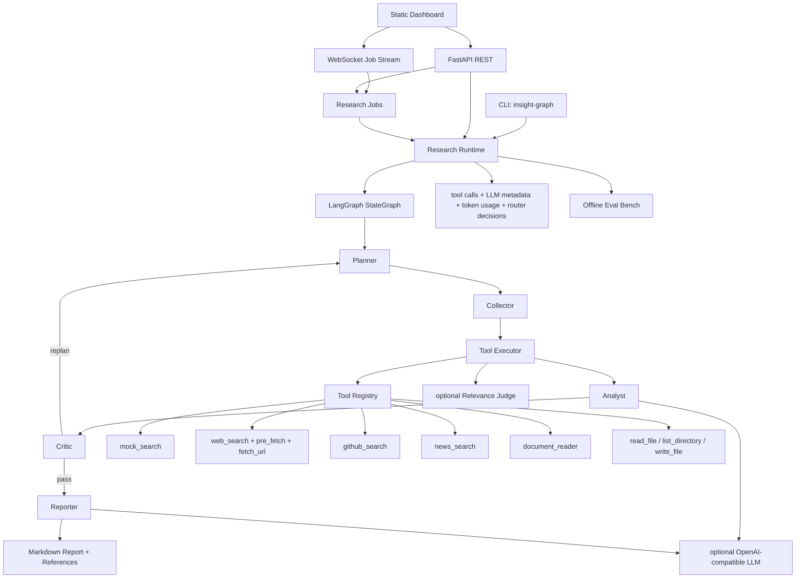
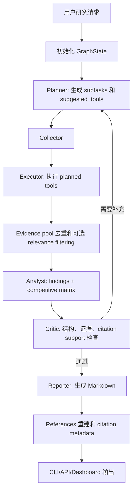
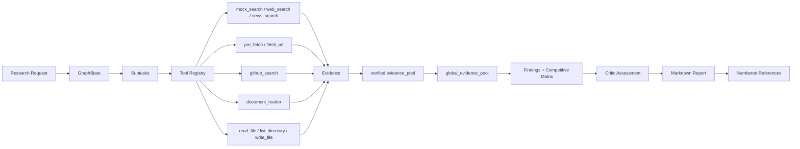

# InsightGraph

InsightGraph 是一个基于 LangGraph 的多智能体商业情报研究引擎，面向竞品分析、技术趋势、市场机会识别、公司研究和产业洞察等场景，生成带证据链和可验证引用的结构化研究报告。

当前项目已经具备可运行的本地 MVP：Planner、Collector、Analyst、Critic、Reporter 组成完整研究流，CLI/API/Dashboard/Eval/CI/部署 smoke 能力已经落地。下一阶段主线是 `Report Quality Roadmap`：在保持现有工程基础稳定的前提下，系统性提升报告深度、来源多样性、claim-level citation support 和多轮证据采集质量。

> 默认运行模式是 deterministic/offline，适合本地开发、测试和 CI。真实搜索、真实 GitHub API、真实 LLM 都需要显式 opt-in。

## 当前定位

| 维度 | 当前状态 |
|------|----------|
| 项目阶段 | MVP 工程骨架已落地，报告质量增强路线进行中 |
| 默认行为 | 离线、确定性、可测试，不访问公网，不调用真实 LLM |
| 已实现链路 | Planner -> Collector -> Analyst -> Critic -> Reporter |
| 已实现入口 | CLI、FastAPI REST、research jobs、WebSocket stream、静态 Dashboard |
| 已实现质量门 | pytest、ruff、offline Eval Bench、CI Eval Gate、deployment smoke entry point |
| 下一主线 | Domain Profile、Entity Resolver、Section Research Plan、Multi-Round Collector、Evidence Scoring、Citation Support Validator、Reporter v2 |

## 项目结构

```text
InsightGraph/
├── src/insight_graph/
│   ├── agents/
│   │   ├── planner.py          # 研究任务分解和工具选择
│   │   ├── collector.py        # Collection 阶段入口
│   │   ├── executor.py         # 工具执行、证据去重、relevance filtering
│   │   ├── analyst.py          # findings 和 competitive matrix 生成
│   │   ├── critic.py           # 结构、证据数量和 citation support 检查
│   │   └── reporter.py         # Markdown 报告和 References 生成
│   ├── tools/
│   │   ├── mock_search.py      # 默认 deterministic 搜索证据
│   │   ├── web_search.py       # opt-in web search provider 调用
│   │   ├── pre_fetch.py        # 搜索结果预抓取
│   │   ├── fetch_url.py        # direct URL 抓取并生成 Evidence
│   │   ├── content_extract.py  # HTML 标题、正文、snippet 提取
│   │   ├── github_search.py    # deterministic 或 opt-in GitHub repository search
│   │   ├── news_search.py      # deterministic news/product announcement evidence
│   │   ├── document_reader.py  # cwd 内 TXT/Markdown/HTML/PDF evidence reader
│   │   └── file_tools.py       # cwd 内安全 read/list/create-only write 工具
│   ├── llm/
│   │   ├── client.py           # OpenAI-compatible client
│   │   ├── config.py           # LLM provider 配置
│   │   ├── observability.py    # safe LLM metadata log
│   │   └── router.py           # opt-in rules router
│   ├── api.py                  # FastAPI REST endpoint
│   ├── dashboard.py            # zero-build static dashboard
│   ├── eval.py                 # deterministic offline Eval Bench
│   ├── graph.py                # LangGraph StateGraph 编排
│   ├── research_jobs.py        # research job lifecycle 和 response shaping
│   ├── research_jobs_store.py  # JSON persistence adapter
│   ├── research_jobs_sqlite_backend.py
│   ├── smoke.py                # deployment smoke CLI
│   └── state.py                # GraphState、Evidence、Finding、Critique 等模型
├── docs/
│   ├── configuration.md
│   ├── architecture.md
│   ├── report-quality-roadmap.md
│   ├── research-jobs-api.md
│   ├── deployment.md
│   └── evals/default.json
├── scripts/
│   ├── run_research.py
│   ├── benchmark_research.py
│   ├── summarize_eval_report.py
│   └── append_eval_history.py
└── tests/
```

## 核心特性

| 能力 | 当前状态 |
|------|----------|
| LangGraph 多智能体工作流 | 已实现 Planner -> Collector -> Analyst -> Critic -> Reporter 状态图 |
| CLI 研究流 | 已实现 `insight-graph research`、`python -m insight_graph.cli research`、JSON 输出、LLM/tool log 展示 |
| FastAPI API | 已实现 `/health`、同步 `/research`、异步 research jobs、report export、API key 保护 |
| Dashboard | 已实现静态本地 UI，支持创建 jobs、WebSocket live events、progress、report、tool calls、LLM metadata、Eval guidance、Markdown/HTML 下载 |
| Research jobs | 已实现 queued/running/succeeded/failed/cancelled 状态、cancel、retry、summary、active cap、terminal retention |
| Job persistence | 已实现默认内存、opt-in JSON metadata store、opt-in SQLite backend 和 worker lease |
| 证据工具 | 已实现 mock search、web search、pre-fetch、fetch URL、content extraction、GitHub search、news search、document reader、本地文件工具 |
| LLM opt-in | 已实现 OpenAI-compatible Analyst/Reporter/Relevance Judge 和 rules router，默认不调用真实 LLM |
| Citation safety | 已实现引用重建、citation support metadata、非法 citation fallback、基本 evidence support 检查 |
| Eval Bench | 已实现 deterministic offline scoring、case file、CI Eval Gate、JSON/Markdown report、summary、history artifact |
| Deployment smoke | 已实现 `insight-graph-smoke`，可检查 `/health`、`/dashboard`、`/research/jobs/summary` |
| 报告质量路线 | 路线中，详见 `docs/report-quality-roadmap.md` |

## 技术架构



## 整体执行流程



## 多智能体协作流程

| Agent | 当前职责 | 报告质量路线中的演进方向 |
|-------|----------|--------------------------|
| Planner | 固定阶段式 subtasks，按环境变量选择工具 | Domain-aware、section-based research plan、entity-aware queries |
| Collector | 调用 executor 采集当前 subtask evidence | Multi-round collection、follow-up queries、budgeted acquisition |
| Executor | 执行工具、记录 tool call、维护 `global_evidence_pool`、去重、可选 relevance filtering | Search/fetch/extract/rank/converge 编排层 |
| Analyst | 从 evidence 生成 findings 和 competitive matrix，支持 deterministic 或 opt-in LLM | Section drafts、grounded claims、source diversity awareness |
| Critic | 检查 evidence 数量、analysis 结果、citation support | Missing-evidence replan by section/source/entity |
| Reporter | 从 findings/evidence 生成 Markdown，重建 References，过滤非法 citation | Verified-only long-form report、strict allowed citations |

## 数据流与证据链路



当前 evidence 模型仍是轻量结构，主要包含 title、source URL、snippet、source type、verified 等字段。路线中的目标是增加 authority、relevance、recency、section、entity、duplicate metadata，并将 claim-level snippet support 作为核心质量门。

## 报告质量主路线

`docs/report-quality-roadmap.md` 是当前 canonical route。后续功能应优先服务报告质量，而不是继续扩展无关 dashboard、部署、auth、storage 或 eval convenience 功能。

| Phase | 目标 | 状态 |
|-------|------|------|
| Phase 1 | Report Quality Baseline，增加深度、来源多样性、引用支撑、unsupported claims 等 deterministic metrics | 计划中 |
| Phase 2 | Domain Profile v1，选择报告模板、来源优先级、必需 sections 和 evidence minimums | 路线中 |
| Phase 3 | Entity Resolver v1，抽取 canonical entities、aliases、official source hints | 路线中 |
| Phase 4 | Section-Based Research Plan，生成 section-level questions、budgets、source requirements | 路线中 |
| Phase 5 | Multi-Round Collector v1，多轮 search/fetch/extract/rank/follow-up | 路线中 |
| Phase 6 | Evidence Scoring v1，authority、relevance、recency、diversity、dedupe scoring | 路线中 |
| Phase 7 | Citation Support Validator v1，claim-to-snippet validation | 路线中 |
| Phase 8 | Critic Replan v2，按 section/source/entity 给出缺失证据任务 | 路线中 |
| Phase 9 | Reporter v2，仅从 verified section drafts 和 allowed citations 写长报告 | 路线中 |
| Phase 10 | Advanced Research Capabilities，高级来源、RAG、长期记忆等按需推进 | 延后 |

## 技术栈

| 层级 | 当前使用 |
|------|----------|
| 语言 | Python 3.11+ |
| 编排 | LangGraph、LangChain Core |
| API | FastAPI，WebSocket endpoint，静态 Dashboard |
| CLI | Typer、Rich |
| 数据模型 | Pydantic |
| HTML 解析 | BeautifulSoup |
| PDF 读取 | pypdf |
| 搜索 | 默认 deterministic mock，opt-in DuckDuckGo via `ddgs` |
| GitHub | 默认 deterministic mock，opt-in GitHub REST Search API |
| LLM | 默认 deterministic/offline，opt-in OpenAI-compatible API |
| Persistence | 默认内存，opt-in JSON metadata store，opt-in SQLite job backend |
| 质量门 | pytest、ruff、offline Eval Bench |

## 内置工具

| 工具 | 默认行为 | Opt-in 行为 |
|------|----------|-------------|
| `mock_search` | 返回稳定 mock evidence | 无 |
| `web_search` | mock provider，不访问公网 | `INSIGHT_GRAPH_SEARCH_PROVIDER=duckduckgo` 启用 DuckDuckGo provider |
| `pre_fetch` | 对候选 URL 做受控抓取 | 跟随 `web_search` provider 输出 |
| `fetch_url` | 抓取 direct HTTP/HTTPS URL 并生成 evidence | 用于 live URL evidence |
| `content_extract` | 从 HTML 提取 title/text/snippet | 无 |
| `github_search` | deterministic/offline repository evidence | `INSIGHT_GRAPH_GITHUB_PROVIDER=live` 调用 GitHub REST Search API |
| `news_search` | deterministic/offline news evidence | 暂无 live news provider |
| `document_reader` | 读取 cwd 内 TXT/Markdown/HTML/PDF | `INSIGHT_GRAPH_USE_DOCUMENT_READER=1` 由 Planner 选择 |
| `read_file` | cwd 内安全只读文本读取 | `INSIGHT_GRAPH_USE_READ_FILE=1` 由 Planner 选择 |
| `list_directory` | cwd 内一层目录列表 | `INSIGHT_GRAPH_USE_LIST_DIRECTORY=1` 由 Planner 选择 |
| `write_file` | cwd 内 create-only 安全文本写入，不覆盖已有文件 | `INSIGHT_GRAPH_USE_WRITE_FILE=1` 由 Planner 选择 |

## 执行链路详解

### Planner

Planner 接收用户研究请求和当前 GraphState，生成结构化 subtasks。当前默认 subtasks 覆盖 scope、collect、analyze、report，并根据环境变量选择 `mock_search`、`web_search`、`github_search`、`news_search`、`document_reader` 或本地文件工具。路线中的 Planner 将演进为 domain-aware 和 section-aware 计划生成器。

### Collector 和 Executor

Collector 负责进入 collection 阶段，Executor 负责执行 planned tools、记录 `tool_call_log`、维护 `global_evidence_pool`、去重 evidence，并在显式启用时执行 relevance filtering。当前不是完整 agentic 多轮检索循环，多轮采集属于 Phase 5。

### Analyst

Analyst 默认使用 deterministic/offline provider，从 verified evidence 生成 findings 和 competitive matrix。设置 `INSIGHT_GRAPH_ANALYST_PROVIDER=llm` 后可以使用 OpenAI-compatible LLM，但 LLM 输出必须引用当前 verified evidence ID，不合法时回退 deterministic 输出。

### Critic

Critic 检查 evidence 数量、analysis 是否存在、citation support 是否足够，并决定是否放行 Reporter 或触发 replan。当前 replan 仍较轻量，Phase 8 会升级为按 section/source/entity 定位缺失证据。

### Reporter

Reporter 默认 deterministic/offline，生成 Markdown report、Competitive Matrix、Critic Assessment 和 numbered References。设置 `INSIGHT_GRAPH_REPORTER_PROVIDER=llm` 后可用 OpenAI-compatible LLM 生成正文，但最终 References 由系统重建，非法 citation 会被丢弃或触发 fallback。

## 快速开始

### 环境要求

- Python 3.11+
- pip

### 安装和运行

```bash
git clone https://github.com/Caser-86/InsightGraph.git
cd InsightGraph
python -m pip install -e ".[dev]"
python -m pytest -v
python -m insight_graph.cli research "Compare Cursor, OpenCode, and GitHub Copilot"
```

### 常用命令

```bash
# Markdown report
python -m insight_graph.cli research "Compare Cursor, OpenCode, and GitHub Copilot"

# CLI/API aligned JSON
python -m insight_graph.cli research "Compare Cursor, OpenCode, and GitHub Copilot" --output-json

# Run script wrapper
python scripts/run_research.py "Compare Cursor, OpenCode, and GitHub Copilot"

# Offline benchmark
python scripts/benchmark_research.py --markdown

# Offline Eval Bench
insight-graph-eval --case-file docs/evals/default.json --markdown --output reports/eval.md

# CI-ready Eval Gate
insight-graph-eval --case-file docs/evals/default.json --min-score 85 --fail-on-case-failure

# Summarize an eval JSON report
python scripts/summarize_eval_report.py reports/eval.json --markdown

# Append a CI eval history row
python scripts/append_eval_history.py --summary reports/eval-summary.json --history reports/eval-history.json --markdown reports/eval-history.md --run-id local --head-sha local --created-at 2026-04-29T00:00:00Z

# Deployment smoke CLI help
insight-graph-smoke --help
```

## API 和 Dashboard

启动本地 API server：

```bash
python -m pip install "uvicorn[standard]"
uvicorn insight_graph.api:app --reload
```

Dashboard：

```text
http://127.0.0.1:8000/dashboard
```

同步研究请求：

```bash
curl -X POST http://127.0.0.1:8000/research \
  -H "Content-Type: application/json" \
  -d '{"query":"Compare Cursor, OpenCode, and GitHub Copilot"}'
```

异步 research jobs：

```bash
curl -X POST http://127.0.0.1:8000/research/jobs \
  -H "Content-Type: application/json" \
  -d '{"query":"Compare Cursor, OpenCode, and GitHub Copilot"}'

curl http://127.0.0.1:8000/research/jobs
curl http://127.0.0.1:8000/research/jobs/summary
curl http://127.0.0.1:8000/research/jobs/<job_id>
curl http://127.0.0.1:8000/research/jobs/<job_id>/report.md
curl http://127.0.0.1:8000/research/jobs/<job_id>/report.html
curl -X POST http://127.0.0.1:8000/research/jobs/<job_id>/cancel
curl -X POST http://127.0.0.1:8000/research/jobs/<job_id>/retry
```

WebSocket stream：

```text
ws://127.0.0.1:8000/research/jobs/<job_id>/stream
```

设置 `INSIGHT_GRAPH_API_KEY` 后，除 `/health` 外的 API endpoint 会要求 `Authorization: Bearer <key>` 或 `X-API-Key: <key>`。Dashboard 提供 API key 输入框。

## 配置示例

启用 live LLM preset：

```bash
INSIGHT_GRAPH_LLM_API_KEY=sk-your-relay-key \
INSIGHT_GRAPH_LLM_BASE_URL=https://relay.example.com/v1 \
INSIGHT_GRAPH_LLM_MODEL=gpt-4o-mini \
python -m insight_graph.cli research "Compare Cursor, OpenCode, and GitHub Copilot" --preset live-llm
```

启用 live GitHub repository search：

```bash
INSIGHT_GRAPH_USE_GITHUB_SEARCH=1 \
INSIGHT_GRAPH_GITHUB_PROVIDER=live \
INSIGHT_GRAPH_GITHUB_LIMIT=3 \
python -m insight_graph.cli research "Compare Cursor, OpenCode, and GitHub Copilot"
```

启用本地 document reader：

```bash
INSIGHT_GRAPH_USE_DOCUMENT_READER=1 \
python -m insight_graph.cli research "README.md"
```

更多配置见 `docs/configuration.md`。

## 示例任务

```text
请分析 AI Coding Agent 市场的主要玩家，包括 Cursor、OpenCode、Claude Code、GitHub Copilot 和 Codeium。
请比较它们的产品定位、核心功能、定价策略、生态集成、技术路线和潜在风险，并给出未来 12 个月的市场趋势判断。
要求所有关键事实附带可验证引用。
```

目标输出：Executive Summary、市场格局概览、竞品功能矩阵、定价与商业模式对比、技术趋势分析、风险与不确定性、未来 12 个月判断、References。

## 文档入口

- [配置说明](docs/configuration.md)：搜索 provider、GitHub provider、document reader、LLM preset、observability、jobs persistence 等配置。
- [架构蓝图](docs/architecture.md)：更完整的目标架构、agent 协作、工具和证据链说明。
- [Report Quality Roadmap](docs/report-quality-roadmap.md)：当前 canonical route 和后续报告质量阶段。
- [脚本说明](docs/scripts.md)：run、benchmark、validator、LLM metadata log、eval summary 脚本用法。
- [MVP Demo](docs/demo.md)：展示报告、offline/live LLM demo 命令和 observability 演示。
- [部署说明](docs/deployment.md)：本地/API demo server、SQLite jobs、reverse proxy、deployment smoke 和 systemd 部署边界。
- [Research jobs API](docs/research-jobs-api.md)：异步 research jobs 端点、状态、限制、取消、retry 和持久化行为。
- [Research job repository contract](docs/research-job-repository-contract.md)：research jobs 稳定契约和存储后端要求。
- [Roadmap](docs/roadmap.md)：当前路线入口和已完成工程优先级。
- [Changelog](CHANGELOG.md)：版本变更记录。

## License

MIT
