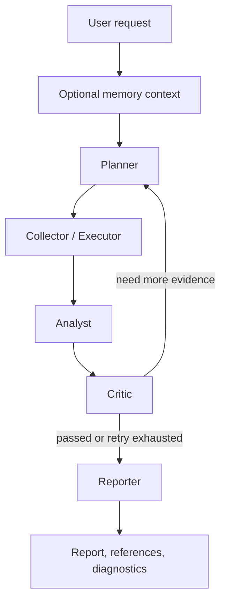

# InsightGraph

InsightGraph is a LangGraph-based deep-research agent for company analysis,
competitive intelligence, technology trends, and evidence-grounded long-form
reports.

It is designed around one product path: `live-research`. Offline deterministic
execution remains the default for local tests and CI. Network access, live
search providers, LLM analysis, PostgreSQL, pgvector, and full trace payloads
all remain explicit opt-in surfaces.

## What It Does

- Multi-agent workflow: Planner -> Collector/Executor -> Analyst -> Critic -> Reporter.
- Evidence-first reporting: findings and references are built from collected
  evidence, not free-form model memory.
- Mixed research inputs: web search, GitHub, SEC, local documents, PDF/HTML
  fetch, and optional long-term memory context.
- Observable runs: runtime diagnostics, tool logs, LLM logs, job events,
  quality cards, and report exports.
- Durable operations: in-memory, JSON, or SQLite jobs; optional PostgreSQL
  checkpoints; optional pgvector memory.

## Product Truths

- The active product path is `live-research`.
- Offline remains the deterministic testing/CI fallback.
- The optimization target is high-quality, evidence-grounded research reports.
- High-risk runtime surfaces remain deferred by default:
  `/tasks` compatibility aliases, MCP runtime invocation, release/deploy
  automation beyond dry-run, and real sandboxed Python/code execution.

## Architecture At A Glance

```text
Client (CLI / API / Dashboard)
  -> LangGraph StateGraph
  -> Planner -> Collector/Executor -> Analyst -> Critic -> Reporter
  -> Search / fetch / GitHub / SEC / local document tools
  -> Evidence scoring / citation support / quality review
  -> Markdown report / JSON diagnostics / optional memory writeback
```

Core execution flow:



## Quick Start

Install from source:

```bash
git clone https://github.com/Caser-86/InsightGraph.git
cd InsightGraph
python -m venv .venv
source .venv/bin/activate  # Windows: .\.venv\Scripts\Activate.ps1
python -m pip install -e ".[dev]"
```

Run the offline deterministic path:

```bash
insight-graph research "Compare Cursor, OpenCode, and GitHub Copilot"
```

Run the live-research path:

```bash
insight-graph research --preset live-research "Compare Cursor, OpenCode, and GitHub Copilot"
```

Start the API and dashboard:

```bash
python -m pip install "uvicorn[standard]"
uvicorn insight_graph.api:app --host 127.0.0.1 --port 8000
```

- Health: `http://127.0.0.1:8000/health`
- OpenAPI: `http://127.0.0.1:8000/docs`
- Dashboard: `http://127.0.0.1:8000/dashboard`

## Documentation Guide

InsightGraph now uses a layered documentation model.

### English Reference Docs

- `docs/README.md`
- `docs/architecture.md`
- `docs/configuration.md`
- `docs/deployment.md`
- `docs/research-jobs-api.md`
- `docs/roadmap.md`
- `docs/scripts.md`
- `docs/BENCHMARKS.md`

### Chinese Operator Docs

- `docs/QUICK_START.md`
- `docs/FAQ.md`
- `docs/roadmap-cn.md`
- `docs/demo.md`

### Internal Reference Docs

- `docs/reference-parity-roadmap.md`
- `docs/report-quality-roadmap.md`
- `docs/research-job-repository-contract.md`
- `docs/skills/caveman-applied-skills.md`
- `docs/superpowers/plans/2026-04-30-remaining-product-roadmap.md`

For asynchronous jobs, restart/resume behavior, cancel/retry semantics, and
memory API endpoints, prefer `docs/research-jobs-api.md`.

## Runtime Diagnostics

CLI JSON output and the dashboard expose safe runtime diagnostics such as:

- `search_provider`
- `search_limit`
- `web_search_call_count`
- `successful_web_search_call_count`
- `llm_configured`
- `successful_llm_call_count`
- `evidence_count`
- `verified_evidence_count`
- `collection_stop_reason`

## Built-In Tools

- `mock_search`
- `web_search`
- `pre_fetch`
- `fetch_url`
- `github_search`
- `sec_filings`
- `sec_financials`
- `news_search`
- `document_reader`
- `search_document`
- `read_file`
- `list_directory`
- `write_file`

## Storage And Memory

- Research jobs: `memory`, opt-in JSON metadata, or SQLite with worker leases.
- Checkpoints: `memory` or opt-in PostgreSQL.
- Long-term memory: `memory` or opt-in pgvector.
- Report memory writeback: opt-in through `INSIGHT_GRAPH_MEMORY_WRITEBACK=1`.

## Live Benchmark

Manual live benchmark remains opt-in:

- Script: `scripts/benchmark_live_research.py`
- Required opt-in: `--allow-live` or `INSIGHT_GRAPH_ALLOW_LIVE_BENCHMARK=1`
- Case profiles: `docs/benchmarks/live-research-cases.json`
- Metrics include `url_validation_rate`, `citation_precision_proxy`,
  `source_diversity_by_type`, `source_diversity_by_domain`,
  `section_coverage`, and `total_tokens`
- Do not commit generated live benchmark reports

This path may incur network/LLM cost.

## Completed Optimization Batches

A-F complete:

- Report Quality v3
- Live Benchmark Case Profiles
- Production RAG Hardening
- Memory Quality Loop
- Dashboard Productization
- API And Operations Hardening

See `docs/roadmap.md` for the completed route and the remaining explicit-decision
items.

## Security And Boundaries

- Default CLI, API tests, and benchmark tests remain offline and deterministic.
- `live-research` is the only intended product path for live network + LLM work.
- Full prompt/completion traces require explicit trace settings and still go
  through redaction.
- Real sandboxed Python/code execution is not enabled.
- MCP runtime invocation is not enabled.

## License

MIT
