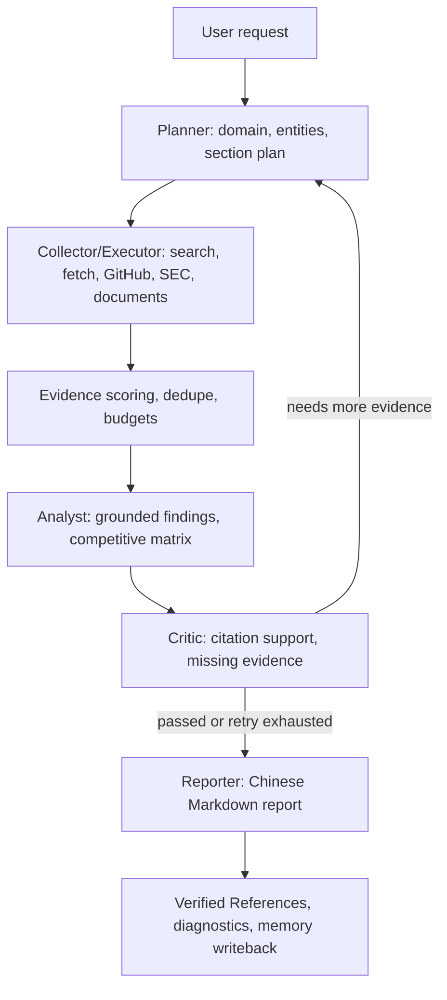
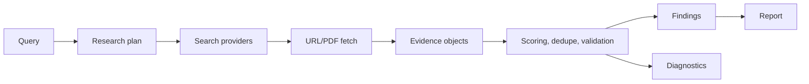

# InsightGraph

InsightGraph 是一个基于 LangGraph 的多智能体深度研究引擎，面向竞品分析、技术趋势、公司研究、产业洞察和市场机会识别。它通过 Planner、Collector/Executor、Analyst、Critic、Reporter 协作完成任务拆解、多源证据采集、引用支持校验和中文 Markdown 研究报告生成。

当前主路径是 `live-research`：联网搜索、URL/PDF 抓取、GitHub/SEC 证据、LLM 分析与报告、URL validation、citation support、运行诊断和 Dashboard 都围绕“可验证的高质量研究报告”服务。默认离线路径仍保持 deterministic，方便测试和 CI。

## 核心特性

| 能力 | 说明 |
| --- | --- |
| 多智能体编排 | Planner -> Collector/Executor -> Analyst -> Critic -> Reporter，支持证据不足时 replan/recollect |
| 多源联网研究 | `web_search`、GitHub REST、SEC filings/companyfacts、本地文档和 URL/PDF 抓取 |
| 搜索引擎切换 | `web_search` 支持 `mock`、`duckduckgo`、`google`、`serpapi` |
| 中文深度报告 | Reporter 默认输出中文 Markdown 深度研究报告，并保留系统重建 References |
| 引用安全 | LLM 只能引用当前 verified evidence ID；未知引用会触发过滤或 fallback |
| 运行诊断 | Dashboard/JSON 输出展示搜索 provider、搜索调用、LLM 调用、证据数量、停止原因 |
| 持久化 | Research jobs 支持 memory、JSON、SQLite；checkpoint 支持 memory/PostgreSQL |
| 长期记忆 | memory store 支持 in-memory 和 pgvector，report writeback 为 opt-in |
| 质量评估 | pytest、ruff、offline eval、live benchmark、URL validation、citation support |

## 效果与亮点

InsightGraph 的目标不是“把搜索结果拼成文章”，而是把研究过程做成可审计链路：每条结论尽量回到证据、引用、URL validation 和 citation support。当前实现的主要亮点：

| 亮点 | 价值 |
| --- | --- |
| 中文默认报告 | Dashboard 和 CLI 生成的研究报告默认面向中文阅读场景 |
| 多搜索 provider | 可在 SerpAPI、DuckDuckGo、Google Custom Search、mock 间切换 |
| 证据优先 | 搜索、抓取、评分、去重、引用校验都围绕 evidence ID 组织 |
| 可观测运行 | 能看到是否调用搜索、是否调用 LLM、证据数量和停止原因 |
| 离线可测 | Offline deterministic 是测试/CI fallback，不依赖公网和付费 key |

## 项目结构

```text
src/insight_graph/
├── agents/                         # Planner / Collector / Executor / Analyst / Critic / Reporter
├── report_quality/                 # domain profiles, research plan, evidence scoring, citation support
├── tools/                          # web search, URL/PDF fetch, GitHub, SEC, documents, file tools
├── llm/                            # OpenAI-compatible config, router, observability, trace writer
├── memory/                         # long-term memory stores, embeddings, report writeback
├── persistence/                    # checkpoint stores and migrations
├── api.py                          # FastAPI REST + WebSocket research jobs API
├── dashboard.py                    # zero-build dashboard
├── eval.py                         # offline quality eval
├── graph.py                        # LangGraph StateGraph orchestration
├── research_jobs.py                # job lifecycle and response shaping
├── research_jobs_sqlite_backend.py # SQLite jobs backend with worker leasing
└── state.py                        # GraphState, Evidence, Finding, Critique 等模型
```

## 技术架构

```text
CLI / FastAPI / Dashboard
  -> LangGraph StateGraph
  -> Planner -> Collector/Executor -> Analyst -> Critic -> Reporter
  -> Search / URL fetch / GitHub / SEC / Documents
  -> Evidence scoring / citation support / URL validation
  -> Markdown report / JSON diagnostics / optional memory writeback
```

核心链路是 Planner → Collector/Executor → Analyst → Critic → Reporter。Planner 负责拆题和工具计划，Collector/Executor 负责多源采集，Analyst 把证据组织成发现，Critic 检查引用支撑和缺口，Reporter 生成最终中文报告。

## 整体执行流程



## 多智能体协作流程

| Agent | 职责 | 失败/不足时的处理 |
| --- | --- | --- |
| Planner | 识别领域、实体、研究章节和工具计划 | 证据不足时接收 Critic 反馈并 replan |
| Collector | 执行确定性采集、预抓取和证据归一化 | 受 collection rounds、tool calls 和 evidence 预算约束 |
| Executor | 按 planned tool loop 调用 live tools | 工具失败会记录 metadata，不让单个 provider 拖垮整轮研究 |
| Analyst | 基于 verified evidence 生成 findings、矩阵和趋势判断 | LLM 不可用时走 rules fallback |
| Critic | 检查 citation support、missing evidence 和质量门槛 | 需要更多证据时触发 recollect/replan |
| Reporter | 输出中文 Markdown，并重建 References | 引用只能来自当前 evidence pool |

## 数据流与证据链路



每条 evidence 会携带 `id`、`source`、`url`、`title`、`snippet/content`、`metadata` 等信息。Analyst 和 Reporter 只能使用当前状态里的 evidence；Reporter 最后会重建 References，减少“模型自己编引用”的风险。

## 技术栈

| 层级 | 技术 |
| --- | --- |
| 语言 | Python 3.11+ |
| 编排 | LangGraph, LangChain Core |
| 数据模型 | Pydantic |
| CLI | Typer, Rich |
| API | FastAPI, WebSocket |
| Dashboard | Zero-build HTML/CSS/JavaScript |
| 搜索 | SerpAPI, DuckDuckGo via `ddgs`, Google Custom Search, deterministic mock |
| 抓取解析 | urllib, BeautifulSoup, pypdf |
| 代码与金融数据 | GitHub REST Search, SEC submissions/companyfacts JSON |
| LLM | OpenAI-compatible providers, local/self-hosted compatible endpoints, rules router |
| 存储 | in-memory, JSON, SQLite, PostgreSQL checkpoint, pgvector memory |
| 可观测性 | trace_id, tool/LLM logs, token summary, Dashboard quality panels |

## 执行链路详解

1. 用户通过 CLI、Dashboard 或 API 提交 query。
2. `live-research` preset 打开联网搜索、URL validation、LLM Analyst/Reporter 和质量评估开关。
3. Planner 生成研究计划和工具调用候选。
4. Collector/Executor 调用 `web_search`、`fetch_url`、GitHub、SEC、本地文档等工具。
5. Evidence 经过评分、去重、预算裁剪和 metadata 归一化。
6. Analyst 基于证据生成 findings，不允许脱离 evidence pool 扩写事实。
7. Critic 检查引用支撑、缺失证据和是否需要继续采集。
8. Reporter 输出默认中文 Markdown 报告，并附带 References 与运行诊断。

## 示例输出

Reporter 默认生成中文结构：

```text
# InsightGraph 深度研究报告
## 摘要
## 背景
## 核心发现
## 证据分析
## 竞争格局
## 趋势判断
## 风险
## 结论
## 引用支持
## References
```

JSON 输出会包含报告、证据、引用支持、URL validation、LLM 调用统计、搜索 provider、搜索调用数量和停止原因等字段，方便 Dashboard 与自动化评估复用。

## 快速开始

```bash
python -m pip install -e ".[dev]"
python -m pytest -q
```

离线 deterministic 运行：

```bash
python -m insight_graph.cli research "Compare Cursor, OpenCode, and GitHub Copilot"
```

联网深度研究：

```bash
python -m insight_graph.cli research "Compare Cursor, OpenCode, and GitHub Copilot" --preset live-research
```

输出 CLI/API 对齐的 JSON：

```bash
python -m insight_graph.cli research "OpenAI 2026 product strategy official news" --preset live-research --output-json
```

## 配置说明

主要配置分为搜索引擎、预算、LLM、持久化、Dashboard/API 和 trace。更完整的生产配置见 `docs/configuration.md` 与 `docs/deployment.md`。

### 搜索引擎配置

`web_search` 的调用由两个变量共同决定：

| 变量 | 作用 |
| --- | --- |
| `INSIGHT_GRAPH_USE_WEB_SEARCH=1` | 让 Planner 在采集阶段使用 `web_search` |
| `INSIGHT_GRAPH_SEARCH_PROVIDER` | 选择 `mock`、`duckduckgo`、`google` 或 `serpapi` |

当前 `.env` 可使用 SerpAPI：

```env
INSIGHT_GRAPH_USE_WEB_SEARCH=1
INSIGHT_GRAPH_SEARCH_PROVIDER=serpapi
INSIGHT_GRAPH_SERPAPI_KEY=your-serpapi-key
INSIGHT_GRAPH_SERPAPI_ENGINE=google
```

SerpAPI key 支持三种变量名，任选其一：

```env
INSIGHT_GRAPH_SERPAPI_KEY=your-serpapi-key
INSIGHT_GRAPH_SERPAPI_API_KEY=your-serpapi-key
SERPAPI_API_KEY=your-serpapi-key
```

切换到 DuckDuckGo：

```env
INSIGHT_GRAPH_SEARCH_PROVIDER=duckduckgo
INSIGHT_GRAPH_SEARCH_PROXY=http://127.0.0.1:7890
```

`INSIGHT_GRAPH_SEARCH_PROXY` 可选，也支持 `DDGS_PROXY`。没有代理时会直接调用 `ddgs.DDGS().text(...)`。

### 数量与预算控制

搜索结果数量、网页抓取数量、工具调用数量是不同的预算层：

| 变量 | 默认值 | 说明 |
| --- | ---: | --- |
| `INSIGHT_GRAPH_SEARCH_LIMIT` | `20` | 标准版单次 `web_search` 的候选搜索结果数量 |
| `INSIGHT_GRAPH_MAX_FETCHES` | `80` | 标准版单次 pre-fetch 最多抓取多少个候选 URL |
| `INSIGHT_GRAPH_MAX_TOOL_CALLS` | `200` | 标准版单次研究最多执行多少个 tool call |
| `INSIGHT_GRAPH_MAX_COLLECTION_ROUNDS` | `1` | 采集最多跑几轮 |
| `INSIGHT_GRAPH_MAX_TOOL_ROUNDS` | 同 collection rounds | Executor 对 planned tool loop 的轮数 |
| `INSIGHT_GRAPH_MAX_EVIDENCE_PER_RUN` | `120` | 标准版最终保留多少条 evidence |
| `INSIGHT_GRAPH_MAX_TOKENS` | `500000` | 标准版 LLM token 预算，耗尽后 Analyst/Reporter/Review fallback |

`live-research` 会补齐更适合真实研究的默认值：

```env
INSIGHT_GRAPH_REPORT_INTENSITY=standard
INSIGHT_GRAPH_SEARCH_LIMIT=20
INSIGHT_GRAPH_MAX_COLLECTION_ROUNDS=5
INSIGHT_GRAPH_MAX_TOOL_CALLS=200
INSIGHT_GRAPH_MAX_FETCHES=80
INSIGHT_GRAPH_MAX_EVIDENCE_PER_RUN=120
INSIGHT_GRAPH_MAX_TOKENS=500000
```

注意：SerpAPI 和 Google Custom Search 当前单次请求的 `num` 会使用 `min(INSIGHT_GRAPH_SEARCH_LIMIT, 10)`。之后 `pre_fetch_results()` 再按 `min(search_limit, max_fetches)` 抓取候选 URL。

### 报告强度

`INSIGHT_GRAPH_REPORT_INTENSITY` 支持四档，默认 `standard`：

| 强度 | 适合场景 | 主要预算 |
| --- | --- | --- |
| `concise` | 快速精简报告 | `SEARCH_LIMIT=6`、`MAX_TOOL_CALLS=24`、`MAX_TOKENS=100000` |
| `standard` | 默认标准深度报告，工具预算接近 `wenyi-research-agent` | `SEARCH_LIMIT=20`、`MAX_TOOL_CALLS=200`、`MAX_FETCHES=80`、`MAX_EVIDENCE_PER_RUN=120`、`MAX_TOKENS=500000` |
| `deep` | 高强度长报告，明显高于标准版 | `SEARCH_LIMIT=30`、`MAX_TOOL_CALLS=320`、`MAX_FETCHES=140`、`MAX_EVIDENCE_PER_RUN=220`、`MAX_TOKENS=2000000` |
| `deep-plus` | 极限高强度报告，适合慢速高成本长研报 | `SEARCH_LIMIT=45`、`MAX_TOOL_CALLS=500`、`MAX_FETCHES=220`、`MAX_EVIDENCE_PER_RUN=350`、`MAX_TOKENS=4000000` |

这些值是单次研究的 LLM total token 上限，不等于每次都会用满；实际效果还取决于模型上下文窗口、供应商限额和调用费用。搜索、抓取和证据数量仍由对应预算单独控制，避免为了提高 token 上限而无界扩大外部请求。

CLI 可直接指定：

```bash
python -m insight_graph.cli research "Compare Cursor, OpenCode, and GitHub Copilot" --preset live-research --report-intensity deep
```

### LLM 配置

项目使用 OpenAI-compatible 配置，DeepSeek、OpenAI 兼容网关、本地兼容服务都可以接入：

```env
INSIGHT_GRAPH_ANALYST_PROVIDER=llm
INSIGHT_GRAPH_REPORTER_PROVIDER=llm
INSIGHT_GRAPH_LLM_PROVIDER=openai_compatible
INSIGHT_GRAPH_LLM_BASE_URL=https://api.deepseek.com/v1
INSIGHT_GRAPH_LLM_MODEL=deepseek-reasoner
INSIGHT_GRAPH_LLM_API_KEY=your-api-key
```

`live-research` 会默认启用 LLM Analyst 和 LLM Reporter，但不会在命令行参数里接收 API key；key 通过环境变量或 `.env` 提供。

可选 V2 审稿润色：

```env
INSIGHT_GRAPH_REPORT_REVIEW_PROVIDER=llm
```

开启后 Reporter 完成初稿后会再调用一次 LLM 做中文审稿、润色和适度扩写；引用仍会校验，只允许使用当前 verified evidence 的编号。失败时会保留 V1 报告。

## API 与 Dashboard

启动本地 API：

```bash
python -m uvicorn insight_graph.api:app --app-dir src --host 127.0.0.1 --port 8001
```

常用入口：

| 地址 | 用途 |
| --- | --- |
| `http://127.0.0.1:8001/dashboard` | Dashboard |
| `http://127.0.0.1:8001/health` | Health check |
| `http://127.0.0.1:8001/docs` | OpenAPI docs |

创建异步研究任务：

```bash
curl -X POST http://127.0.0.1:8001/research/jobs \
  -H "Content-Type: application/json" \
  -d '{"query":"OpenAI 2026 product strategy official news","preset":"live-research"}'
```

Dashboard 支持任务列表、实时事件、报告查看、证据池、引用支持、URL validation、LLM 日志、运行诊断和 Markdown/HTML 下载。

## 运行诊断

`--output-json` 和 Dashboard 会暴露安全的运行诊断字段，包括：

| 字段 | 含义 |
| --- | --- |
| `search_provider` | 当前实际搜索 provider，例如 `serpapi` |
| `search_limit` | 当前搜索候选数量 |
| `web_search_call_count` | `web_search` 调用次数 |
| `successful_web_search_call_count` | 成功的 `web_search` 调用次数 |
| `llm_configured` | 是否读到 LLM key |
| `successful_llm_call_count` | 成功 LLM 调用次数 |
| `evidence_count` | 最终 evidence 数量 |
| `verified_evidence_count` | verified evidence 数量 |
| `collection_stop_reason` | 采集停止原因，例如 `sufficient` 或 `tool_budget_exhausted` |

## 内置工具

| 工具 | 用途 |
| --- | --- |
| `mock_search` | 离线 deterministic evidence |
| `web_search` | SerpAPI、DuckDuckGo、Google 或 mock 搜索 |
| `pre_fetch` | 对搜索候选 URL 做 bounded fetch |
| `fetch_url` | 抓取 HTML/PDF 并生成 evidence chunks |
| `github_search` | GitHub repository/README/release evidence |
| `sec_filings` | SEC EDGAR filings evidence |
| `sec_financials` | SEC companyfacts financial evidence |
| `news_search` | deterministic news/product announcement evidence |
| `document_reader` | 读取 cwd 内 TXT/Markdown/HTML/PDF |
| `search_document` | 本地文档 query/page/section 检索 |
| `read_file` / `list_directory` | cwd 内只读文件工具 |
| `write_file` | cwd 内 create-only 文本文件创建 |

## 脚本

| 脚本 | 用途 |
| --- | --- |
| `scripts/run_research.py` | 运行研究任务 |
| `scripts/run_with_llm_log.py` | 运行任务并输出 LLM 调用日志 |
| `scripts/benchmark_research.py` | 离线 benchmark |
| `scripts/benchmark_live_research.py` | 手动 opt-in live benchmark，可能产生网络/LLM 成本 |
| `scripts/summarize_eval_report.py` | 汇总 eval JSON |
| `scripts/append_eval_history.py` | 追加 CI eval history |
| `scripts/validate_github_search.py` | 验证 GitHub search provider |
| `scripts/validate_pdf_fetch.py` | 验证 PDF fetch 与 metadata |

## 安全与边界

默认 CLI 和测试路径不访问公网。`live-research` 才会启用联网搜索、GitHub live provider、SEC、URL validation、LLM Analyst/Reporter 和 relevance judge。

Full prompt/completion trace 需要显式设置 `INSIGHT_GRAPH_LLM_TRACE_FULL=1`。API key 会进入 redaction 流程，但 full trace 仍应只用于本地诊断。

真实 sandboxed Python/code execution 暂不启用。MCP runtime invocation 暂不启用。release/deploy automation 等高风险能力仍保持 deferred，直到有明确使用场景和安全评估。

## 后续优化路线

当前 roadmap 已完成 Report Quality v3、Live Benchmark Case Profiles、Production RAG Hardening、Memory Quality Loop、Dashboard Productization、API And Operations Hardening，状态为 A-F complete。

下一阶段仍需要显式决策的工作包括 `/tasks` API compatibility aliases、MCP runtime invocation behind allowlist、release/deploy automation dry-run only、真实 sandboxed Python/code execution。这些能力都涉及兼容性或安全边界，默认不启用。

## 更多文档

| 文档 | 内容 |
| --- | --- |
| `docs/configuration.md` | 环境变量、live provider、预算、持久化和 memory 配置 |
| `docs/architecture.md` | 架构、数据流和 agent 边界 |
| `docs/deployment.md` | 部署、存储、API key auth、trace redaction |
| `docs/roadmap.md` | 后续优化路线 |

## License

MIT
