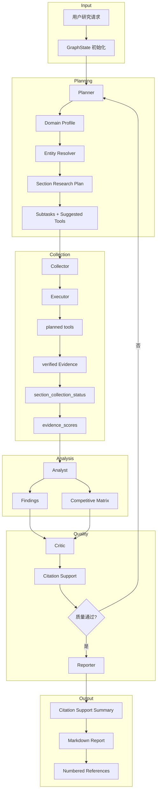
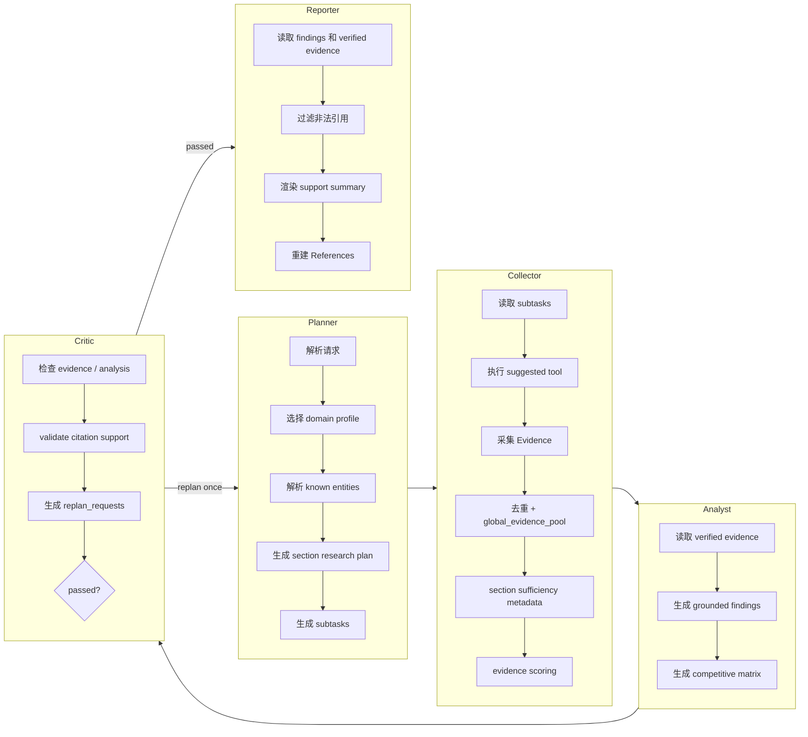
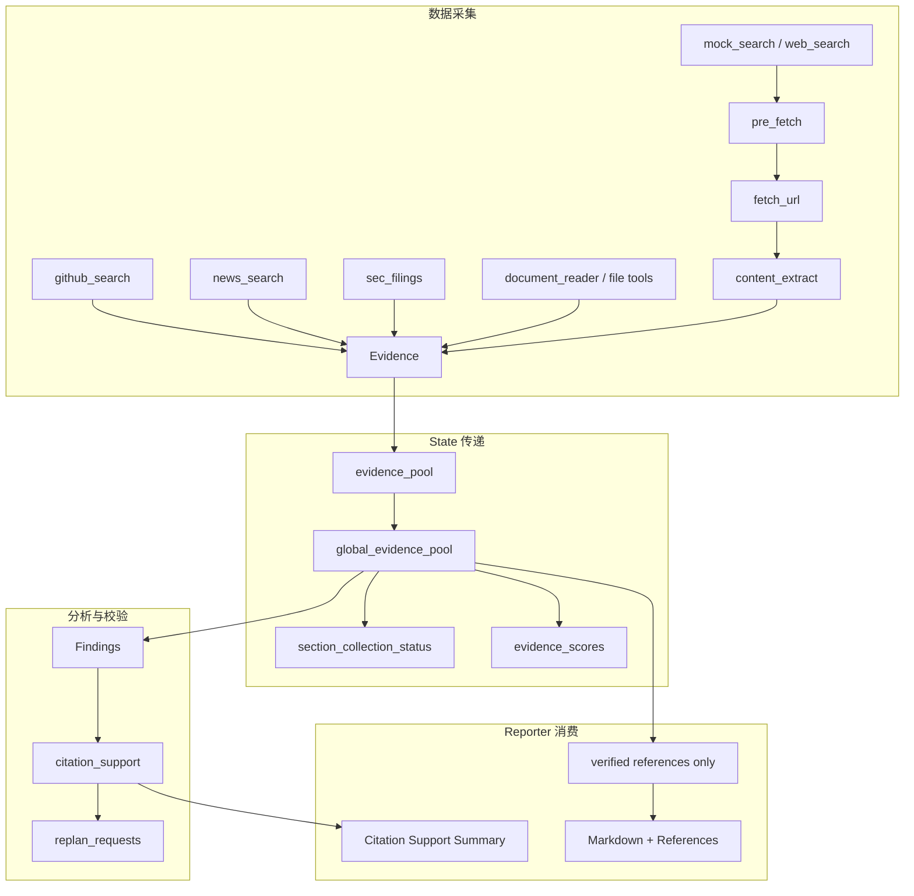

# InsightGraph

基于 LangGraph 的多智能体商业情报研究引擎，面向竞品分析、技术趋势、市场机会识别、公司研究和产业洞察等场景。系统通过 Planner、Collector、Analyst、Critic、Reporter 协作完成任务分解、证据采集、分析归纳、质量评审和引用报告生成，默认产出带可验证 References 的结构化 Markdown 报告。

Phase 10 report-quality queue is complete, and Phase 11 has started the reference-quality deep-research route with bounded multi-round collection for live research. PostgreSQL checkpoint resume and pgvector memory are intentionally deferred to a later infrastructure phase.

当前项目已完成可运行 MVP 和 Report Quality Roadmap Phase 1-9：支持 domain profile、实体解析、section research plan、section evidence status、evidence scoring、citation support metadata、critic replan requests、tried-strategy metadata 和 Reporter citation support summary。默认运行模式是 deterministic/offline，适合本地开发、测试和 CI；真实搜索、真实 GitHub API、真实 LLM 都需要显式 opt-in。

---

## 项目结构

```text
src/insight_graph/
├── agents/                         # 多智能体核心
│   ├── planner.py                  # 任务分解、工具选择、domain/entity/section plan 注入
│   ├── collector.py                # Collection 阶段入口
│   ├── executor.py                 # 工具执行、证据去重、section status、evidence scoring
│   ├── analyst.py                  # Findings 与 competitive matrix 生成
│   ├── critic.py                   # 质量评审、citation support、replan request
│   └── reporter.py                 # Markdown 报告、citation support summary、References
├── report_quality/                 # 报告质量增强层
│   ├── domain_profiles.py          # 领域检测与 source policy baseline
│   ├── entity_resolver.py          # 实体识别、别名与 source hints
│   ├── research_plan.py            # section-aware research plan
│   ├── document_index.py            # deterministic long-document ranking + vector boundary
│   ├── evidence_scoring.py         # authority / relevance / overall scoring
│   └── citation_support.py         # claim-to-snippet support metadata
├── tools/                          # 内置工具集
│   ├── mock_search.py              # 默认 deterministic evidence
│   ├── web_search.py               # opt-in DuckDuckGo provider
│   ├── pre_fetch.py                # search candidate 预抓取
│   ├── fetch_url.py                # direct URL 抓取并生成 Evidence
│   ├── content_extract.py          # HTML title/text/snippet 提取
│   ├── github_search.py            # deterministic 或 opt-in GitHub repository search
│   ├── news_search.py              # deterministic news/product announcement evidence
│   ├── sec_filings.py              # opt-in SEC EDGAR recent filings evidence
│   ├── document_reader.py          # cwd 内 TXT/Markdown/HTML/PDF evidence reader
│   └── file_tools.py               # cwd 内安全 read/list/create-only write
├── llm/                            # OpenAI-compatible LLM 与 router
│   ├── client.py
│   ├── config.py
│   ├── observability.py            # 安全 LLM metadata log
│   ├── trace_export.py             # opt-in full trace event builder
│   └── router.py                   # opt-in rules router
├── api.py                          # FastAPI REST + WebSocket
├── dashboard.py                    # zero-build static Dashboard
├── eval.py                         # deterministic offline Eval Bench
├── graph.py                        # LangGraph StateGraph 编排
├── research_jobs.py                # research job lifecycle 和 response shaping
├── research_jobs_store.py          # JSON persistence adapter
├── research_jobs_sqlite_backend.py # opt-in SQLite job metadata backend
├── persistence/                    # opt-in checkpoint persistence adapters
├── memory/                         # opt-in long-term research memory adapters
├── smoke.py                        # deployment smoke CLI
└── state.py                        # GraphState、Evidence、Finding、Critique 等模型
```

---

## 核心特性

| 特性 | 说明 |
|------|------|
| **多智能体编排** | Planner → Collector → Analyst → Critic → Reporter，支持 Critic 触发一次 replan 闭环 |
| **报告质量链路** | Phase 1-9 已落地：domain profile、entity resolver、section plan、evidence status、scoring、citation support、replan/tried-strategy metadata、Reporter support summary |
| **证据溯源链** | Evidence 从 search / fetch / GitHub / news / local document 进入 pool，Reporter 仅引用 verified evidence；文档、远程 PDF 和长网页 evidence 带 chunk/page/section metadata、deterministic document index ranking，并可归因到 planned section |
| **Rendered fetch** | 默认关闭；`INSIGHT_GRAPH_FETCH_RENDERED=1` 时 `fetch_url` 可尝试 optional Playwright rendering，并在失败时回退 bounded HTTP fetch |
| **SEC financials** | `sec_filings` 发现近期 filings；`sec_financials` 可从 SEC companyfacts 生成 revenue / net income / assets evidence，不做完整财务模型 |
| **Citation 安全** | LLM Reporter 不能保留未知引用；References 由系统重建；Critic 记录 claim-level citation support metadata |
| **竞品矩阵** | Analyst 可从 verified evidence 生成 competitive matrix，Reporter 只渲染可引用行 |
| **可选 LLM** | Analyst、Reporter、Relevance Judge 支持 OpenAI-compatible provider；默认不调用真实 LLM，并受 `INSIGHT_GRAPH_MAX_TOKENS` 约束 |
| **可选实时数据源** | DuckDuckGo web search、GitHub REST Search、SEC filings 和 direct URL/PDF fetch 均为显式 opt-in；默认测试不访问公网 |
| **Live Research Preset** | `--preset live-research` 一键启用 DuckDuckGo web search、GitHub live search、SEC filings、多源采集、bounded fetch、deterministic relevance filtering、全局 tool/evidence budgets 和最多 3 轮 section follow-up collection |
| **API + Dashboard** | FastAPI 同步研究、异步 jobs、WebSocket stream、Markdown/HTML report export、静态 Dashboard |
| **Eval Gate** | Offline Eval Bench 输出 JSON/Markdown，包含 report quality metrics，可在 CI 中按分数 gate |
| **工程质量门** | pytest、ruff、CI Eval Gate、deployment smoke entry point、repository hygiene tests |

未实现或未默认启用的高级能力：API/background-worker 自动 resume 和真实 embedding/vector RAG。PostgreSQL checkpoint store 目前是 opt-in persistence adapter，event runner 已支持按 `run_id` 保存并从 checkpoint 继续；pgvector memory 目前是 opt-in storage/search/delete adapter，尚未接入 embeddings pipeline；Document retrieval 目前有 deterministic index 和 opt-in vector ranker boundary；Conversation compression 目前是 deterministic evidence-preserving summary helper，尚未接入长跑 agent memory loop。Full trace payload、MCP-style tool specs 和 restricted code execution 都有安全边界，默认不暴露 prompt/completion、不执行外部 MCP 工具、不启用 code execution。

---

## 技术架构

```text
┌───────────────────────────────────────────────────────────────────────┐
│                    CLI / FastAPI / Dashboard                           │
│       insight-graph, /research, /research/jobs, WebSocket stream        │
└───────────────────────────────┬───────────────────────────────────────┘
                                │
┌───────────────────────────────▼───────────────────────────────────────┐
│                       LangGraph StateGraph                             │
│                                                                       │
│  ┌──────────┐   ┌───────────┐   ┌─────────┐   ┌──────────┐            │
│  │ Planner  │──▶│ Collector │──▶│ Analyst │──▶│  Critic  │            │
│  │ domain   │   │ tools     │   │ claims  │   │ support  │            │
│  │ entities │   │ scoring   │   │ matrix  │   │ replan   │            │
│  └────┬─────┘   └───────────┘   └─────────┘   └────┬─────┘            │
│       ▲                                            │                  │
│       └────────────── one retry / replan ──────────┘                  │
│                                                    │                  │
│                                           ┌────────▼────────┐         │
│                                           │    Reporter     │         │
│                                           │ verified-only   │         │
│                                           └─────────────────┘         │
└───────────────────────────────┬───────────────────────────────────────┘
                                │
┌───────────────────────────────▼───────────────────────────────────────┐
│                         Evidence Grounding Layer                       │
│ Domain Profile │ Entity Resolver │ Section Plan │ Evidence Scoring    │
│ Citation Support Validator │ Replan Requests │ Eval Quality Metrics    │
└───────────────────────────────┬───────────────────────────────────────┘
                                │
┌───────────────────────────────▼───────────────────────────────────────┐
│                              Tools                                     │
│ mock_search │ web_search │ pre_fetch │ fetch_url │ github_search       │
│ news_search │ sec_filings │ document_reader │ read_file │ list_directory │
│ write_file │
└───────────────────────────────────────────────────────────────────────┘
```

---

## 整体执行流程



---

## 多智能体协作流程



---

## 数据流与证据链路



当前 `Evidence` 模型仍是轻量结构，主要包含 title、source URL、snippet、source type、verified 等字段。报告质量增强 metadata 通过 `GraphState` 承载，避免破坏现有公共 API 形状。

---

## 技术栈

| 层级 | 技术 |
|------|------|
| **语言** | Python 3.11+ |
| **编排** | LangGraph、LangChain Core |
| **API** | FastAPI、WebSocket endpoint |
| **前端** | zero-build static HTML/CSS/JS Dashboard |
| **CLI** | Typer、Rich |
| **数据模型** | Pydantic |
| **HTML 解析** | BeautifulSoup |
| **PDF 读取** | pypdf |
| **搜索** | deterministic mock；opt-in DuckDuckGo via `ddgs` |
| **GitHub** | deterministic mock；opt-in GitHub REST Search API |
| **LLM** | deterministic default；opt-in OpenAI-compatible API |
| **Job metadata** | 默认内存；opt-in JSON store；opt-in SQLite backend |
| **质量门** | pytest、ruff、offline Eval Bench、CI Eval Gate |

---

## 内置工具

| 工具 | 用途 | 默认行为 |
|------|------|----------|
| `mock_search` | 稳定搜索证据 | deterministic/offline |
| `web_search` | 搜索引擎查询 | mock provider；DuckDuckGo 需 opt-in |
| `pre_fetch` | 对候选 URL 做受控抓取 | 跟随候选 URL |
| `fetch_url` | 抓取 direct HTTP/HTTPS URL 并生成 Evidence | live URL 工具，需用户提供 URL 或由上游候选触发 |
| `content_extract` | 从 HTML 提取 title/text/snippet | 本地解析 |
| `github_search` | GitHub repository evidence | mock provider；GitHub API 需 opt-in |
| `news_search` | 新闻和产品公告风格 evidence | deterministic/offline |
| `sec_filings` | SEC EDGAR recent filings evidence | opt-in，known ticker/company name → SEC submissions JSON |
| `document_reader` | 读取 cwd 内 TXT/Markdown/HTML/PDF，记录 chunk/page/section metadata | opt-in，本地文件，不读 cwd 外路径 |
| `read_file` | 读取 cwd 内安全文本文件 | opt-in，只读 |
| `list_directory` | 列出 cwd 内一层目录 | opt-in，只读 |
| `write_file` | 创建 cwd 内安全文本文件 | opt-in，create-only，不覆盖 |

---

## 执行链路详解

### 1. Planner

- **输入**：`user_request` 和当前 `GraphState`。
- **输出**：`subtasks`，包括 scope、collect、analyze、report 等阶段。
- **报告质量增强**：写入 `domain_profile`、`resolved_entities`、`section_research_plan`。
- **工具选择**：根据环境变量选择 `mock_search`、`web_search`、`github_search`、`news_search`、`sec_filings`、`document_reader` 或本地文件工具；`live-research` 使用多源采集。

### 2. Collector / Executor

- **工具执行**：执行 Planner 指定工具；每个工具收到基于 source type、section plan 和 resolved entities 的 deterministic query，生成 verified evidence。
- **证据管理**：维护 `evidence_pool` 和 `global_evidence_pool`，执行基础去重，按 deterministic evidence score 排序，并应用 per-tool / per-section / per-run caps。
- **质量 metadata**：写入 `section_collection_status`（按 evidence `section_id` 统计 required/covered/missing source types）和 `evidence_scores`。
- **边界**：当前不是完整 agentic 多轮工具循环；Critic retry 会把 replan metadata 转为一次 deterministic follow-up query。

### 3. Analyst

- **deterministic 默认**：从 verified evidence 生成 findings 和 competitive matrix。
- **LLM opt-in**：设置 `INSIGHT_GRAPH_ANALYST_PROVIDER=llm` 后可调用 OpenAI-compatible LLM。
- **引用约束**：LLM findings 和 matrix 必须引用当前 verified evidence ID，否则 fallback。

### 4. Critic

- **质量评审**：检查 evidence 数量、analysis 是否存在、citation support 是否足够。
- **Citation support**：记录 claim-level support metadata，标记 supported / unsupported。
- **Replan metadata**：写入结构化 `replan_requests`，包含 missing section evidence 和 unsupported claim 请求；section follow-up 会记录 `strategy_key` 到 `tried_strategies`，避免重复尝试同一失败策略。

### 5. Reporter

- **deterministic 默认**：生成 Markdown report；有 section plan 时按 planned domain sections 输出，否则使用 legacy Key Findings；同时生成 Competitive Matrix、Critic Assessment、Citation Support Summary 和 References。
- **LLM opt-in**：设置 `INSIGHT_GRAPH_REPORTER_PROVIDER=llm` 后可用 OpenAI-compatible LLM 生成正文。
- **引用安全**：最终 References 由系统从 verified evidence 重建；support summary 只暴露 verified evidence ID。

### 6. API / Dashboard / Jobs

- **同步 API**：`POST /research` 返回一次性研究结果。
- **异步 Jobs**：`/research/jobs` 支持 queued/running/succeeded/failed/cancelled 状态、cancel、retry、summary 和 report export。
- **WebSocket**：`/research/jobs/{job_id}/stream` 推送 job lifecycle events。
- **Dashboard**：静态页面，无构建步骤，支持创建 jobs、查看进度、报告、tool calls、LLM metadata 和导出。

---

## 示例输出

默认离线任务：

```bash
python -m insight_graph.cli research "Compare Cursor, OpenCode, and GitHub Copilot"
```

典型输出结构：

| 章节 | 内容 |
|------|------|
| `# InsightGraph Research Report` | 报告标题 |
| `Research Request` | 原始用户请求 |
| `Planned Sections` / `Key Findings` | 有 section plan 时按 domain section 输出，否则输出带编号引用的核心发现 |
| `Competitive Matrix` | 可引用的竞品对比表，只有 evidence 可验证时输出 |
| `Critic Assessment` | Critic 质量评审摘要 |
| `Citation Support` | claim support 状态、verified evidence ID 和原因 |
| `References` | 系统重建的 numbered references |

当前 offline Eval Bench 会生成 deterministic JSON/Markdown 报告，包含深度、来源多样性、引用支撑、unsupported claims 等质量指标。示例命令：

```bash
insight-graph-eval --case-file docs/evals/default.json --markdown --output reports/eval.md
```

---

## 效果与亮点

- **可验证引用**：最终报告只从 verified evidence 重建 References。
- **报告质量 metadata**：从 Planner 到 Reporter 持续记录 domain、entity、section、score、support 和 replan 信息。
- **默认安全离线**：测试、CI、默认 CLI 不访问公网，不调用真实 LLM。
- **渐进 opt-in**：真实搜索、GitHub API、LLM provider、本地文件工具均由环境变量显式开启。
- **API 和 Dashboard 可用**：可本地运行研究任务、查看事件流、导出 Markdown/HTML 报告。
- **Eval 可度量**：报告质量改进通过 offline Eval Bench 和 CI Gate 验证。

---

## 快速开始

### 环境要求

- Python 3.11+
- pip

### 安装和运行

```bash
# 1. 克隆项目
git clone https://github.com/Caser-86/InsightGraph.git
cd InsightGraph

# 2. 安装开发依赖
python -m pip install -e ".[dev]"

# 3. 运行测试
python -m pytest -v

# 4. 执行一次离线研究
python -m insight_graph.cli research "Compare Cursor, OpenCode, and GitHub Copilot"
```

### 常用命令

```bash
# Markdown report
python -m insight_graph.cli research "Compare Cursor, OpenCode, and GitHub Copilot"

# Reference-style networked research path
python -m insight_graph.cli research "Compare Cursor, OpenCode, and GitHub Copilot" --preset live-research

# CLI/API aligned JSON
python -m insight_graph.cli research "Compare Cursor, OpenCode, and GitHub Copilot" --output-json

# Run script wrapper
python scripts/run_research.py "Compare Cursor, OpenCode, and GitHub Copilot"

# Offline benchmark
python scripts/benchmark_research.py --markdown

# Offline Eval Bench
insight-graph-eval --case-file docs/evals/default.json --markdown --output reports/eval.md

# CI-ready Eval Gate
insight-graph-eval --case-file docs/evals/default.json --min-score 85 --fail-on-case-failure

# Summarize an eval JSON report
python scripts/summarize_eval_report.py reports/eval.json --markdown

# Deployment smoke CLI help
insight-graph-smoke --help
```

---

## API 和 Dashboard

启动本地 API server：

```bash
python -m pip install "uvicorn[standard]"
uvicorn insight_graph.api:app --reload
```

访问：

- **Dashboard**：http://127.0.0.1:8000/dashboard
- **Health check**：http://127.0.0.1:8000/health

同步研究请求：

```bash
curl -X POST http://127.0.0.1:8000/research \
  -H "Content-Type: application/json" \
  -d '{"query":"Compare Cursor, OpenCode, and GitHub Copilot"}'
```

异步 research jobs：

```bash
curl -X POST http://127.0.0.1:8000/research/jobs \
  -H "Content-Type: application/json" \
  -d '{"query":"Compare Cursor, OpenCode, and GitHub Copilot"}'

curl http://127.0.0.1:8000/research/jobs
curl http://127.0.0.1:8000/research/jobs/summary
curl http://127.0.0.1:8000/research/jobs/<job_id>
curl http://127.0.0.1:8000/research/jobs/<job_id>/report.md
curl http://127.0.0.1:8000/research/jobs/<job_id>/report.html
curl -X POST http://127.0.0.1:8000/research/jobs/<job_id>/cancel
curl -X POST http://127.0.0.1:8000/research/jobs/<job_id>/retry
```

WebSocket stream：

```text
ws://127.0.0.1:8000/research/jobs/<job_id>/stream
```

设置 `INSIGHT_GRAPH_API_KEY` 后，除 `/health` 外的 API endpoint 会要求 `Authorization: Bearer <key>` 或 `X-API-Key: <key>`。Dashboard 提供 API key 输入框。

---

## 配置说明

| 变量 | 说明 | 默认值 |
|------|------|--------|
| `INSIGHT_GRAPH_USE_WEB_SEARCH` | Planner collect subtask 使用 `web_search` | 未启用 |
| `INSIGHT_GRAPH_SEARCH_PROVIDER` | `web_search` provider：`mock` 或 `duckduckgo` | `mock` |
| `INSIGHT_GRAPH_SEARCH_LIMIT` | web search candidate / pre-fetch 数量 | `3` |
| `INSIGHT_GRAPH_USE_GITHUB_SEARCH` | Planner collect subtask 使用 `github_search` | 未启用 |
| `INSIGHT_GRAPH_GITHUB_PROVIDER` | `github_search` provider：`mock` 或 `live` | `mock` |
| `INSIGHT_GRAPH_GITHUB_TOKEN` | GitHub API token，可选 | - |
| `INSIGHT_GRAPH_MULTI_SOURCE_COLLECTION` | Planner collect subtask 同时使用多个启用的采集工具 | 未启用 |
| `INSIGHT_GRAPH_USE_SEC_FILINGS` | 对已知上市公司 ticker/name 使用 SEC EDGAR recent filings evidence | 未启用 |
| `INSIGHT_GRAPH_USE_NEWS_SEARCH` | 使用 deterministic news evidence | 未启用 |
| `INSIGHT_GRAPH_USE_DOCUMENT_READER` | 使用 cwd 内 document reader | 未启用 |
| `INSIGHT_GRAPH_USE_READ_FILE` | 使用 cwd 内只读文本文件工具 | 未启用 |
| `INSIGHT_GRAPH_USE_LIST_DIRECTORY` | 使用 cwd 内目录列表工具 | 未启用 |
| `INSIGHT_GRAPH_USE_WRITE_FILE` | 使用 cwd 内 create-only 写文件工具 | 未启用 |
| `INSIGHT_GRAPH_RELEVANCE_FILTER` | 启用 evidence relevance filtering | 未启用 |
| `INSIGHT_GRAPH_RELEVANCE_JUDGE` | `deterministic` 或 `openai_compatible` | `deterministic` |
| `INSIGHT_GRAPH_ANALYST_PROVIDER` | `deterministic` 或 `llm` | `deterministic` |
| `INSIGHT_GRAPH_REPORTER_PROVIDER` | `deterministic` 或 `llm` | `deterministic` |
| `INSIGHT_GRAPH_LLM_API_KEY` | OpenAI-compatible API key | - |
| `INSIGHT_GRAPH_LLM_BASE_URL` | OpenAI-compatible `/v1` endpoint | - |
| `INSIGHT_GRAPH_LLM_MODEL` | LLM model name | `gpt-4o-mini` |
| `INSIGHT_GRAPH_RESEARCH_JOBS_PATH` | opt-in JSON job metadata store | - |
| `INSIGHT_GRAPH_RESEARCH_JOBS_BACKEND` | job backend，支持 `sqlite` | memory |
| `INSIGHT_GRAPH_RESEARCH_JOBS_SQLITE_PATH` | SQLite job metadata path | - |

启用联网研究 preset：

```bash
python -m insight_graph.cli research "Compare Cursor, OpenCode, and GitHub Copilot" --preset live-research
```

该 preset 会启用 DuckDuckGo-backed `web_search`、GitHub live repository search、SEC filings、多源采集、较高搜索候选数量和 deterministic relevance filtering；不会自动启用 LLM Analyst/Reporter。

启用 live LLM preset：

```bash
INSIGHT_GRAPH_LLM_API_KEY=sk-your-relay-key \
INSIGHT_GRAPH_LLM_BASE_URL=https://relay.example.com/v1 \
INSIGHT_GRAPH_LLM_MODEL=gpt-4o-mini \
python -m insight_graph.cli research "Compare Cursor, OpenCode, and GitHub Copilot" --preset live-llm
```

启用 live GitHub repository search：

```bash
INSIGHT_GRAPH_USE_GITHUB_SEARCH=1 \
INSIGHT_GRAPH_GITHUB_PROVIDER=live \
INSIGHT_GRAPH_GITHUB_LIMIT=3 \
python -m insight_graph.cli research "Compare Cursor, OpenCode, and GitHub Copilot"
```

启用本地 document reader：

```bash
INSIGHT_GRAPH_USE_DOCUMENT_READER=1 \
python -m insight_graph.cli research "README.md"
```

更多配置见 `docs/configuration.md`。

---

## 示例任务

```text
请分析 AI Coding Agent 市场的主要玩家，包括 Cursor、OpenCode、Claude Code、GitHub Copilot 和 Codeium。
请比较它们的产品定位、核心功能、定价策略、生态集成、技术路线和潜在风险，并给出未来 12 个月的市场趋势判断。
要求所有关键事实附带可验证引用。
```

目标输出结构：Executive Summary、市场格局概览、竞品功能矩阵、定价与商业模式对比、技术趋势分析、风险与不确定性、未来 12 个月判断、Citation Support、References。

---

## 脚本

| 脚本 | 用途 |
|------|------|
| `scripts/run_research.py` | 命令行执行研究任务 |
| `scripts/benchmark_research.py` | 运行 offline benchmark，支持 Markdown 输出 |
| `scripts/summarize_eval_report.py` | 汇总 Eval JSON 报告 |
| `scripts/append_eval_history.py` | 追加 CI eval history artifact |
| `scripts/validate_document_reader.py` | 验证本地 document reader 行为 |
| `scripts/validate_github_search.py` | 验证 GitHub search provider 行为 |
| `scripts/validate_sources.py` | 验证 source URL / source data |

---

## 文档入口

- [配置说明](docs/configuration.md)：搜索 provider、GitHub provider、document reader、LLM preset、observability、jobs persistence 等配置。
- [架构蓝图](docs/architecture.md)：更完整的目标架构、agent 协作、工具和证据链说明。
- [Report Quality Roadmap](docs/report-quality-roadmap.md)：当前 canonical route 和后续报告质量阶段。
- [脚本说明](docs/scripts.md)：run、benchmark、validator、LLM metadata log、eval summary 脚本用法。
- [MVP Demo](docs/demo.md)：展示报告、offline/live LLM demo 命令和 observability 演示。
- [部署说明](docs/deployment.md)：本地/API demo server、SQLite jobs、reverse proxy、deployment smoke 和 systemd 部署边界。
- [Research jobs API](docs/research-jobs-api.md)：异步 research jobs 端点、状态、限制、取消、retry 和持久化行为。
- [Research job repository contract](docs/research-job-repository-contract.md)：research jobs 稳定契约和存储后端要求。
- [Roadmap](docs/roadmap.md)：当前路线入口和已完成工程优先级。
- [Changelog](CHANGELOG.md)：版本变更记录。

---

## License

MIT
