# InsightGraph

基于 LangGraph 的多智能体深度研究引擎，面向公司分析、竞品研究、技术趋势、产业洞察和证据驱动的长篇报告生成。支持任务拆解、多轮工具调用、Critic 闭环纠错、证据溯源、引用校验、异步任务流和可观测运行诊断。

当前唯一正式 live 产品路径是 `live-research`。离线路径继续作为 deterministic 测试与 CI fallback。

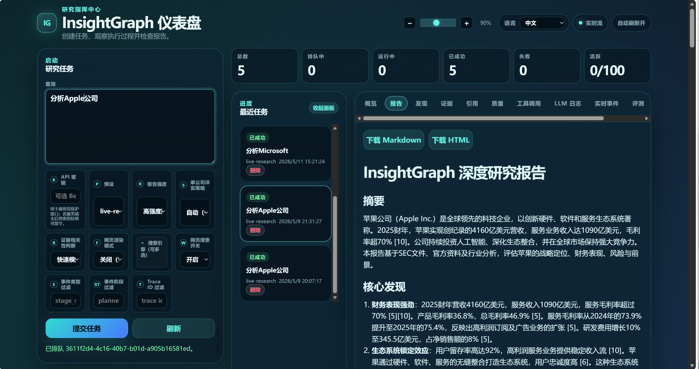
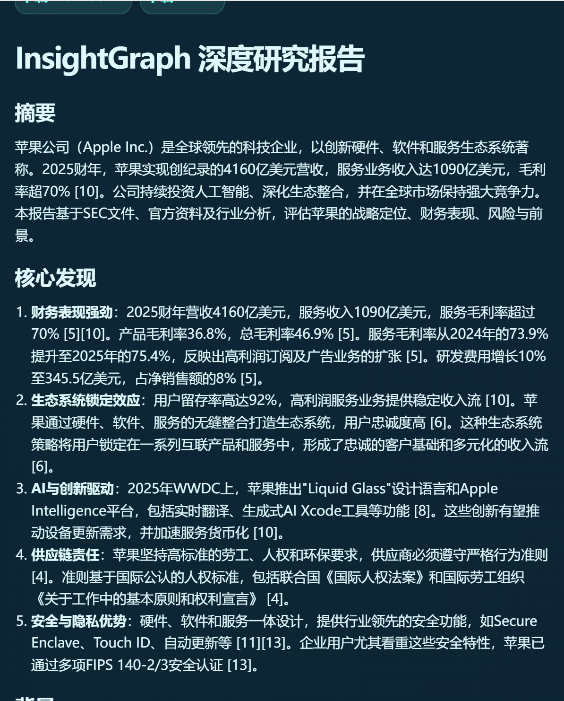
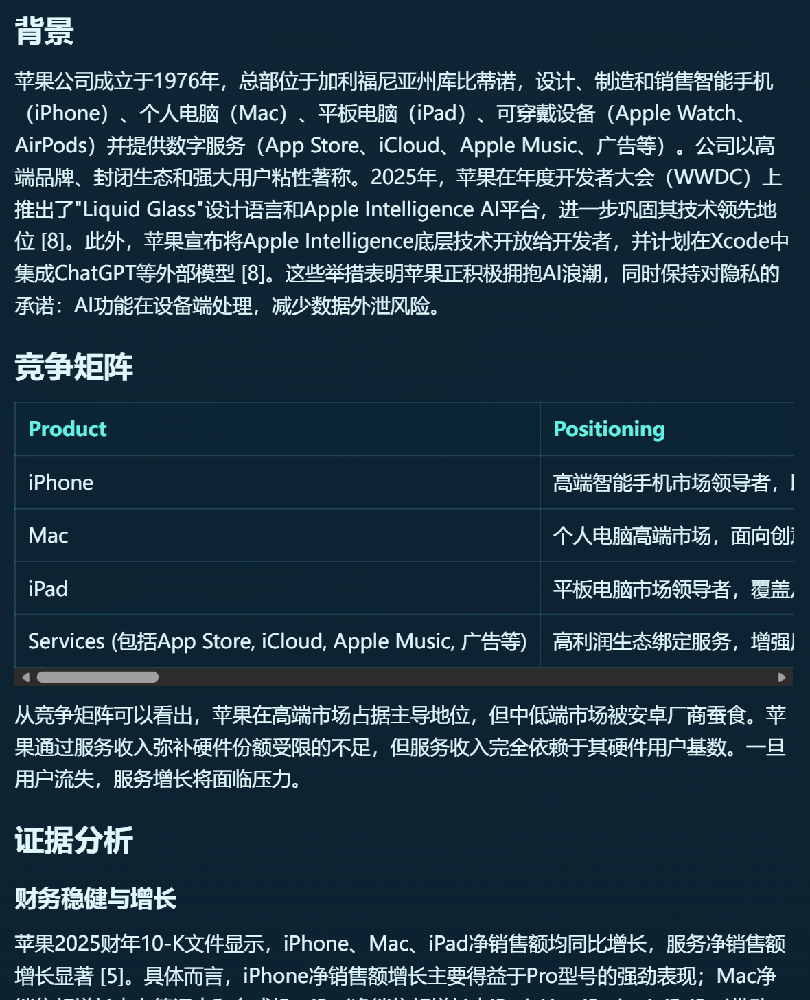
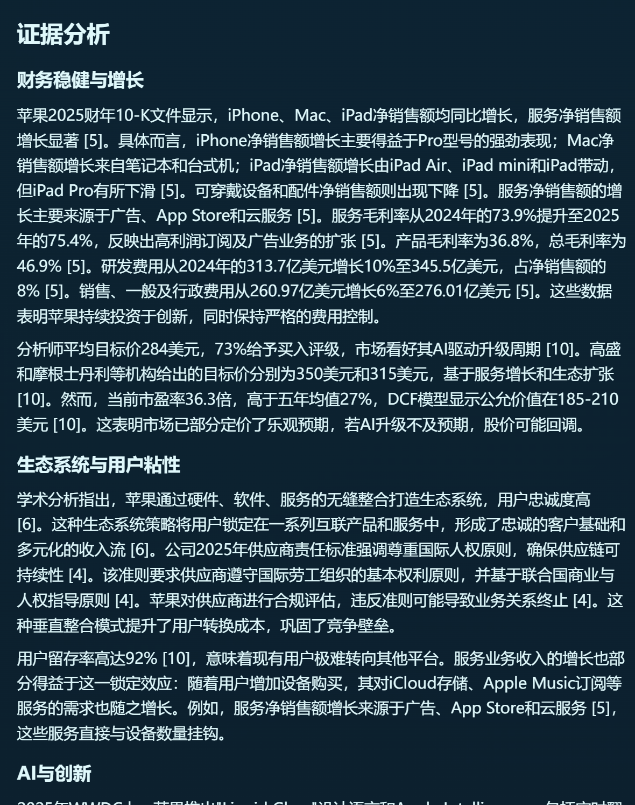
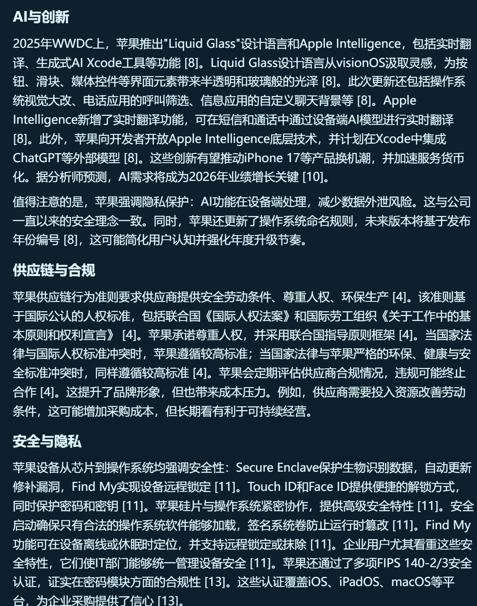
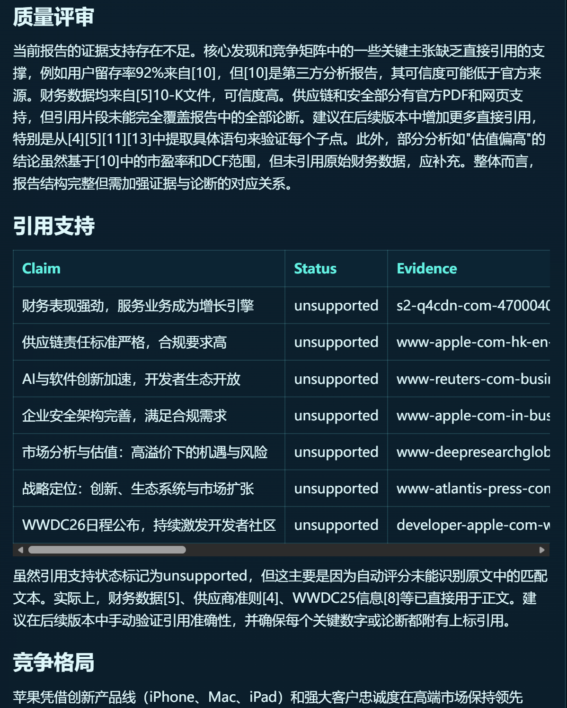
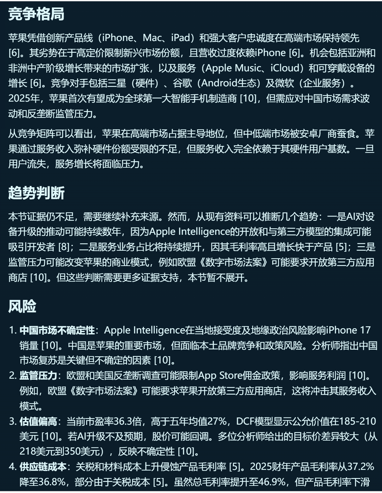
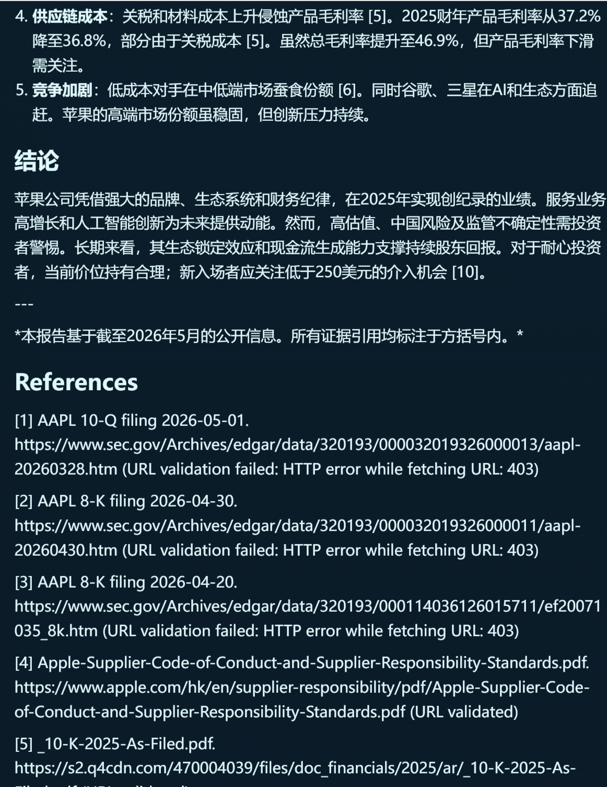

---

## 项目结构

```text
src/insight_graph/
├── agents/                         # 多智能体核心
│   ├── planner.py                  # 任务分解、实体识别、章节规划
│   ├── collector.py                # 多源采集与查询策略展开
│   ├── executor.py                 # 多轮工具调用、预算控制、证据汇聚
│   ├── analyst.py                  # 发现提炼、竞争矩阵、长报告素材整理
│   ├── critic.py                   # 质量评审、引用支撑检查、replan 决策
│   ├── reporter.py                 # 报告生成、引用过滤、URL 校验、报告复审
│   └── relevance.py                # relevance judge 边界
├── tools/                          # 搜索、抓取、文档、GitHub、SEC、本地文件工具
├── report_quality/                 # 领域配置、研究计划、证据评分、引用支持、报告评估
├── llm/                            # OpenAI-compatible 客户端、路由、trace 和观测
├── memory/                         # 长期记忆、embedding、report writeback
├── persistence/                    # checkpoint store 与 migrations
├── api.py                          # FastAPI REST + WebSocket + Dashboard 路由
├── dashboard.py                    # 零构建前端控制台
├── eval.py                         # 离线评测与 live benchmark 汇总
├── graph.py                        # LangGraph StateGraph 编排
├── research_jobs.py                # 异步任务生命周期与服务层契约
├── research_jobs_sqlite_backend.py # SQLite jobs backend + worker lease
└── state.py                        # GraphState、Evidence、Finding、Critique 等模型
```

---

## 核心特性

| 特性 | 说明 |
|------|------|
| **多智能体编排** | Planner -> Collector/Executor -> Analyst -> Critic -> Reporter，支持 Critic 打回 replan / recollect |
| **证据优先报告** | 报告结论、引用和 References 基于当前证据池构建，不依赖自由发挥的模型记忆 |
| **多源研究输入** | 支持 web search、GitHub、SEC、PDF/HTML 抓取、本地文档、长期记忆上下文 |
| **异步任务体系** | 提供 `/research/jobs`、任务摘要、实时流、取消、重试、Markdown/HTML 导出 |
| **持久化与恢复** | jobs 支持 in-memory / JSON / SQLite；checkpoint 支持 memory / PostgreSQL；memory 支持 memory / pgvector |
| **可观测执行链路** | runtime diagnostics、tool/LLM log、quality cards、citation support、URL validation、dashboard events |
| **高质量长报告** | 支持多档报告强度、单公司深挖、引用支持检查、报告复审、质量评审面板 |

---

## 技术架构

```text
Client (CLI / API / Dashboard)
  -> LangGraph StateGraph
  -> Planner -> Collector/Executor -> Analyst -> Critic -> Reporter
  -> Search / fetch / GitHub / SEC / local document tools
  -> Evidence scoring / citation support / report quality review
  -> Markdown report / JSON diagnostics / optional memory writeback
```

---

## 整体执行流程

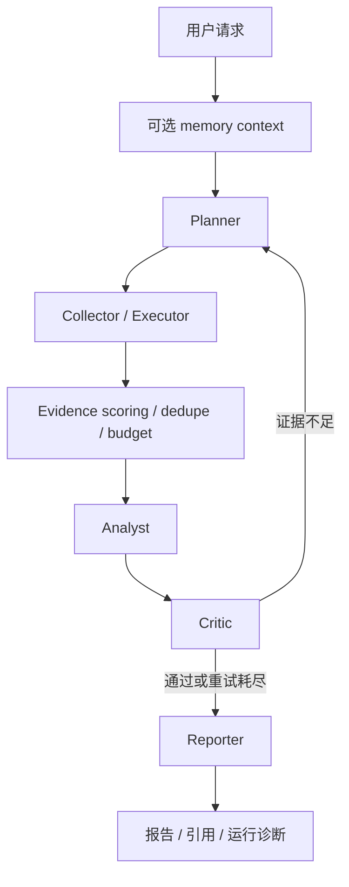

---

## 多智能体协作流程

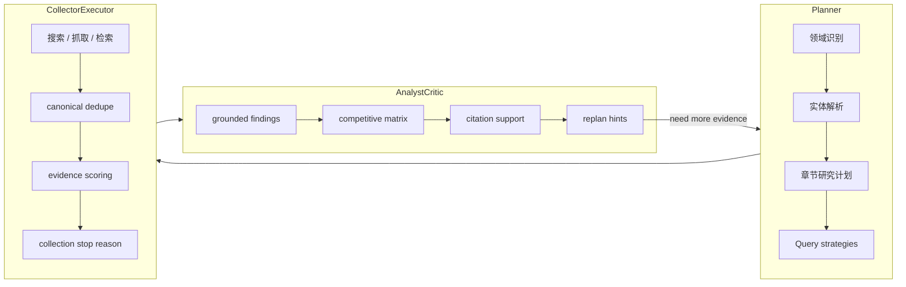

---

## 数据流与证据链路

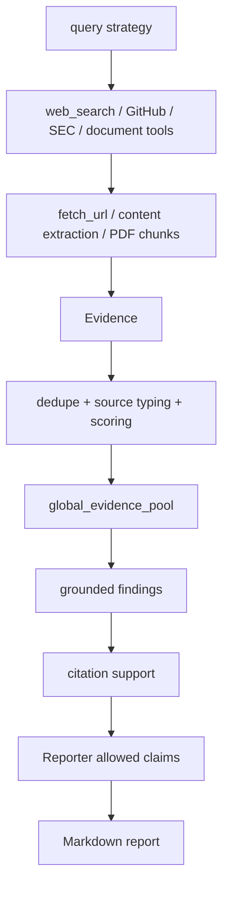

---

## 技术栈

| 层级 | 技术 |
|------|------|
| 编排 | LangGraph、LangChain Core |
| API | FastAPI、WebSocket |
| CLI | Typer、Rich |
| 模型 | Pydantic |
| 搜索与抓取 | DuckDuckGo via `ddgs`、SerpAPI、Google、urllib、BeautifulSoup、pypdf |
| 数据源 | GitHub REST、SEC submissions / companyfacts、本地文档 |
| LLM | OpenAI-compatible / local / self-hosted providers |
| 存储 | in-memory、JSON、SQLite、PostgreSQL checkpoint、pgvector memory |
| 观测 | trace_id、LLM trace、Dashboard、Eval Bench |

---

## 内置工具

| 工具 | 用途 |
|------|------|
| `mock_search` | 离线 deterministic evidence |
| `web_search` | 联网搜索，支持 `mock` / `duckduckgo` / `google` / `serpapi` |
| `pre_fetch` | 对搜索结果做 bounded fetch |
| `fetch_url` | 抓取 HTML / PDF 并生成 evidence chunks |
| `github_search` | GitHub 仓库、README、release 风格证据 |
| `sec_filings` | SEC filings 证据 |
| `sec_financials` | SEC companyfacts 财务证据 |
| `news_search` | 产品公告 / 新闻证据 |
| `document_reader` | 读取本地 TXT / Markdown / HTML / PDF |
| `search_document` | 本地文档 query / page / section 检索 |
| `read_file` / `list_directory` / `write_file` | 本地文件只读 / create-only 边界工具 |

---

## 执行链路详解

### 1. Planner

- 识别领域、实体、章节、研究策略
- 结合 `memory_context` 和 `tried_strategies` 生成新一轮 query strategies
- 为单公司分析、多公司对比、趋势研究提供不同策略展开

### 2. Collector / Executor

- 执行多轮工具调用
- 对 URL 做 canonical dedupe
- 保留 provider、rank、query、snippet、source_type、fetch diagnostics
- 受 `MAX_TOOL_CALLS`、`MAX_FETCHES`、`MAX_EVIDENCE_PER_RUN`、`MAX_TOKENS` 等预算约束

### 3. Analyst

- 基于当前 evidence pool 生成 grounded findings
- 形成 competitive matrix、section draft、趋势判断与风险列表
- 不把未验证的“模型记忆”当作报告事实

### 4. Critic

- 检查 citation support、source diversity、unsupported claims、章节覆盖
- 当证据不足时给出更具体的 replan hints
- 控制是否继续回到 Planner / Collector 补证据

### 5. Reporter

- 仅从允许的结论和 verified evidence 生成长篇 Markdown 报告
- 支持 URL validation、report review、References 重建
- 输出摘要、核心发现、背景、矩阵、证据分析、风险、结论和引用

### 6. 持久化与恢复

- jobs：in-memory / JSON / SQLite
- checkpoint：memory / PostgreSQL
- memory：memory / pgvector
- `INSIGHT_GRAPH_RESEARCH_JOBS_STARTUP_WORKER=1` 与 `INSIGHT_GRAPH_CHECKPOINT_RESUME=1` 支持重启后的任务续跑路径

---

## 示例输出

从当前 Dashboard 与报告页面可以直接看到：

- 任务控制台与状态卡片
- 最近任务与实时事件
- 长篇中文报告页
- 竞争矩阵、证据分析、质量评审、引用支持、References
- Markdown / HTML 下载

上面的截图就是当前项目实际输出界面和报告样式，不是静态示意图。

---

## 效果与亮点

- **界面与报告一体化**：提交任务、观察执行、查看报告、核对证据都在同一套 Dashboard 内完成
- **可追溯**：报告中的关键论断可回到 citation support、URL validation 和 evidence drilldown
- **单公司深挖能力**：对单一公司任务会展开更细实体与章节覆盖，报告显著更充实
- **演示友好**：异步任务、实时流、报告下载、LLM 日志和质量面板都适合现场演示
- **离线也能测**：默认路径仍是 deterministic / offline，方便本地验证与 CI

---

## 快速开始

### 环境要求

- Python 3.11+
- 可选：OpenAI-compatible LLM endpoint
- 可选：DuckDuckGo / SerpAPI / Google 搜索配置

### 安装

```bash
git clone https://github.com/Caser-86/InsightGraph.git
cd InsightGraph
python -m venv .venv
source .venv/bin/activate  # Windows: .\.venv\Scripts\Activate.ps1
python -m pip install -e ".[dev]"
```

### 离线模式

```bash
insight-graph research "Compare Cursor, OpenCode, and GitHub Copilot"
```

### live-research 模式

```bash
insight-graph research --preset live-research "Compare Cursor, OpenCode, and GitHub Copilot"
```

### 启动 API 与 Dashboard

```bash
python -m pip install "uvicorn[standard]"
uvicorn insight_graph.api:app --host 127.0.0.1 --port 8000
```

- Health: `http://127.0.0.1:8000/health`
- OpenAPI: `http://127.0.0.1:8000/docs`
- Dashboard: `http://127.0.0.1:8000/dashboard`

---

## 配置说明

核心产品路径：

- `offline`：默认 deterministic 测试 / CI 路径
- `live-llm`：轻量 web search + LLM 路径
- `live-research`：当前正式 live 产品路径

关键变量示例：

| 变量 | 说明 |
|------|------|
| `INSIGHT_GRAPH_API_KEY` | API 鉴权 |
| `INSIGHT_GRAPH_SEARCH_PROVIDER` | `mock` / `duckduckgo` / `google` / `serpapi` |
| `INSIGHT_GRAPH_SERPAPI_KEY` | SerpAPI key |
| `INSIGHT_GRAPH_LLM_BASE_URL` | OpenAI-compatible endpoint |
| `INSIGHT_GRAPH_LLM_API_KEY` | LLM API key |
| `INSIGHT_GRAPH_REPORT_INTENSITY` | 报告强度 |
| `INSIGHT_GRAPH_RESEARCH_JOBS_BACKEND` | `memory` / `sqlite` |
| `INSIGHT_GRAPH_RESEARCH_JOBS_SQLITE_PATH` | SQLite jobs 路径 |
| `INSIGHT_GRAPH_RESEARCH_JOBS_STARTUP_WORKER` | 启动时 claim 队列任务 |
| `INSIGHT_GRAPH_CHECKPOINT_RESUME` | checkpoint resume 开关 |
| `INSIGHT_GRAPH_MEMORY_BACKEND` | `memory` / `pgvector` |
| `INSIGHT_GRAPH_MEMORY_WRITEBACK` | 报告写回长期记忆 |

更完整配置见：

- `docs/configuration.md`
- `docs/configuration.zh-CN.md`

---

## 脚本

| 脚本 | 用途 |
|------|------|
| `scripts/run_research.py` | 运行一次研究任务 |
| `scripts/run_with_llm_log.py` | 运行任务并输出安全 LLM 日志 |
| `scripts/benchmark_research.py` | 离线 benchmark |
| `scripts/benchmark_live_research.py` | 手动 opt-in live benchmark |
| `scripts/validate_sources.py` | 离线引用与来源检查 |
| `scripts/validate_document_reader.py` | 本地文档读取验证 |
| `scripts/validate_pdf_fetch.py` | PDF 抓取与检索验证 |
| `insight-graph-smoke` | API / Dashboard 部署 smoke 测试 |

---

## 文档导航

### 中文文档

- `docs/README.zh-CN.md`
- `docs/API.zh-CN.md`
- `docs/architecture.zh-CN.md`
- `docs/configuration.zh-CN.md`
- `docs/deployment.zh-CN.md`
- `docs/research-jobs-api.zh-CN.md`
- `docs/scripts.zh-CN.md`
- `docs/BENCHMARKS.zh-CN.md`
- `docs/demo.md`
- `docs/FAQ.md`
- `docs/roadmap-cn.md`

### 英文参考

- `docs/README.md`
- `docs/API.md`
- `docs/architecture.md`
- `docs/configuration.md`
- `docs/deployment.md`
- `docs/research-jobs-api.md`
- `docs/scripts.md`
- `docs/BENCHMARKS.md`
- `docs/roadmap.md`

---

## 安全边界

- 当前唯一正式 live 产品路径是 `live-research`
- 离线路径继续作为 deterministic 测试与 CI fallback
- MCP runtime invocation 默认未启用
- real sandboxed Python/code execution 默认未启用

---

Do not commit generated live benchmark reports.

---

## License

MIT
