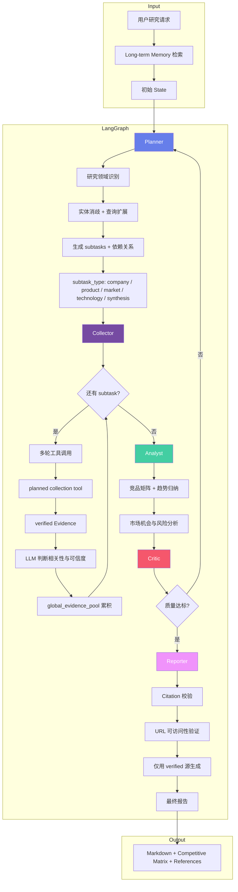
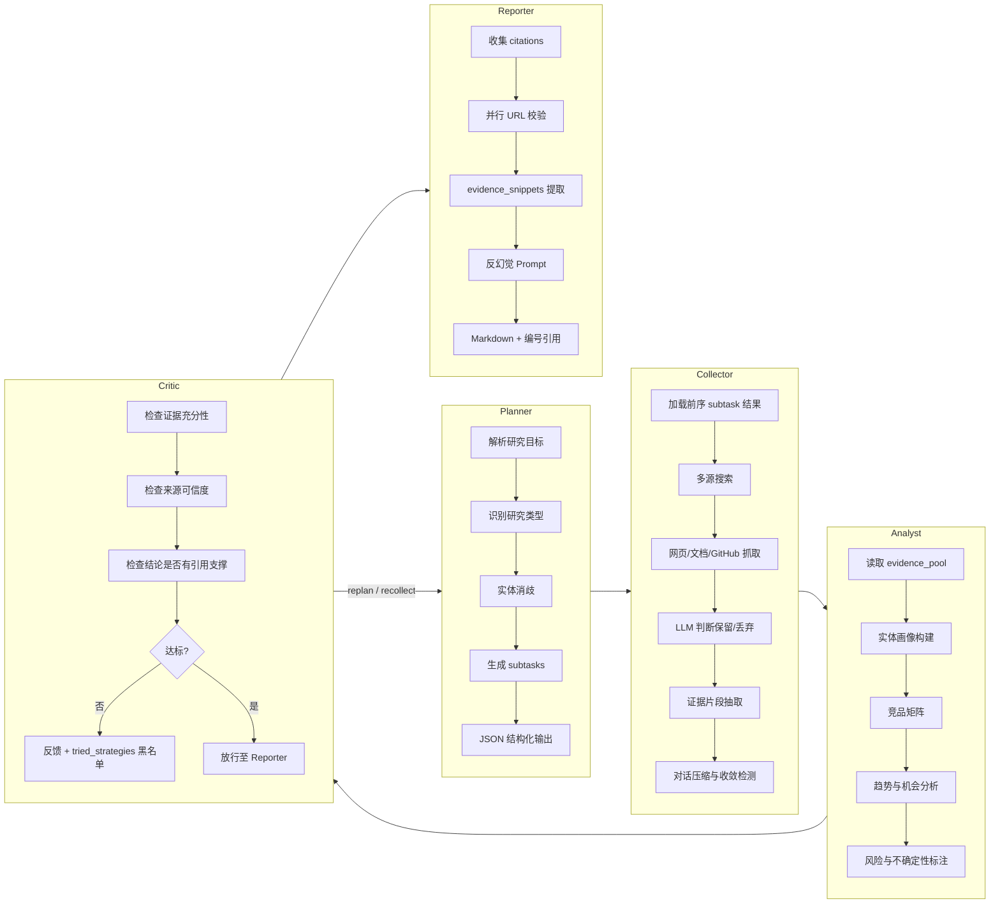
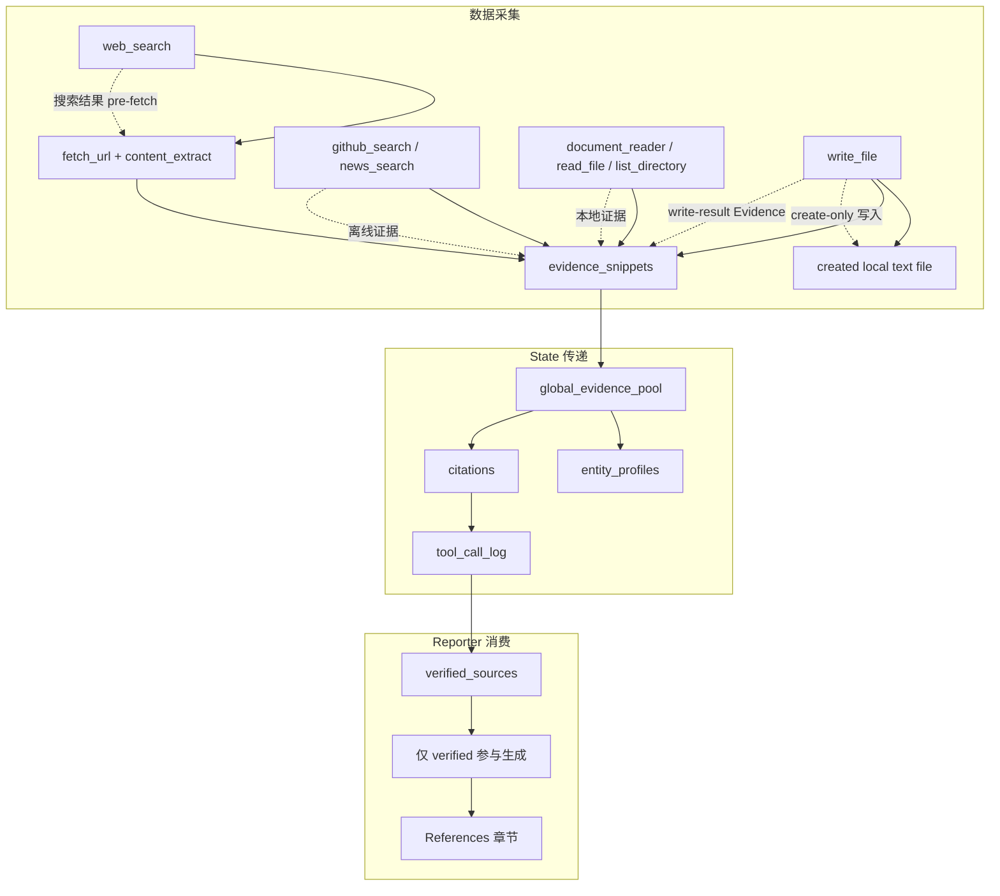

# InsightGraph

基于 LangGraph 的多智能体商业情报研究引擎，面向竞品分析、技术趋势、市场机会识别与产业洞察等场景的深度报告自动生成。支持任务分解、多轮工具调用、Critic 闭环纠错、证据溯源与引用校验，产出带可验证来源的结构化研究报告。

> 当前仓库处于 MVP 架构落地阶段：优先实现可测试的 LangGraph 多智能体研究流骨架，再逐步接入真实搜索、持久化、向量记忆与 Web API。

## 当前 MVP 已实现

| 能力 | 状态 |
|------|------|
| LangGraph 工作流 | 已实现 Planner → Collector → Analyst → Critic → Reporter 的可运行状态图 |
| CLI | 已实现 `insight-graph research "..."` / `python -m insight_graph.cli research "..."` |
| 证据链 | 已实现 deterministic `mock_search`、direct URL `fetch_url`、默认 mock `web_search -> pre_fetch -> fetch_url`，并支持 opt-in DuckDuckGo provider；报告引用仅来自 verified evidence |
| Analyst | 默认 `deterministic`，离线且不调用真实 LLM；可通过 `INSIGHT_GRAPH_ANALYST_PROVIDER=llm` opt-in 使用 OpenAI-compatible LLM 生成 evidence-grounded findings |
| Reporter | 默认 deterministic/offline；可通过 `INSIGHT_GRAPH_REPORTER_PROVIDER=llm` opt-in 使用 OpenAI-compatible LLM 生成更专业的报告正文，References 仍由系统基于 verified evidence 生成 |
| Critic | 已实现证据数量、分析结果、citation support 检查；失败路径最多重试一次后输出失败评估 |
| 测试 | 已实现 pytest 覆盖 state、agents、graph、CLI |

> MVP 阶段默认 CLI 仍使用固定 mock evidence，适合验证架构闭环；工具层已支持 direct URL 抓取、HTML evidence 提取、默认 mock web_search pre-fetch 链路，以及通过 `INSIGHT_GRAPH_SEARCH_PROVIDER=duckduckgo` 启用的 DuckDuckGo 搜索入口。当前已有 OpenAI-compatible LLM 层供 Analyst/Reporter opt-in 使用；更完整的多 provider LLM 路由和可观测性属于后续路线图。

### Search Provider 配置

`web_search` 默认使用 deterministic mock provider，测试和默认 CLI 不访问公网。需要在工具层使用真实搜索时，可显式启用 DuckDuckGo 后直接调用 `web_search` 或通过 `ToolRegistry` 运行该工具：

```bash
INSIGHT_GRAPH_SEARCH_PROVIDER=duckduckgo INSIGHT_GRAPH_SEARCH_LIMIT=3 python -c "from insight_graph.tools.web_search import web_search; print(web_search('Compare Cursor, OpenCode, and GitHub Copilot'))"
```

当前 CLI 的 Planner 默认仍选择 `mock_search`，不会因为设置 DuckDuckGo provider 而自动联网。需要让研究流调用 `web_search` 时，显式设置 `INSIGHT_GRAPH_USE_WEB_SEARCH=1`；此时 `INSIGHT_GRAPH_SEARCH_PROVIDER` 再决定 `web_search` 使用 mock provider 还是 DuckDuckGo provider。

需要只采集 GitHub 风格证据而不访问公网时，可设置 `INSIGHT_GRAPH_USE_GITHUB_SEARCH=1`。第一版 `github_search` 是 deterministic/offline 工具，返回稳定 verified GitHub evidence，不调用 GitHub API、不需要 token，也不受 rate limit 影响。后续 live GitHub provider 会单独设计。

需要只采集新闻和产品公告风格证据而不访问公网时，可设置 `INSIGHT_GRAPH_USE_NEWS_SEARCH=1`。第一版 `news_search` 是 deterministic/offline 工具，返回稳定 verified news evidence，不调用新闻 API、不需要 token，也不受 rate limit 影响。若同时启用 `INSIGHT_GRAPH_USE_WEB_SEARCH` 或 `INSIGHT_GRAPH_USE_GITHUB_SEARCH`，Planner 会按 web search、GitHub search、news search、mock search 的顺序选择第一个启用工具。

需要从本地 TXT/Markdown/HTML/PDF 文档生成 evidence 时，可设置 `INSIGHT_GRAPH_USE_DOCUMENT_READER=1` 并把用户请求写成本地文件路径，例如 `README.md`。当前 `document_reader` 读取当前工作目录内的 `.txt`、`.md`、`.markdown`、`.html`、`.htm`、`.pdf` 文件；长文档会返回最多 5 条 500 字符 snippets，并在相邻 snippets 间保留 100 字符重叠；也可用 JSON 输入提供检索词，例如 `{"path":"report.pdf","query":"enterprise pricing"}`，此时会用 deterministic lexical matching 排序 chunks，不调用 embedding 或 LLM。不读取工作目录外路径、不读取 URL，也不做 PDF OCR、页级分页或向量语义检索。若同时启用搜索工具，Planner 会按 web search、GitHub search、news search、document reader、mock search 的顺序选择第一个启用工具。

需要安全浏览本地项目素材时，可使用只读文件工具：`INSIGHT_GRAPH_USE_READ_FILE=1` 将用户请求作为 cwd 内安全文本文件路径读取，当前支持 `.txt`、`.md`、`.markdown`、`.py`、`.json`、`.toml`、`.yaml`、`.yml` 且单文件不超过 64 KiB；`INSIGHT_GRAPH_USE_LIST_DIRECTORY=1` 将用户请求作为 cwd 内目录路径列出一层内容。第一版只读文件工具不会写文件、不会递归扫描、不会读取工作目录外路径，也不会执行代码。`INSIGHT_GRAPH_USE_WRITE_FILE=1` 将用户请求作为 JSON 写入请求处理，格式为 `{"path":"notes.md","content":"Notes."}`。第一版 `write_file` 只会在 cwd 内创建新的安全文本文件，不覆盖已有文件、不自动创建父目录、不执行代码；若同时启用 read/list 工具，Planner 优先选择只读工具。

| 变量 | 说明 | 默认值 |
|------|------|--------|
| `INSIGHT_GRAPH_USE_WEB_SEARCH` | `1` / `true` / `yes` 时 Planner collect subtask 使用 `web_search` | 未启用 |
| `INSIGHT_GRAPH_USE_GITHUB_SEARCH` | `1` / `true` / `yes` 时 Planner collect subtask 使用 deterministic `github_search`；若同时启用 web search，则 web search 优先 | 未启用 |
| `INSIGHT_GRAPH_USE_NEWS_SEARCH` | `1` / `true` / `yes` 时 Planner collect subtask 使用 deterministic `news_search`；若同时启用 web 或 GitHub search，则前者优先 | 未启用 |
| `INSIGHT_GRAPH_USE_DOCUMENT_READER` | `1` / `true` / `yes` 时 Planner collect subtask 使用本地 `document_reader`；若同时启用搜索工具，则搜索工具优先 | 未启用 |
| `INSIGHT_GRAPH_USE_READ_FILE` | `1` / `true` / `yes` 时 Planner collect subtask 使用本地只读 `read_file`；搜索工具和 `document_reader` 优先 | 未启用 |
| `INSIGHT_GRAPH_USE_LIST_DIRECTORY` | `1` / `true` / `yes` 时 Planner collect subtask 使用本地只读 `list_directory`；搜索工具、`document_reader` 和 `read_file` 优先 | 未启用 |
| `INSIGHT_GRAPH_USE_WRITE_FILE` | `1` / `true` / `yes` 时 Planner collect subtask 使用 create-only `write_file`；搜索工具、`document_reader`、`read_file` 和 `list_directory` 优先 | 未启用 |
| `INSIGHT_GRAPH_SEARCH_PROVIDER` | `mock` 或 `duckduckgo` | `mock` |
| `INSIGHT_GRAPH_SEARCH_LIMIT` | `web_search` 候选 URL pre-fetch 数量 | `3` |

当前 Executor 是第一阶段实现：它会执行 planned tools、记录 `tool_call_log`、维护 `global_evidence_pool` 并去重 evidence；relevance 判断默认使用 deterministic/offline 流程，OpenAI-compatible LLM relevance 可通过环境变量配置启用，尚未包含多轮 agentic tool loop、conversation compression 或收敛检测。

Relevance filtering 默认关闭。需要过滤工具返回的 evidence 时，可显式启用 deterministic/offline judge：

```bash
INSIGHT_GRAPH_RELEVANCE_FILTER=1 python -m insight_graph.cli research "Compare Cursor, OpenCode, and GitHub Copilot"
```

| 变量 | 说明 | 默认值 |
|------|------|--------|
| `INSIGHT_GRAPH_RELEVANCE_FILTER` | `1` / `true` / `yes` 时启用 Executor evidence relevance filtering | 未启用 |
| `INSIGHT_GRAPH_RELEVANCE_JUDGE` | Relevance judge 类型，支持 `deterministic` 或 `openai_compatible` | `deterministic` |
| `INSIGHT_GRAPH_LLM_API_KEY` | OpenAI-compatible provider API key；未设置时回退到 `OPENAI_API_KEY` | - |
| `INSIGHT_GRAPH_LLM_BASE_URL` | OpenAI-compatible `/v1` endpoint；未设置时回退到 `OPENAI_BASE_URL` | - |
| `INSIGHT_GRAPH_LLM_MODEL` | OpenAI-compatible relevance model | `gpt-4o-mini` |
| `INSIGHT_GRAPH_LLM_WIRE_API` | OpenAI-compatible wire API，支持 `chat_completions` 或 `responses`；`responses` 需 provider 支持 `/v1/responses` | `chat_completions` |

默认 `deterministic` judge 不调用真实 LLM，适合离线过滤：未 verified 或缺少 title/source URL/snippet 的 evidence 会被丢弃。需要真实 LLM relevance 判断时，可设置 `INSIGHT_GRAPH_RELEVANCE_JUDGE=openai_compatible`，并通过 API key、base URL 和 model 指向 OpenAI-compatible provider。

OpenAI-compatible relay 示例：

```bash
INSIGHT_GRAPH_RELEVANCE_FILTER=1 \
INSIGHT_GRAPH_RELEVANCE_JUDGE=openai_compatible \
INSIGHT_GRAPH_LLM_API_KEY=sk-your-relay-key \
INSIGHT_GRAPH_LLM_BASE_URL=https://relay.example.com/v1 \
INSIGHT_GRAPH_LLM_MODEL=gpt-4o-mini \
python -m insight_graph.cli research "Compare Cursor, OpenCode, and GitHub Copilot"
```

### LLM Analyst 配置

Analyst 默认使用 `deterministic` provider，离线且不调用真实 LLM，适合本地开发、测试和 CLI smoke。需要 OpenAI-compatible LLM 生成 evidence-grounded findings 时，可显式 opt-in：

```bash
INSIGHT_GRAPH_ANALYST_PROVIDER=llm \
INSIGHT_GRAPH_LLM_API_KEY=sk-your-relay-key \
INSIGHT_GRAPH_LLM_BASE_URL=https://relay.example.com/v1 \
INSIGHT_GRAPH_LLM_MODEL=gpt-4o-mini \
python -m insight_graph.cli research "Compare Cursor, OpenCode, and GitHub Copilot"
```

| 变量 | 说明 | 默认值 |
|------|------|--------|
| `INSIGHT_GRAPH_ANALYST_PROVIDER` | Analyst provider 类型，支持默认离线行为的 `deterministic` 或 `llm` opt-in | `deterministic` |
| `INSIGHT_GRAPH_LLM_API_KEY` | OpenAI-compatible provider API key；未设置时回退到 `OPENAI_API_KEY` | - |
| `INSIGHT_GRAPH_LLM_BASE_URL` | OpenAI-compatible `/v1` endpoint；未设置时回退到 `OPENAI_BASE_URL` | - |
| `INSIGHT_GRAPH_LLM_MODEL` | OpenAI-compatible Analyst model | `gpt-4o-mini` |
| `INSIGHT_GRAPH_LLM_WIRE_API` | OpenAI-compatible wire API，支持 `chat_completions` 或 `responses`；`responses` 需 provider 支持 `/v1/responses` | `chat_completions` |

LLM Analyst 只接受引用当前 verified evidence ID 的 JSON findings；`competitive_matrix` 可由 LLM 提供，但每一行必须引用当前 verified evidence ID。缺少矩阵时会用 deterministic 矩阵补齐并保留有效 LLM findings；缺少 key/API、LLM 返回非 JSON、schema 不合法或矩阵引用未 verified/current evidence ID 时，会 fallback 到 deterministic Analyst。测试不调用外部 LLM。

### LLM Reporter 配置

Reporter 默认使用 deterministic/offline provider，离线且不调用真实 LLM，适合本地开发、测试和 CLI smoke。需要 OpenAI-compatible LLM 生成更专业的报告正文时，可显式 opt-in：

```bash
INSIGHT_GRAPH_REPORTER_PROVIDER=llm \
INSIGHT_GRAPH_LLM_API_KEY=sk-your-relay-key \
INSIGHT_GRAPH_LLM_BASE_URL=https://relay.example.com/v1 \
INSIGHT_GRAPH_LLM_MODEL=gpt-4o-mini \
python -m insight_graph.cli research "Compare Cursor, OpenCode, and GitHub Copilot"
```

| 变量 | 说明 | 默认值 |
|------|------|--------|
| `INSIGHT_GRAPH_REPORTER_PROVIDER` | Reporter provider 类型，支持默认离线行为的 `deterministic` 或 `llm` opt-in | `deterministic` |
| `INSIGHT_GRAPH_LLM_API_KEY` | OpenAI-compatible provider API key；未设置时回退到 `OPENAI_API_KEY` | - |
| `INSIGHT_GRAPH_LLM_BASE_URL` | OpenAI-compatible `/v1` endpoint；未设置时回退到 `OPENAI_BASE_URL` | - |
| `INSIGHT_GRAPH_LLM_MODEL` | OpenAI-compatible Reporter model | `gpt-4o-mini` |
| `INSIGHT_GRAPH_LLM_WIRE_API` | OpenAI-compatible wire API，支持 `chat_completions` 或 `responses`；`responses` 需 provider 支持 `/v1/responses` | `chat_completions` |

LLM Reporter 只生成报告正文；最终 References 由系统根据 verified evidence 重建。LLM 返回的 fake References 会被丢弃；缺失 `Competitive Matrix` 时会确定性补齐矩阵并保留有效 LLM findings，无法映射到合法引用的矩阵会被替换为 deterministic 矩阵；非法 citation 会 fallback 到 deterministic Reporter。测试不调用外部 LLM。

### Live LLM Preset

The default CLI remains deterministic/offline:

```bash
python -m insight_graph.cli research "Compare Cursor, OpenCode, and GitHub Copilot"
```

To enable the live pipeline with one explicit switch, configure your LLM endpoint and use `--preset live-llm`:

```bash
INSIGHT_GRAPH_LLM_API_KEY=sk-your-relay-key \
INSIGHT_GRAPH_LLM_BASE_URL=https://relay.example.com/v1 \
INSIGHT_GRAPH_LLM_MODEL=gpt-4o-mini \
python -m insight_graph.cli research "Compare Cursor, OpenCode, and GitHub Copilot" --preset live-llm
```

`live-llm` applies missing runtime defaults for DuckDuckGo search, relevance filtering, OpenAI-compatible relevance judging, LLM Analyst, and LLM Reporter. It does not permanently modify your environment and does not accept API keys as command-line arguments.

`live-llm` does not set `INSIGHT_GRAPH_LLM_WIRE_API`; by default LLM calls use Chat Completions. To test a provider's Responses API support, explicitly set `INSIGHT_GRAPH_LLM_WIRE_API=responses`. If the provider does not support `/v1/responses` or the JSON response format, InsightGraph records the sanitized failure in `llm_call_log` and does not automatically fall back to Chat Completions.

If live `web_search` returns no evidence or fails, the executor records the failed `web_search` attempt and falls back to deterministic `mock_search` evidence. This keeps live smoke/demo runs from producing empty reports while making the fallback visible in `tool_call_log` and `--output-json`.

### LLM Observability

Live LLM paths populate `GraphState.llm_call_log` with metadata for attempted LLM calls. Each record includes the stage (`relevance`, `analyst`, or `reporter`), provider, model, configured wire API when available, success flag, duration in milliseconds, and a short sanitized error summary when a call fails. When the provider returns usage data, records also include nullable `input_tokens`, `output_tokens`, and `total_tokens` fields. InsightGraph does not estimate cost in this version.

The log is in-memory only for this MVP. It does not store prompts, completions, raw response JSON, API keys, authorization headers, or request bodies.

Use `--show-llm-log` to append the in-memory LLM call metadata after the Markdown report:

```bash
python -m insight_graph.cli research "Compare Cursor, OpenCode, and GitHub Copilot" --preset live-llm --show-llm-log
```

The appended table is opt-in and contains only stage, provider, model, wire API when available, success, duration, token counts when available, and sanitized error metadata.

Use `--output-json` when scripts need a structured summary instead of Markdown:

```bash
python -m insight_graph.cli research "Compare Cursor, OpenCode, and GitHub Copilot" --output-json
```

JSON output includes `user_request`, `report_markdown`, `findings`, `competitive_matrix`, `critique`, `tool_call_log`, `llm_call_log`, and `iterations`. It intentionally omits `evidence_pool` and `global_evidence_pool` to avoid dumping fetched snippets. If `--output-json` and `--show-llm-log` are both provided, JSON output takes precedence.

---

## 目标项目结构（蓝图）

```text
src/insight_graph/
├── agents/                    # 多智能体核心
│   ├── planner.py             # 研究目标解析与任务分解
│   ├── collector.py           # 多源信息采集与工具调用
│   ├── analyst.py             # 竞品矩阵、趋势归纳与商业分析
│   ├── evidence_validator.py  # URL、引用片段与来源可信度校验
│   ├── critic.py              # 质量评审与 replan 决策
│   ├── reporter.py            # 引用校验 + 报告生成
│   ├── graph.py               # LangGraph 状态图编排
│   ├── state.py               # GraphState 定义
│   ├── source_policy.py       # 数据源优先级与可信度策略
│   ├── entity_resolver.py     # 公司、产品、技术名实体消歧
│   └── domains/               # 可插拔研究领域配置
│       ├── competitive_intel.md
│       ├── technology_trends.md
│       ├── market_research.md
│       └── generic.md
├── tools/
│   ├── builtin/               # 内置工具集
│   │   ├── web_search.py, news_search.py, http_client.py
│   │   ├── content_extract.py, document_reader.py
│   │   ├── github_search.py, code_exec.py, file_ops.py
│   │   └── ...
│   ├── registry.py            # MCP / 本地工具注册表
│   └── executor.py            # 工具执行引擎
├── llm/                       # LLM 提供方与模型路由
│   ├── openai.py
│   ├── qwen.py
│   ├── anthropic.py
│   └── router.py
├── api/                       # FastAPI REST + WebSocket
├── memory/                    # pgvector 长期记忆
├── persistence/               # PostgreSQL checkpoint 持久化
├── budget/                    # Token / 步数 / 工具调用预算控制
├── observability/             # LLM 调用日志与执行链路追踪
└── settings.py                # 全局配置
```

---

## 目标核心特性（蓝图）

| 特性 | 说明 |
|------|------|
| **多智能体编排** | Planner → Collector → Analyst → Critic → Reporter，支持 Critic 打回 replan 闭环纠错 |
| **商业情报建模** | 支持竞品、公司、产品、技术、市场、价格、融资、生态合作等实体分析 |
| **领域自适应** | 可插拔领域配置（`domains/*.md`），按研究主题选择数据源、搜索策略与报告模板 |
| **证据溯源链** | 从 web_search / fetch_url / github_search 到 citation 的完整链路，Reporter 仅引用 verified 源 |
| **竞品矩阵生成** | 自动提取功能、定价、定位、目标用户、技术栈、发布时间线并生成对比表 |
| **技术趋势分析** | 支持论文、博客、GitHub、产品文档、新闻源的多源交叉验证 |
| **持久化与恢复** | PostgreSQL + pgvector 存储任务状态、检查点、历史研究上下文与证据片段 |
| **全链路可观测** | 记录每次 LLM 调用、工具调用、状态转移、token 消耗与引用验证结果 |

---

## 目标技术架构（蓝图）

```text
┌───────────────────────────────────────────────────────────────────────┐
│                     FastAPI (REST + WebSocket)                        │
│              /tasks, /tasks/{id}/stream, /reports, /tools             │
└───────────────────────────────┬───────────────────────────────────────┘
                                │
┌───────────────────────────────▼───────────────────────────────────────┐
│                       LangGraph StateGraph                            │
│                                                                       │
│  ┌──────────┐   ┌───────────┐   ┌─────────┐   ┌──────────┐           │
│  │ Planner  │──▶│ Collector │──▶│ Analyst │──▶│  Critic  │           │
│  │ 任务分解  │   │ 信息采集   │   │ 分析归纳 │   │ 质量评审  │           │
│  └──────────┘   └───────────┘   └─────────┘   └────┬─────┘           │
│       ▲                                             │                 │
│       └────────────── replan / recollect ───────────┘                 │
│                                                     │                 │
│                                            ┌────────▼────────┐        │
│                                            │    Reporter     │        │
│                                            │ 报告生成 + 引用校验 │        │
│                                            └─────────────────┘        │
└───────────────────────────────┬───────────────────────────────────────┘
                                │
┌───────────────────┬───────────┴───────────┬───────────────────────────┐
│ Tool Registry     │ Long-term Memory      │ Postgres Checkpoint       │
│ web_search        │ pgvector 向量检索      │ 任务中断/恢复              │
│ news_search       │ 历史研究摘要            │ thread_id 持久化           │
│ github_search     │ 实体画像与证据片段      │ 状态快照                   │
│ fetch_url         │                       │                           │
│ document_reader   │                       │                           │
│ read_file         │                       │                           │
│ list_directory    │                       │                           │
│ write_file        │                       │                           │
└───────────────────┴───────────────────────┴───────────────────────────┘
```

---

## 整体执行流程



---

## 多智能体协作流程



---

## 数据流与证据链路



---

## 技术栈

| 层级 | 技术 |
|------|------|
| **编排** | LangGraph, LangChain |
| **LLM** | OpenAI, Anthropic, Qwen, OpenAI-compatible API |
| **结构化输出** | Pydantic, LangChain OutputParser |
| **向量检索** | pgvector, PostgreSQL, text embeddings |
| **存储** | PostgreSQL + asyncpg, SQLAlchemy 2.0 |
| **工具** | DuckDuckGo / Tavily / SerpAPI, httpx, curl-cffi, Playwright |
| **文档处理** | PyMuPDF, Trafilatura, BeautifulSoup, Markdown parser |
| **API** | FastAPI, WebSocket 流式输出 |
| **可观测** | LLM 调用日志、工具调用日志、Graph state snapshot |

---

## 内置工具

| 工具 | 用途 |
|------|------|
| `web_search` | 搜索引擎查询，获取官网、文档、新闻、博客等来源 |
| `news_search` | 新闻与公告检索，用于市场动态、融资、发布事件追踪 |
| `fetch_url` | 抓取 direct HTTP/HTTPS URL，并从 HTML 页面生成 verified Evidence |
| `content_extract` | 从 HTML 中提取标题、正文和 evidence snippet |
| `github_search` | 检索 GitHub 仓库、README、Release、Issue 和 Star 趋势 |
| `document_reader` | 当前读取 cwd 内本地 `.txt`、`.md`、`.markdown`、`.html`、`.htm`、`.pdf` 文件；长文档最多返回 5 条 bounded snippets；JSON 输入可按检索词进行 deterministic lexical ranking；PDF OCR、页级分页与向量语义检索属于后续路线图 |
| `read_file` / `list_directory` / `write_file` | 当前支持 cwd 内只读安全文本读取、一层目录列表，以及 create-only 安全文本写入 |

`code_execute` 计划用于沙箱 Python 代码执行和表格计算，当前尚未实现，将单独设计。

---

## 执行链路详解

### 1. Planner

- **输入**：`user_request` + `memory_context` + `domain_profile` + `tried_strategies`
- **输出**：`subtasks`（含 id、description、dependencies、subtask_type、suggested_tools）
- **研究类型**：支持 competitive_intel、market_research、technology_trends、company_profile、synthesis
- **Replan 支持**：Critic 打回时，根据 `tried_strategies` 避免重复失败搜索路径

### 2. Collector

- **多轮循环**：每个 subtask 最多 `MAX_TOOL_ROUNDS=5` 轮工具调用
- **多源采集**：支持 web_search、news_search、github_search、fetch_url、document_reader、read_file、list_directory；`write_file` 作为 create-only 本地文本写入工具单独 opt-in。当前 Planner collect subtask 按 opt-in 优先级选择一个主工具
- **可信度初筛**：按官网、官方文档、GitHub、权威媒体、第三方博客等来源等级排序
- **上下文控制**：超过 `MAX_CONVERSATION_CHARS` 后触发对话压缩，保留最近关键证据
- **跨 subtask 共享**：`global_evidence_pool` 供后续 Agent 复用已采集证据

### 3. Analyst

- **实体画像**：为公司、产品、技术、市场主题建立结构化 profile
- **竞品矩阵**：默认/offline Analyst 生成 evidence-backed deterministic `competitive_matrix`；`--preset live-llm` 或 LLM Analyst opt-in 时可由 LLM 提供矩阵行，但每行必须引用 verified evidence，缺失时补齐 deterministic 矩阵并保留有效 LLM findings，无效时回退 deterministic Analyst；Reporter 输出 citable `Competitive Matrix` Markdown 表格，缺失或不可引用的 LLM 矩阵会被 deterministic 矩阵补齐或替换；第一版不做排名、评分或精确定价抽取
- **趋势归纳**：从时间线、发布节奏、开源活跃度、媒体关注度中提取趋势信号
- **不确定性标注**：对缺失数据、冲突证据、低可信来源进行显式标注

### 4. Critic

- **证据充分性检查**：判断是否有足够来源支撑每个关键结论
- **来源可信度检查**：优先使用官网、文档、公告、GitHub、权威媒体等可验证来源
- **闭环控制**：质量不达标时打回 Planner 或 Collector，并限制最大 replan 次数
- **反幻觉检查**：禁止无来源数字、无依据排名、过度推断和未验证结论

### 5. Reporter

- **Citation 校验**：并行请求所有引用 URL，标记 `verified` / `unverified`
- **报告生成**：输出 Executive Summary、Competitive Matrix、Key Findings、Risks、References
- **引用格式**：`[N]` 编号对应 References 中的稳定 URL 与 evidence snippet
- **输出格式**：默认 Markdown，可扩展为 HTML、PDF、JSON report schema

### 6. 持久化与记忆

- **Checkpoint**：每节点执行后写入 PostgreSQL，支持任务中断后 `resume`
- **Long-term Memory**：pgvector 存储历史研究摘要、实体画像与证据片段
- **任务追踪**：通过 `task_id` 与 `thread_id` 关联用户请求、Graph 状态和最终报告

---

## 示例输出

以下为一次实际运行的目标形态（任务：AI Coding Agent 竞品分析）：

| 指标 | 数值 |
|------|------|
| 研究对象 | Cursor、OpenCode、Claude Code、GitHub Copilot、Codeium |
| LLM 调用次数 | 60-100 次 |
| 工具调用次数 | 120-220 次 |
| 报告长度 | 4,000-8,000 词，包含竞品矩阵与趋势判断 |
| 引用来源 | 官网、产品文档、GitHub Release、定价页、新闻报道、技术博客 |
| 运行时间 | 8-20 分钟，取决于搜索深度与引用校验数量 |

**产出报告结构**：Executive Summary → Market Overview → Competitive Matrix → Product Deep Dives → Pricing & Positioning → Technology Trends → Risks & Open Questions → References

每个关键事实均通过 `[N]` 编号关联到 References 中的具体 URL，可逐条验证。

---

## 效果与亮点

- **可验证引用**：报告中的关键事实可追溯到具体 URL 与 evidence snippet
- **闭环纠错**：Critic 评审不达标时自动 replan 或 recollect，避免证据不足直接生成
- **竞品分析友好**：内置产品定位、功能矩阵、定价、生态、路线图等分析维度
- **技术趋势友好**：支持 GitHub、论文、博客、文档、新闻多源交叉验证
- **领域可扩展**：新增研究领域仅需添加 `domains/*.md` 配置文件
- **资源可控**：`max_tokens`、`max_steps`、`max_tool_calls` 三重预算限制
- **全链路可观测**：记录每次 LLM 调用、工具调用、Graph 节点状态与 token 消耗

---

## 快速开始（当前 MVP）

### 环境要求

- Python 3.11+
- pip

### 启动步骤

```bash
# 1. 克隆并配置
git clone https://github.com/Caser-86/InsightGraph.git
cd InsightGraph

# 2. 安装依赖
python -m pip install -e ".[dev]"

# 3. 运行测试
python -m pytest -v

# 4. 执行一次 MVP 研究流
python -m insight_graph.cli research "Compare Cursor, OpenCode, and GitHub Copilot"
```

### 当前输出

- **CLI 报告**：Markdown 格式，包含 `Key Findings`、有可引用矩阵行时的 `Competitive Matrix`、`Critic Assessment`、`References`
- **结构化输出**：`--output-json` 包含 `competitive_matrix`，便于当前 API、benchmark 和后续前端复用
- **数据源**：固定 mock evidence，不进行真实联网搜索
- **API**：当前 MVP 提供同步 `GET /health` 和 `POST /research`，响应结构与 CLI `--output-json` 对齐，包含 `competitive_matrix`
- **前端 / WebSocket**：尚未实现，属于后续路线图

### API MVP

当前 API 是单进程同步 MVP，不包含 WebSocket、auth、持久化、后台任务或并行 workflow execution。`/research` 会在应用 runtime preset 环境后串行执行 workflow。

```bash
python -m pip install "uvicorn[standard]"
uvicorn insight_graph.api:app --reload
```

```bash
curl -X POST http://127.0.0.1:8000/research \
  -H "Content-Type: application/json" \
  -d '{"query":"Compare Cursor, OpenCode, and GitHub Copilot"}'
```

`uvicorn` 是运行示例依赖，不是当前 package runtime dependency。

---

## 计划配置（后续路线图）

默认 CLI 不需要环境变量；真实搜索、relevance、LLM Analyst 等能力通过上文列出的环境变量 opt-in。以下配置项用于后续接入数据库、预算控制和更多 provider 时落地。

| 变量 | 说明 | 默认值 |
|------|------|--------|
| `DEFAULT_LLM_PROVIDER` | LLM 提供方（openai / anthropic / qwen / compatible） | openai |
| `OPENAI_API_KEY` | OpenAI API Key | - |
| `ANTHROPIC_API_KEY` | Anthropic API Key | - |
| `QWEN_API_KEY` | Qwen / DashScope API Key | - |
| `SEARCH_PROVIDER` | 搜索提供方（duckduckgo / tavily / serpapi） | duckduckgo |
| `SEARCH_API_KEY` | 搜索服务 API Key | - |
| `DATABASE_URL` | PostgreSQL 连接字符串 | postgresql+asyncpg://localhost/insightgraph |
| `MAX_TOKENS` | 单任务 token 上限 | 500000 |
| `MAX_STEPS` | 最大执行步数（LLM 调用次数） | 100 |
| `MAX_TOOL_CALLS` | 最大工具调用次数 | 200 |
| `MAX_TOOL_ROUNDS` | 单个 subtask 最大工具调用轮数 | 5 |
| `EMBEDDING_DIMENSION` | 向量维度 | 1536 |

---

## 脚本状态

| 脚本 | 状态 | 用途 |
|------|------|------|
| `scripts/run_research.py` | 当前可用 | 运行 research workflow，默认输出 Markdown；支持 stdin `-`、`--preset offline\|live-llm` 和 `--output-json` 输出 CLI/API 对齐结构 |
| `scripts/run_with_llm_log.py` | 当前可用 | 运行 research workflow，stdout 输出 Markdown，并将安全 LLM metadata 写入 `llm_logs/`；不记录 prompt、completion、raw response 或 API key |
| `scripts/validate_sources.py` | 当前可用 | 离线校验 Markdown 报告 citation 与 References；支持文件路径或 stdin `-`，默认 JSON 输出，`--markdown` 输出表格；不联网校验 URL 可访问性 |
| `scripts/benchmark_research.py` | 当前可用 | 离线运行固定 benchmark cases，输出 JSON 或 `--markdown` 表格；不访问公网、不调用 LLM、不做阈值 gate |
| `scripts/validate_document_reader.py` | 当前可用 | 离线验证当前本地 TXT/Markdown/HTML/PDF `document_reader` 行为、长文档 bounded snippets 和 JSON query ranking，默认 JSON 输出，`--markdown` 输出表格；PDF OCR、页级分页与向量语义检索验证属于后续路线图 |

当前 run research 用法：

```bash
python scripts/run_research.py "Compare Cursor, OpenCode, and GitHub Copilot"
python scripts/run_research.py - < query.txt
python scripts/run_research.py "Compare Cursor, OpenCode, and GitHub Copilot" --output-json
INSIGHT_GRAPH_USE_DOCUMENT_READER=1 python scripts/run_research.py '{"path":"report.md","query":"enterprise pricing"}'
```

该脚本复用当前 research workflow。默认 `--preset offline` 不应用 live defaults；当未预先设置 opt-in 工具/LLM 环境变量时，会使用 deterministic mock evidence。显式设置的 opt-in 环境变量仍会被保留并生效，与现有 CLI 语义一致；`--preset live-llm` 会使用与 CLI 相同的 live runtime defaults。

当 `INSIGHT_GRAPH_USE_DOCUMENT_READER=1` 时，query 可以是本地文件路径，也可以是 JSON：`{"path":"report.md","query":"enterprise pricing"}`。JSON `query` 会触发 `document_reader` 的 deterministic lexical ranking，从本地文档 chunks 中优先返回词项匹配的 evidence；不使用 embeddings、LLM 或公网服务。

当前 run with LLM log 用法：

```bash
python scripts/run_with_llm_log.py "Compare Cursor, OpenCode, and GitHub Copilot"
python scripts/run_with_llm_log.py - < query.txt
python scripts/run_with_llm_log.py "Compare Cursor, OpenCode, and GitHub Copilot" --log-dir tmp_llm_logs
INSIGHT_GRAPH_USE_DOCUMENT_READER=1 python scripts/run_with_llm_log.py '{"path":"report.md","query":"enterprise pricing"}' --log-dir tmp_llm_logs
```

该脚本会把本次运行的安全 LLM metadata 写入 JSON 文件。日志包含 `tool_call_log`、`llm_call_log`、summary counts 和 iterations；不包含完整报告、完整 findings、evidence pool、prompt、completion、raw response、headers、request body 或 API key。

与 `run_research.py` 一样，当 `INSIGHT_GRAPH_USE_DOCUMENT_READER=1` 时，JSON query 会触发 `document_reader` 的 deterministic lexical ranking，并同时写入安全 metadata log；不使用 embeddings、LLM retrieval 或公网服务。

当前 benchmark 用法：

```bash
python scripts/benchmark_research.py
python scripts/benchmark_research.py --markdown
```

该脚本会在进程内清理会改变默认工具/LLM 行为的 opt-in 环境变量，确保 benchmark 使用 offline deterministic workflow。

当前 source validator 用法：

```bash
python scripts/validate_sources.py report.md
python scripts/validate_sources.py - < report.md
python scripts/validate_sources.py report.md --markdown
```

该脚本只做离线结构校验，不请求 URL，也不验证网页是否可访问。

当前 document reader validator 用法：

```bash
python scripts/validate_document_reader.py
python scripts/validate_document_reader.py --markdown
```

该脚本会在临时目录内创建 TXT/Markdown/HTML/PDF fixtures，并验证 `document_reader` 的成功读取、unsupported/empty/invalid 文件、缺失文件和路径越界返回空结果；不读取用户文件、不访问公网、不调用 LLM。

`document_reader` 也支持 JSON 输入按检索词选择更相关的 chunks：

```bash
INSIGHT_GRAPH_USE_DOCUMENT_READER=1 python -m insight_graph.cli research '{"path":"report.pdf","query":"enterprise pricing"}'
```

该排序是 deterministic lexical matching，不使用 embeddings、LLM 或公网服务。

---

## 示例任务

```text
请分析 AI Coding Agent 市场的主要玩家，包括 Cursor、OpenCode、Claude Code、GitHub Copilot 和 Codeium。
请比较它们的产品定位、核心功能、定价策略、生态集成、技术路线和潜在风险，并给出未来 12 个月的市场趋势判断。
要求所有关键事实附带可验证引用。
```

预期输出：

- Executive Summary
- 市场格局概览
- 竞品功能矩阵
- 定价与商业模式对比
- 技术趋势分析
- 风险与不确定性
- 未来 12 个月判断
- References

---

## License

MIT
