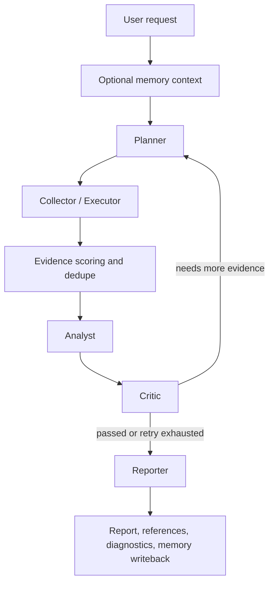

# InsightGraph Architecture

InsightGraph is built around a single production-oriented route: `live-research`.
Offline deterministic execution remains the testing and CI fallback.

The core design goal is not just "generate an article", but generate a
high-quality, evidence-grounded deep research report with observable execution
and bounded live-runtime risk.

## Package Layout

```text
src/insight_graph/
├── agents/                         # Planner / Collector / Executor / Analyst / Critic / Reporter
├── report_quality/                 # domain profiles, scoring, citation support, review
├── tools/                          # search, fetch, GitHub, SEC, documents, file tools
├── llm/                            # OpenAI-compatible config, router, traces
├── memory/                         # long-term memory stores, embeddings, writeback
├── persistence/                    # checkpoints and migrations
├── api.py                          # FastAPI REST + WebSocket jobs API
├── dashboard.py                    # zero-build dashboard
├── eval.py                         # offline eval and live benchmark plumbing
├── graph.py                        # LangGraph orchestration
├── research_jobs.py                # job lifecycle and service-facing contract
├── research_jobs_sqlite_backend.py # SQLite backend with worker leasing
└── state.py                        # GraphState and shared models
```

## Runtime Flow



## Agent Responsibilities

| Agent | Responsibility |
| --- | --- |
| Planner | Detect domain, entities, section plan, and tool strategy |
| Collector | Coordinate tool selection and collection rounds |
| Executor | Execute tools under fetch, tool-call, and evidence budgets |
| Analyst | Convert evidence into grounded findings and matrix rows |
| Critic | Validate support quality and emit replan hints |
| Reporter | Produce the final long-form Markdown report from allowed claims only |

## Evidence Boundary

`Evidence` is the fact boundary for reporting. It carries metadata such as:

- source URL
- canonical URL
- snippet
- source type
- verified flag
- reachable / source-trusted metadata
- chunk/page/section metadata
- fetch diagnostics

Reporter output should be grounded in verified evidence and validated citation
support, not unsupported model memory.

## Storage And Persistence

| Surface | Implemented options |
| --- | --- |
| Jobs | in-memory, JSON metadata, SQLite |
| Checkpoints | in-memory, PostgreSQL |
| Long-term memory | in-memory, pgvector |
| Document retrieval index | local JSON, optional pgvector |

SQLite adds internal worker leasing so queued jobs and expired running jobs can
be safely reclaimed after restart.

## Observability

The project exposes:

- `trace_id`
- tool call logs
- LLM call logs
- quality cards
- citation support results
- URL validation results
- dashboard event streams
- optional trace export with redaction

## Product Route And Deferred Surfaces

The architecture is intentionally conservative:

- product path is `live-research`
- offline remains the deterministic testing/CI fallback
- live providers are explicit opt-in
- full prompt/completion traces are explicit opt-in
- MCP runtime invocation is deferred
- `/tasks` compatibility aliases are deferred
- release/deploy automation beyond dry-run is deferred
- real sandboxed Python/code execution is deferred

## Relationship To The Roadmap

Completed work is summarized in `docs/roadmap.md`.

The architecture route prioritizes:

- report quality
- benchmark profiles
- production RAG hardening
- memory quality
- dashboard productization
- API and operations hardening

before any higher-risk runtime expansion.
