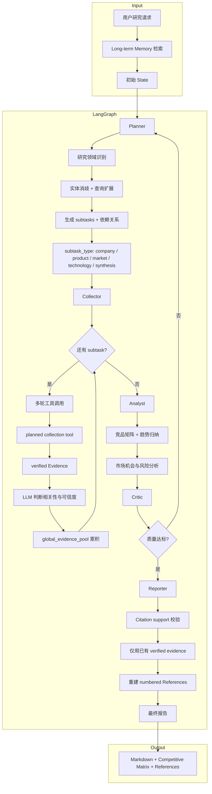
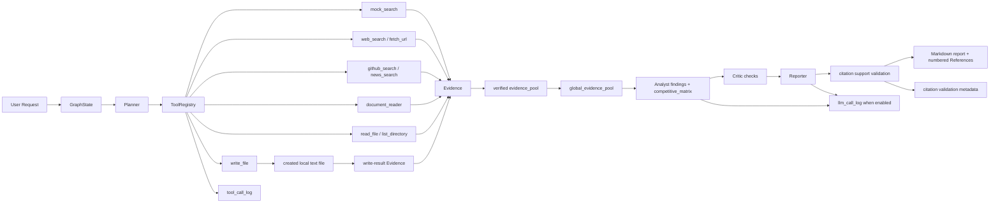

# InsightGraph Architecture

This document keeps the project blueprint and execution model. The root README is intentionally short and links here for deeper architecture details.

## 目标项目结构（蓝图）

```text
src/insight_graph/
├── agents/                    # 多智能体核心
│   ├── planner.py             # 研究目标解析与任务分解
│   ├── collector.py           # 多源信息采集与工具调用
│   ├── analyst.py             # 竞品矩阵、趋势归纳与商业分析
│   ├── evidence_validator.py  # URL、引用片段与来源可信度校验
│   ├── critic.py              # 质量评审与 replan 决策
│   ├── reporter.py            # 引用校验 + 报告生成
│   ├── graph.py               # LangGraph 状态图编排
│   ├── state.py               # GraphState 定义
│   ├── source_policy.py       # 数据源优先级与可信度策略
│   ├── entity_resolver.py     # 公司、产品、技术名实体消歧
│   └── domains/               # 可插拔研究领域配置
│       ├── competitive_intel.md
│       ├── technology_trends.md
│       ├── market_research.md
│       └── generic.md
├── tools/
│   ├── builtin/               # 内置工具集
│   │   ├── web_search.py, news_search.py, http_client.py
│   │   ├── content_extract.py, document_reader.py
│   │   ├── github_search.py, code_exec.py, file_ops.py
│   │   └── ...
│   ├── registry.py            # MCP / 本地工具注册表
│   └── executor.py            # 工具执行引擎
├── llm/                       # LLM 提供方与模型路由
│   ├── openai.py
│   ├── qwen.py
│   ├── anthropic.py
│   └── router.py
├── api/                       # FastAPI REST + WebSocket
├── memory/                    # pgvector 长期记忆
├── persistence/               # PostgreSQL checkpoint 持久化
├── budget/                    # Token / 步数 / 工具调用预算控制
├── observability/             # LLM 调用日志与执行链路追踪
└── settings.py                # 全局配置
```

## 目标核心特性（蓝图）

| 特性 | 说明 |
|------|------|
| **多智能体编排** | Planner → Collector → Analyst → Critic → Reporter，支持 Critic 打回 replan 闭环纠错 |
| **商业情报建模** | 支持竞品、公司、产品、技术、市场、价格、融资、生态合作等实体分析 |
| **领域自适应** | 可插拔领域配置（`domains/*.md`），按研究主题选择数据源、搜索策略与报告模板 |
| **证据溯源链** | 从 web_search / fetch_url / github_search 到 citation 的完整链路，Reporter 仅引用 verified 源 |
| **竞品矩阵生成** | 自动提取功能、定价、定位、目标用户、技术栈、发布时间线并生成对比表 |
| **技术趋势分析** | 支持论文、博客、GitHub、产品文档、新闻源的多源交叉验证 |
| **持久化与恢复** | PostgreSQL + pgvector 存储任务状态、检查点、历史研究上下文与证据片段 |
| **全链路可观测** | 记录每次 LLM 调用、工具调用、状态转移、token 消耗与引用验证结果 |

## 目标技术架构（蓝图）

```text
┌───────────────────────────────────────────────────────────────────────┐
│                     FastAPI (REST + WebSocket)                        │
│              /tasks, /tasks/{id}/stream, /reports, /tools             │
└───────────────────────────────┬───────────────────────────────────────┘
                                │
┌───────────────────────────────▼───────────────────────────────────────┐
│                       LangGraph StateGraph                            │
│                                                                       │
│  ┌──────────┐   ┌───────────┐   ┌─────────┐   ┌──────────┐           │
│  │ Planner  │──▶│ Collector │──▶│ Analyst │──▶│  Critic  │           │
│  └──────────┘   └───────────┘   └─────────┘   └────┬─────┘           │
│       ▲                                             │                 │
│       └────────────── replan / recollect ───────────┘                 │
│                                                     │                 │
│                                            ┌────────▼────────┐        │
│                                            │    Reporter     │        │
│                                            └─────────────────┘        │
└───────────────────────────────┬───────────────────────────────────────┘
                                │
┌───────────────────┬───────────┴───────────┬───────────────────────────┐
│ Tool Registry     │ Long-term Memory      │ Postgres Checkpoint       │
│ web_search        │ pgvector 向量检索      │ 任务中断/恢复              │
│ news_search       │ 历史研究摘要            │ thread_id 持久化           │
│ github_search     │ 实体画像与证据片段      │ 状态快照                   │
│ fetch_url         │                       │                           │
│ document_reader   │                       │                           │
│ read_file         │                       │                           │
│ list_directory    │                       │                           │
│ write_file        │                       │                           │
└───────────────────┴───────────────────────┴───────────────────────────┘
```

## 整体执行流程



## 多智能体协作流程

```mermaid
flowchart LR
    subgraph Planner
        P1[解析研究目标] --> P2[识别研究类型]
        P2 --> P3[实体消歧]
        P3 --> P4[生成 subtasks]
        P4 --> P5[JSON 结构化输出]
    end

    subgraph Collector
        C1[加载前序 subtask 结果] --> C2[多源搜索]
        C2 --> C3[网页/文档/GitHub 抓取]
        C3 --> C4[LLM 判断保留/丢弃]
        C4 --> C5[证据片段抽取]
        C5 --> C6[目标态: 对话压缩与收敛检测]
    end

    subgraph Analyst
        A1[读取 evidence_pool] --> A2[实体画像构建]
        A2 --> A3[竞品矩阵]
        A3 --> A4[趋势与机会分析]
        A4 --> A5[风险与不确定性标注]
    end

    subgraph Critic
        K1[检查证据充分性] --> K2[检查来源可信度]
        K2 --> K3[检查结论是否有引用支撑]
        K3 --> K4{达标?}
        K4 -->|否| K5[反馈 + tried_strategies 黑名单]
        K4 -->|是| K6[放行至 Reporter]
    end

    subgraph Reporter
        R1[读取 findings + evidence] --> R2[Citation / snippet support validation]
        R2 --> R3[反幻觉 prompt: 仅引用 verified evidence]
        R3 --> R4[生成报告正文]
        R4 --> R5[重建 numbered References]
        R5 --> R6[输出 Markdown]
    end

    P5 --> C1
    C6 --> A1
    A5 --> K1
    K6 --> R1
```



## 数据流与证据链路



当前 MVP 中部分蓝图能力仍是目标态：Long-term Memory、PostgreSQL checkpoint、conversation compression、domain profiles、WebSocket 和 Reporter 主动 URL 网络校验尚未实现。已实现路径仍保留相同数据边界：工具只产出 `Evidence`，Reporter 只引用已有 verified evidence 并检查 citation/snippet support，API/CLI JSON 输出不 dump `evidence_pool` 或 `global_evidence_pool`。

## 技术栈

| 层级 | 技术 |
|------|------|
| **编排** | LangGraph, LangChain |
| **LLM** | OpenAI, Anthropic, Qwen, OpenAI-compatible API |
| **结构化输出** | Pydantic, LangChain OutputParser |
| **向量检索** | pgvector, PostgreSQL, text embeddings |
| **存储** | PostgreSQL + asyncpg, SQLAlchemy 2.0 |
| **工具** | DuckDuckGo / Tavily / SerpAPI, httpx, curl-cffi, Playwright |
| **文档处理** | PyMuPDF, Trafilatura, BeautifulSoup, Markdown parser |
| **API** | FastAPI, WebSocket 流式输出 |
| **可观测** | LLM 调用日志、工具调用日志、Graph state snapshot |

## 内置工具

| 工具 | 用途 |
|------|------|
| `web_search` | 搜索引擎查询，获取官网、文档、新闻、博客等来源 |
| `news_search` | 新闻与公告检索，用于市场动态、融资、发布事件追踪 |
| `fetch_url` | 抓取 direct HTTP/HTTPS URL，并从 HTML 页面生成 verified Evidence |
| `content_extract` | 从 HTML 中提取标题、正文和 evidence snippet |
| `github_search` | 检索 GitHub 仓库、README、Release、Issue 和 Star 趋势 |
| `document_reader` | 当前读取 cwd 内本地 `.txt`、`.md`、`.markdown`、`.html`、`.htm`、`.pdf` 文件；长文档最多返回 5 条 bounded snippets；JSON 输入可按检索词进行 deterministic lexical ranking |
| `read_file` / `list_directory` / `write_file` | 当前支持 cwd 内只读安全文本读取、一层目录列表，以及 create-only 安全文本写入 |

`code_execute` 计划用于沙箱 Python 代码执行和表格计算，当前尚未实现，将单独设计。

## 执行链路详解

### 1. Planner

- **输入**：当前 MVP 以 `user_request` 和 GraphState 中已有字段为主；`memory_context`、`domain_profile`、更完整的 `tried_strategies` 属于目标态扩展
- **输出**：`subtasks`（含 id、description、dependencies、subtask_type、suggested_tools）
- **研究类型**：支持 competitive_intel、market_research、technology_trends、company_profile、synthesis
- **Replan 支持**：Critic 打回时，根据 `tried_strategies` 避免重复失败搜索路径

### 2. Collector

- **多轮循环（目标态）**：每个 subtask 最多 `MAX_TOOL_ROUNDS=5` 轮工具调用；当前 MVP 每个 collect subtask 按 opt-in 优先级选择一个主工具执行
- **多源采集**：支持 web_search、news_search、github_search、fetch_url、document_reader、read_file、list_directory；`write_file` 作为 create-only 本地文本写入工具单独 opt-in。当前 Planner collect subtask 按 opt-in 优先级选择一个主工具
- **可信度初筛**：按官网、官方文档、GitHub、权威媒体、第三方博客等来源等级排序
- **上下文控制（目标态）**：超过 `MAX_CONVERSATION_CHARS` 后触发对话压缩，保留最近关键证据；当前 MVP 尚未实现 conversation compression
- **跨 subtask 共享**：`global_evidence_pool` 供后续 Agent 复用已采集证据

### 3. Analyst

- **实体画像**：为公司、产品、技术、市场主题建立结构化 profile
- **竞品矩阵**：默认/offline Analyst 生成 evidence-backed deterministic `competitive_matrix`；LLM Analyst opt-in 时可由 LLM 提供矩阵行，但每行必须引用 verified evidence
- **趋势归纳**：从时间线、发布节奏、开源活跃度、媒体关注度中提取趋势信号
- **不确定性标注**：对缺失数据、冲突证据、低可信来源进行显式标注

### 4. Critic

- **证据充分性检查**：判断是否有足够来源支撑每个关键结论
- **来源可信度检查**：优先使用官网、文档、公告、GitHub、权威媒体等可验证来源
- **闭环控制**：质量不达标时打回 Planner 或 Collector，并限制最大 replan 次数
- **反幻觉检查**：禁止无来源数字、无依据排名、过度推断和未验证结论

### 5. Reporter

- **Citation 校验**：当前检查结论引用是否由已有 verified evidence 支撑，并重建 numbered References；主动请求所有引用 URL 并标记 `verified` / `unverified` 属于目标态
- **报告生成**：输出 Executive Summary、Competitive Matrix、Key Findings、Risks、References
- **引用格式**：`[N]` 编号对应 References 中的稳定 URL 与 evidence snippet
- **输出格式**：默认 Markdown，可扩展为 HTML、PDF、JSON report schema

### 6. 持久化与记忆（目标态）

- **Checkpoint**：目标态每节点执行后写入 PostgreSQL，支持任务中断后 `resume`；当前 MVP 使用内存状态
- **Long-term Memory**：目标态由 pgvector 存储历史研究摘要、实体画像与证据片段；当前 MVP 未实现长期记忆
- **任务追踪**：目标态通过 `task_id` 与 `thread_id` 关联用户请求、Graph 状态和最终报告；当前 API jobs 仅为单进程内存 job store，支持列出任务摘要、按 `job_id` 查询详情、取消尚未执行的 `queued` jobs，并返回 `created_at` / `started_at` / `finished_at` UTC 时间 metadata；内存 store 只保留最近 100 个 `succeeded` / `failed` / `cancelled` jobs，`queued` / `running` jobs 不会被裁剪

## 示例输出

以下为目标形态示例：

| 指标 | 数值 |
|------|------|
| 研究对象 | Cursor、OpenCode、Claude Code、GitHub Copilot、Codeium |
| LLM 调用次数 | 60-100 次 |
| 工具调用次数 | 120-220 次 |
| 报告长度 | 4,000-8,000 词，包含竞品矩阵与趋势判断 |
| 引用来源 | 官网、产品文档、GitHub Release、定价页、新闻报道、技术博客 |
| 运行时间 | 8-20 分钟，取决于搜索深度与引用校验数量 |

**产出报告结构**：Executive Summary → Market Overview → Competitive Matrix → Product Deep Dives → Pricing & Positioning → Technology Trends → Risks & Open Questions → References

每个关键事实均通过 `[N]` 编号关联到 References 中的具体 URL，可逐条验证。

## 效果与亮点

- **可验证引用**：报告中的关键事实可追溯到具体 URL 与 evidence snippet
- **闭环纠错**：Critic 评审不达标时自动 replan 或 recollect，避免证据不足直接生成
- **竞品分析友好**：内置产品定位、功能矩阵、定价、生态、路线图等分析维度
- **技术趋势友好**：支持 GitHub、论文、博客、文档、新闻多源交叉验证
- **领域可扩展**：新增研究领域仅需添加 `domains/*.md` 配置文件
- **资源可控**：`max_tokens`、`max_steps`、`max_tool_calls` 三重预算限制
- **全链路可观测**：记录每次 LLM 调用、工具调用、Graph 节点状态与 token 消耗
