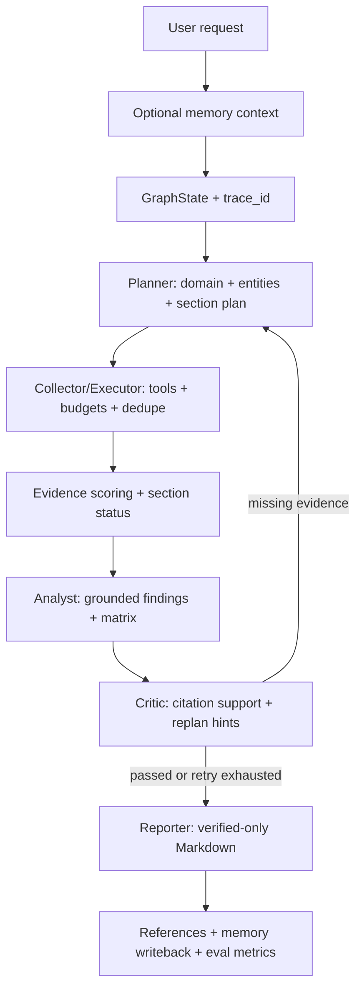
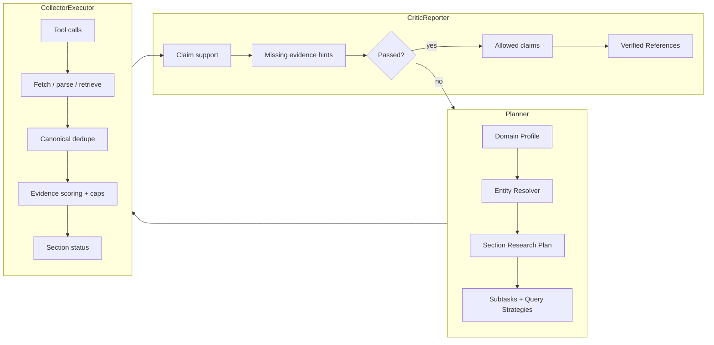
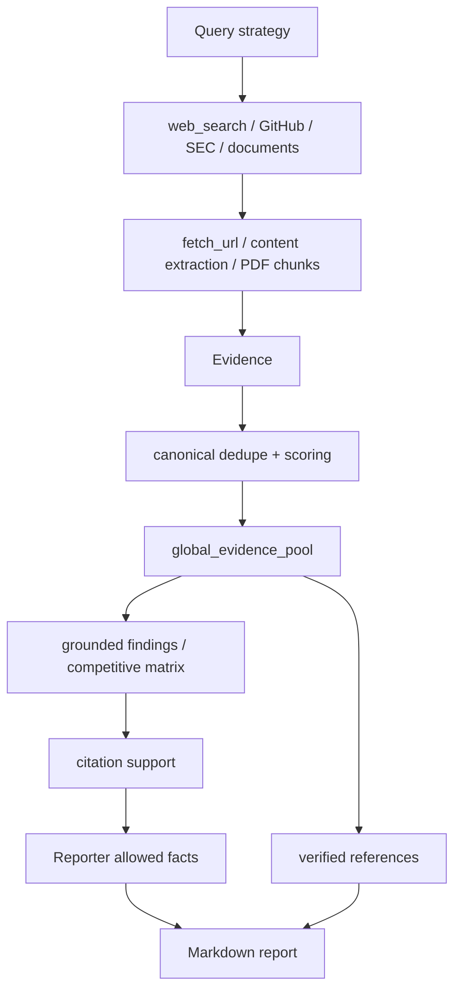

# InsightGraph Architecture

InsightGraph 的当前产品路径是 `live-research`，目标是生成高质量、可验证深度研究报告。Offline deterministic 保留为测试/CI fallback；网络、LLM、数据库、外部 embeddings、full trace payload 和 live benchmark 均为显式 opt-in。

## 当前项目结构

```text
src/insight_graph/
├── agents/                         # Planner / Collector / Executor / Analyst / Critic / Reporter
├── report_quality/                 # domain profiles, entity resolver, research plan, scoring, citation support
├── tools/                          # web/fetch/pdf/GitHub/SEC/document/file tools
├── llm/                            # OpenAI-compatible config, routing, trace writer/redaction
├── memory/                         # long-term memory stores, embeddings, report writeback
├── persistence/                    # checkpoint stores and idempotent migrations
├── api.py                          # FastAPI REST + WebSocket jobs API
├── dashboard.py                    # zero-build dashboard
├── eval.py                         # offline quality eval and memory comparison proof
├── graph.py                        # LangGraph orchestration
├── research_jobs.py                # job lifecycle and response shaping
├── research_jobs_sqlite_backend.py # SQLite backend with worker leasing
└── state.py                        # GraphState and shared models
```

## 核心架构

```text
┌───────────────────────────────────────────────────────────────────────┐
│                    CLI / FastAPI / Dashboard                           │
│       /research, /research/jobs, WebSocket stream, report export        │
└───────────────────────────────┬───────────────────────────────────────┘
                                │
┌───────────────────────────────▼───────────────────────────────────────┐
│                       LangGraph StateGraph                             │
│                                                                       │
│  Planner ─▶ Collector/Executor ─▶ Analyst ─▶ Critic ─▶ Reporter        │
│     ▲                                   │         │                    │
│     └──────── missing-evidence replan ◀─┴─────────┘                    │
└───────────────────────────────┬───────────────────────────────────────┘
                                │
┌───────────────────┬───────────▼───────────┬───────────────────────────┐
│ Evidence Tools    │ Persistence / Memory   │ Observability / Eval      │
│ web/fetch/pdf     │ PostgreSQL checkpoint  │ trace_id + LLM logs       │
│ GitHub / SEC      │ pgvector memory        │ Dashboard + Eval Bench    │
│ local documents   │ JSON / SQLite jobs     │ live benchmark            │
└───────────────────┴───────────────────────┴───────────────────────────┘
```

## 整体执行流程



## 多智能体协作流程



## 数据流与证据链路



## 数据模型边界

`Evidence` 是报告生成的事实边界，包含 source URL、canonical URL、snippet、source type、verified、reachable、source_trusted、claim_supported、chunk/page/section、fetch status 和 diagnostics。LLM findings、matrix rows 和 reporter content 必须引用当前 verified evidence ID；非法引用会被过滤或 fallback。

`GraphState` 串联 agent 输出：domain profile、resolved entities、section plans、evidence pools、tool/LLM logs、citation support、replan requests、report markdown、trace ID、memory context 和 URL validation metadata。

## 技术栈

| 层级 | 技术 |
|------|------|
| 编排 | LangGraph, LangChain Core |
| API | FastAPI, WebSocket |
| CLI | Typer, Rich |
| 数据模型 | Pydantic |
| 搜索/抓取 | DuckDuckGo via `ddgs`, GitHub REST, SEC JSON, urllib, BeautifulSoup, pypdf |
| LLM | OpenAI-compatible/local/self-hosted providers, rules router |
| 持久化 | in-memory, JSON, SQLite, PostgreSQL checkpoint, pgvector memory |
| 可观测 | trace_id, LLM trace writer, redaction controls, Dashboard panels, Eval Bench |

## 安全与 Opt-in 边界

- Offline deterministic 是测试/CI fallback。
- `live-research` 才启用联网搜索、GitHub live provider、SEC、URL validation、LLM Analyst/Reporter 和 relevance judge。
- Full trace payload 需要 `INSIGHT_GRAPH_LLM_TRACE_FULL=1`，且 API key 会被 redacted。
- pgvector/PostgreSQL/external embeddings 需要显式环境变量。
- MCP runtime invocation、真实 sandboxed Python/code execution、`/tasks` API aliases、release/deploy/force-push automation 保持 deferred，直到其他报告质量优化完成后再决定。

## 后续优化方向

架构后续工作以报告质量为中心：Report Quality v3、Live Benchmark Case Profiles、Production RAG Hardening、Memory Quality Loop、Dashboard Productization、API/Operations Hardening。详细任务见 `docs/roadmap.md`。
