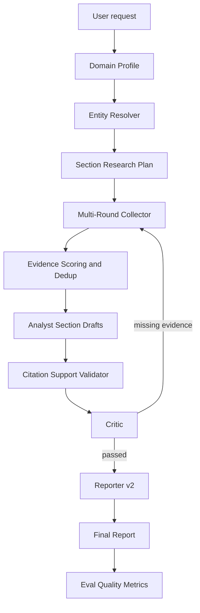
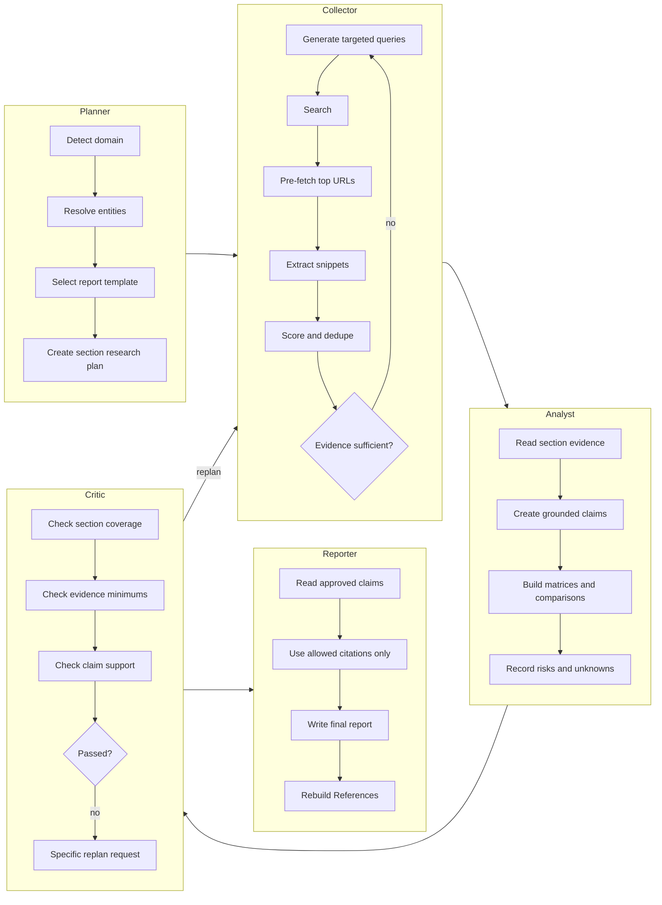
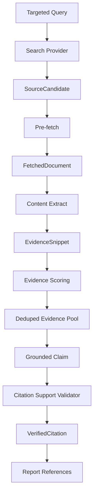

# Report Quality Roadmap

This document is the canonical execution route for InsightGraph after `v0.1.32`.
Future work must follow this route unless the user explicitly approves a route change.

## Route Status

| Item | Decision |
|------|----------|
| Primary goal | Generate high-quality, evidence-grounded deep research reports comparable to `wenyi-research-agent`. |
| Route priority | This roadmap supersedes deployment, dashboard, eval artifact, and smoke-test feature work as the main direction. |
| Allowed exceptions | Bug fixes, security fixes, CI failures, broken releases, and changes that directly support report quality. |
| Forbidden drift | Do not add unrelated deployment, dashboard, auth, storage, or eval convenience features without user approval. |
| Execution rule | Every future task must state which phase in this roadmap it implements before code changes begin. |

## Target Quality

InsightGraph should produce reports with the same practical quality profile as a mature deep-research agent:

- Clear section structure: Executive Summary, Background, Market or Company Analysis, Competitive Landscape, Risks, Outlook, and References.
- Claims grounded in verified evidence snippets, not unsupported model memory.
- Multiple source types where appropriate: official sites, docs, GitHub, news, filings, local documents, and high-authority domain sources.
- Domain-aware research strategy instead of one generic query path.
- Multi-round evidence collection with follow-up queries when evidence is weak.
- Critic-driven replan that asks for specific missing evidence.
- Reporter that only writes from allowed claims and verified references.
- Eval metrics that measure report depth, source diversity, citation support, and unsupported claims.

## Current Gap

| Area | Current InsightGraph | Target Quality Route |
|------|----------------------|----------------------|
| Planner | Fixed `scope / collect / analyze / report` subtasks. | Domain-aware, section-based research plan. |
| Queries | Mostly original user request. | Entity-aware targeted queries per section. |
| Collection | Mostly one tool pass per suggested tool. | Multi-round search, fetch, extract, filter, converge. |
| Evidence | Lightweight `Evidence` with title, URL, snippet, type, verified. | Scored snippets with authority, relevance, recency, section, entity, and duplicate metadata. |
| Relevance | Optional filter; deterministic default checks field completeness. | Core relevance gate with deterministic baseline and opt-in LLM judge. |
| Domain logic | Blueprint only. | Domain profiles drive source policy and report sections. |
| Citation validation | Basic citation support and reference rebuilding. | Claim-level snippet support validation. |
| Critic | Structure and citation checks, limited replan. | Missing-evidence replan by section/source/entity. |
| Reporter | Deterministic or opt-in LLM report from findings/evidence. | Section drafts to final report with strict allowed citations. |
| Memory/checkpoint | Job metadata JSON/SQLite. | Deferred until quality route is stable. |

## Target Project Shape

The route should grow the existing package without replacing working API, dashboard, eval, or deployment foundations.

```text
src/insight_graph/
├── agents/
│   ├── planner.py              # route will evolve to section-aware planning
│   ├── collector.py            # route will evolve to multi-round collection
│   ├── executor.py             # route will host budgeted acquisition orchestration
│   ├── analyst.py              # route will emit section drafts and grounded claims
│   ├── critic.py               # route will emit missing-evidence replan requests
│   └── reporter.py             # route will write only from verified section drafts
├── report_quality/
│   ├── domain_profiles.py      # domain detection and source policy
│   ├── entity_resolver.py      # canonical entities, aliases, official domains
│   ├── research_plan.py        # section-aware plan models
│   ├── evidence_scoring.py     # authority, relevance, recency, duplicate scoring
│   ├── citation_support.py     # claim-to-snippet validation
│   └── report_templates.py     # domain-specific report skeletons
├── tools/
│   ├── web_search.py
│   ├── pre_fetch.py
│   ├── fetch_url.py
│   ├── content_extract.py
│   ├── github_search.py
│   └── document_reader.py
└── eval.py                     # route will add report-quality metrics
```

The exact module names may change during implementation if a smaller edit is better, but the boundaries must remain: domain/profile logic, entity resolution, research planning, evidence scoring, citation support, and report templates should not be tangled into one large file.

## Core Features

| Feature | Purpose |
|---------|---------|
| Domain Profile | Select report template, source priorities, required sections, and evidence minimums. |
| Entity Resolver | Convert user text into canonical entities, aliases, and source hints. |
| Section Research Plan | Turn the request into report sections with questions, budgets, and required source types. |
| Multi-Round Collector | Search, fetch, extract, rank, and follow up until section evidence is sufficient or budget is exhausted. |
| Evidence Scoring | Prefer authoritative, relevant, recent, diverse sources and remove duplicates. |
| Citation Support Validator | Verify that each claim is supported by a specific snippet. |
| Critic Replan v2 | Generate precise missing-evidence tasks instead of generic retry. |
| Reporter v2 | Produce long-form reports from section drafts and allowed citations only. |
| Eval Quality Metrics | Gate improvements with measurable report-quality signals. |

## Target Architecture

```text
┌───────────────────────────────────────────────────────────────────────┐
│                       API / CLI / Dashboard                            │
│       Existing job execution, WebSocket events, exports, eval gates     │
└───────────────────────────────┬───────────────────────────────────────┘
                                │
┌───────────────────────────────▼───────────────────────────────────────┐
│                         LangGraph Research Flow                        │
│                                                                       │
│  ┌─────────────┐  ┌──────────────┐  ┌──────────────┐  ┌────────────┐ │
│  │   Planner   │─▶│  Collector   │─▶│   Analyst    │─▶│   Critic   │ │
│  │ domain plan │  │ multi-round  │  │ section      │  │ replan     │ │
│  └──────┬──────┘  └──────┬───────┘  │ drafts       │  └─────┬──────┘ │
│         ▲                │          └──────────────┘        │        │
│         └──────── missing-evidence replan ◀─────────────────┘        │
│                                                                      │
│                         ┌──────────────┐                             │
│                         │  Reporter    │                             │
│                         │ verified-only│                             │
│                         └──────────────┘                             │
└───────────────────────────────┬───────────────────────────────────────┘
                                │
┌───────────────────────────────▼───────────────────────────────────────┐
│                         Evidence Grounding Layer                       │
│ Domain Profile │ Entity Resolver │ Source Policy │ Evidence Scoring   │
│ Citation Support Validator │ Report Templates │ Eval Quality Metrics  │
└───────────────────────────────────────────────────────────────────────┘
```

## Execution Flow



## Agent Collaboration



## Evidence Chain



## Data Models

The implementation should add fields incrementally and preserve existing public API shapes unless a phase explicitly designs a migration.

```json
{
  "SourceCandidate": {
    "url": "https://example.com/pricing",
    "title": "Pricing",
    "source_type": "official_site",
    "section_id": "pricing",
    "entity_ids": ["github-copilot"]
  },
  "EvidenceSnippet": {
    "id": "github-copilot-pricing-snippet-1",
    "source_url": "https://example.com/pricing",
    "canonical_url": "https://example.com/pricing",
    "title": "Pricing",
    "snippet": "...",
    "source_type": "official_site",
    "section_id": "pricing",
    "entity_ids": ["github-copilot"],
    "authority_score": 0.9,
    "relevance_score": 0.8,
    "recency_score": 0.7,
    "verified": true
  },
  "GroundedClaim": {
    "section_id": "pricing",
    "claim": "GitHub Copilot has individual and business pricing tiers.",
    "evidence_ids": ["github-copilot-pricing-snippet-1"],
    "support_status": "supported",
    "confidence": "high"
  }
}
```

## Phase Plan

### Phase 0: Baseline and Guardrails

Goal: lock the new route as the only main route.

Required outputs:

- This roadmap exists and is linked from `docs/roadmap.md`.
- Future work states its phase before implementation.
- Changelog and docs changes support this route only.

Acceptance criteria:

- No unrelated deployment, dashboard, smoke, or eval convenience work is started without user approval.

### Phase 1: Report Quality Baseline

Goal: define measurable report quality before changing the research chain.

Initial implementation adds deterministic Eval Bench metrics: section coverage, report depth, source diversity, citation support, unsupported claim count, and duplicate source rate. These metrics are measured first and are not yet hard gates in `RULE_IDS`.

Required outputs:

- Target report rubric with section coverage, evidence density, source diversity, and unsupported claim metrics.
- Eval Bench extensions for report quality.
- A showcase query set that represents competitive intelligence and technology trend reports.

Acceptance criteria:

- Eval can fail when a report has weak sections, low source diversity, missing citations, or unsupported claims.

### Phase 2: Domain Profile v1

Goal: make research strategy domain-aware.

Initial implementation lives in `src/insight_graph/report_quality/domain_profiles.py`, selects a deterministic profile in Planner, and stores the selected profile ID on `GraphState.domain_profile`. This does not change the workflow behavior yet; later phases consume the profile for section plans and collection budgets.

Required domains:

- `competitive_intel`
- `technology_trends`
- `market_research`
- `company_profile`
- `generic`

Each profile defines:

- Report sections.
- Required questions.
- Priority source types.
- Minimum evidence per section.
- Expected matrices or tables.

Acceptance criteria:

- Planner can select a deterministic profile for a request.
- Tests cover at least competitive intelligence, technology trends, and generic fallback.

### Phase 3: Entity Resolver v1

Goal: improve query precision by resolving entities before collection.

Initial implementation lives in `src/insight_graph/report_quality/entity_resolver.py`, resolves known products/companies and simple unknown capitalized entities, and stores serializable payloads on `GraphState.resolved_entities`. This does not change collection behavior yet.

Required outputs:

- Canonical entity name.
- Aliases.
- Entity type.
- Optional official domain hints.
- Query expansion terms.

Acceptance criteria:

- The same product/company is not collected under multiple unrelated names.
- Expanded queries remain deterministic in tests.

### Phase 4: Section-Based Research Plan

Goal: replace fixed subtasks with section-aware research planning.

Initial implementation lives in `src/insight_graph/report_quality/research_plan.py`, derives section-level questions/source requirements/budgets from the selected domain profile, and stores serializable payloads on `GraphState.section_research_plan`. The existing LangGraph subtask sequence remains unchanged until Collector phases consume this plan.

Required outputs per section:

- `section_id`
- `title`
- `questions`
- `required_source_types`
- `min_evidence`
- `budget`

Acceptance criteria:

- The plan maps directly to final report sections.
- Collector receives targeted work instead of only the raw user request.

### Phase 5: Multi-Round Collector v1

Goal: collect enough evidence per section before analysis.

Initial implementation records deterministic per-section collection sufficiency on `GraphState.section_collection_status` after the existing tool pass. It does not add follow-up tool rounds yet; later iterations can use this status to generate missing-evidence queries.

Loop shape:

```text
section questions
→ targeted queries
→ search
→ pre-fetch top URLs
→ fetch_url
→ content_extract
→ evidence snippets
→ score and dedupe
→ follow-up query if evidence is insufficient
```

Budgets:

- Max rounds per section.
- Max queries per section.
- Max fetched URLs per section.
- Max evidence snippets per section.
- Convergence stop when no new useful evidence appears.

Acceptance criteria:

- Collector can run multiple rounds in deterministic tests.
- Collector records why it stopped: sufficient evidence, exhausted budget, or no new evidence.

### Phase 6: Evidence Scoring v1

Goal: keep better evidence, not just more evidence.

Initial implementation lives in `src/insight_graph/report_quality/evidence_scoring.py` and records deterministic authority/relevance/overall scores on `GraphState.evidence_scores` after collection. Recency and diversity expansion remain later scoring refinements.

Scores:

- Authority score.
- Relevance score.
- Recency score.
- Duplicate penalty.
- Source diversity contribution.

Acceptance criteria:

- Official/docs/filings outrank weak blogs for factual claims.
- Duplicate or near-duplicate URLs collapse into one preferred source.

### Phase 7: Citation Support Validator v1

Goal: validate claim-to-snippet grounding before the final report.

Initial implementation lives in `src/insight_graph/report_quality/citation_support.py` and records deterministic finding support metadata on `GraphState.citation_support` during Critic.

Checks:

- Claim has at least one evidence ID.
- Evidence is verified.
- Snippet has lexical or judged support for the claim.
- Unsupported claims are removed or marked as uncertainty.

Acceptance criteria:

- Reporter does not receive unsupported claims as authoritative facts.
- Eval can identify unsupported findings.

### Phase 8: Critic Replan v2

Goal: make Critic drive targeted evidence collection.

Initial implementation records structured missing-evidence and unsupported-claim requests on `GraphState.replan_requests`. The existing one-retry LangGraph loop remains unchanged; later collector work can consume these requests for targeted follow-up queries.

Critic outputs:

- Missing section.
- Missing entity.
- Missing source type.
- Missing evidence reason.
- Suggested follow-up query.

Acceptance criteria:

- Replan goes back to Collector with specific missing-evidence tasks.
- Repeated failed strategies are blacklisted for the same section.

### Phase 9: Reporter v2

Goal: produce long-form reports from approved section drafts and verified citations.

Initial implementation appends a deterministic `Citation Support` table to final reports when Critic metadata is present. The table exposes claim status, reason, and only verified evidence IDs so unsupported or unverified sources are not promoted as report references.

Rules:

- Reporter must not introduce new facts.
- Every key factual claim must cite an allowed reference.
- Weakly supported claims must be written as uncertainty or omitted.
- References are rebuilt from verified citations only.

Acceptance criteria:

- Reports contain stable sections from the selected domain profile.
- Reports include grounded comparisons, risks, outlook, and references.
- Output quality is measured by Eval Bench.

### Phase 10: Advanced Research Capabilities

Goal: add heavier capabilities only after phases 1-9 are stable.

Initial implementation adds a `live-research` runtime preset for reference-style networked research. The preset explicitly enables DuckDuckGo-backed web search, GitHub live repository search, multi-source collection, a larger live search limit, and deterministic relevance filtering while preserving offline defaults for tests and CI. LLM Analyst/Reporter remain separately opt-in through `live-llm` or explicit environment variables.

The document retrieval baseline records optional chunk index, PDF page number, and Markdown section heading metadata on `Evidence`. This gives local document/PDF evidence a TOC/page-aware foundation without adding pgvector, OCR, or remote PDF storage.

Live fetched HTML pages now use the same bounded evidence chunking model: long pages produce multiple verified `Evidence` records with chunk index and nearest HTML heading metadata. This connects the networked `web_search -> pre_fetch -> fetch_url` path to the long-document evidence model.

The first filings capability adds an opt-in `sec_filings` tool backed by SEC submissions JSON for known public-company tickers and company-name aliases. `live-research` enables the source, and Planner includes it in multi-source collection only when the request contains a known public-company target.

Remote PDF responses fetched through `fetch_url` now retain response bytes, extract text with pypdf, suppress noisy parser logs, and emit verified docs evidence with chunk index and page metadata. This extends the live evidence path to PDF reports without adding OCR, browser rendering, storage, or vector search.

Live HTTP fetches now reject oversized `Content-Length` responses before body reads and oversized response bodies before decoding or extraction, keeping HTML/PDF evidence generation bounded in addition to the existing evidence chunk limits.

Collected evidence is now ordered by deterministic evidence scores before downstream analysis and reporting, so official/docs/filings sources are preferred when evidence competes for attention.

Section collection status now records required, covered, and missing source types, and Critic replan requests carry missing source type hints. This makes section sufficiency closer to the roadmap source-policy target without adding another collection loop yet.

Retry collection now consumes Critic `replan_requests`: on the retry pass, Executor preserves prior evidence and builds a deterministic follow-up query from the original request, missing section ID, missing source types, and missing evidence count.

Collected evidence now carries optional `section_id` attribution. Executor assigns evidence to the best matching planned section before scoring and section status calculation, so section sufficiency is based on per-section evidence rather than the same global pool for every section.

Executor now enforces deterministic evidence caps: at most five retained records per tool call, at most each section's positive `budget`, and at most twenty retained records per run. Tool call logs keep the original evidence count and include cap removals in `filtered_count`.

Executor now builds section-aware per-tool collection queries. Tool queries include the original request, resolved entity names, and up to two matching planned sections based on the tool's source type coverage, while retry queries still include replan hints.

Deterministic Reporter now follows `section_research_plan` when present. Planned section titles replace the fixed `Key Findings` body, and findings are placed under the section matching their cited evidence's `section_id`; states without a plan keep the legacy `Key Findings` output.

Long-document retrieval now ranks chunks before truncation. Local document queries boost section-heading matches, and `fetch_url` accepts JSON `url`/`query` payloads so remote HTML/PDF chunks can be ordered by retrieval intent.

Rendered-page fetch is now opt-in. `fetch_url` uses lazy Playwright rendering only when `INSIGHT_GRAPH_FETCH_RENDERED` is truthy, and falls back to bounded HTTP fetch if the optional renderer is unavailable or fails.

SEC financial evidence now extends beyond recent filing discovery. The opt-in `sec_financials` tool reads SEC companyfacts JSON for known public-company targets and emits deterministic revenue, net income, and assets evidence without claiming full financial modeling.

PostgreSQL checkpoint resume and pgvector long-term memory are deferred to a later infrastructure phase. Phase 10 closes without adding heavy persistence dependencies; future work must first specify resume semantics, migration paths, embedding cost controls, privacy/deletion behavior, and report-quality gains.

Deferred infrastructure items:

- PostgreSQL checkpoint resume.
- pgvector long-term memory.
- Conversation compression for very long live runs.

Next work queue:

1. Done: replan-driven follow-up collection consumes `replan_requests` to issue targeted follow-up queries for missing section/source evidence before the existing one retry returns to analysis.
2. Done: section evidence attribution attaches evidence to likely section IDs using source requirements, query terms, entity mentions, and source types instead of treating every section as covered by the same global pool.
3. Done: collection budgets and caps enforce per-run/per-tool/per-section evidence caps so live multi-source collection remains bounded as more providers are added.
4. Done: section-aware query generation builds deterministic queries from `section_research_plan`, resolved entities, and missing source types so each source receives narrower prompts.
5. Done: report template tightening maps domain profile sections to deterministic Reporter sections so output structure follows the selected domain instead of a mostly fixed report body.
6. Done: long-document retrieval v2 improves local/remote document chunk ranking with TOC/page/heading awareness before adding embeddings or pgvector.
7. Done: rendered-page fetch adds opt-in Playwright only after fetch bounds, source attribution, and budgets are stable.
8. Done: financial analysis tools extend SEC support from recent filing discovery to filing content extraction and simple deterministic financial evidence, without claiming full financial modeling.
9. Done: persistence and memory defers PostgreSQL checkpoint resume and pgvector long-term memory until a separate infrastructure phase.

Acceptance criteria:

- These items must not be started before the route has a stable quality baseline and grounded report pipeline.

## Eval Gates

Report-quality work must expand Eval Bench instead of relying only on manual inspection.

Initial post-Phase 10 expansion adds evidence-per-section and official-source coverage metrics to Eval Bench case quality, summary aggregates, and Markdown reports. These metrics use `Evidence.section_id`, `section_research_plan`, and `section_collection_status` so eval output can detect sparse section grounding and missing required source types. Eval Bench also exposes opt-in gates for section coverage, citation support, official-source coverage, unsupported claims, source diversity, report depth, evidence density, and duplicate source rate while preserving deterministic offline defaults.

Required future metrics:

- Section coverage score. (gate implemented)
- Evidence per section. (gate implemented)
- Source diversity score. (gate implemented)
- Official-source coverage where required. (gate implemented)
- Citation support score. (gate implemented)
- Unsupported claim count. (gate implemented)
- Duplicate source rate. (gate implemented)
- Report depth score. (gate implemented)

The route should keep deterministic offline evals as the default. Live evals may exist later but must be opt-in.

## Strict Execution Protocol

These rules are mandatory for future work:

1. State the roadmap phase before starting implementation.
2. Do not work on unrelated deployment, dashboard, smoke, auth, storage, or release convenience items unless the work directly supports report quality or the user explicitly approves a route change.
3. Do not jump to PostgreSQL, pgvector, SEC, Playwright, or memory before phases 1-9 unless the user explicitly changes the route.
4. Prefer the smallest correct change that advances the active phase.
5. Preserve deterministic offline behavior and tests.
6. Use opt-in live providers only; do not make network or LLM calls the default path.
7. Use TDD for behavior changes.
8. Run verification before claiming completion.
9. In git worktrees, run module/CLI verification against the current checkout by reinstalling the editable install from that worktree or by setting `PYTHONPATH=src`; otherwise `python -m insight_graph...` can load a stale editable install from another workspace.
10. Update this roadmap only after user approval.
11. If a task does not map to this roadmap, stop and ask before proceeding.

## Next Required Step

Phases 1-10 are implemented. The next approved direction is the reference-quality deep-research route in `docs/superpowers/plans/2026-04-29-reference-quality-deep-research.md`. Phase 11 starts with bounded multi-round collection for live research and collection-depth Eval metrics before adding heavyweight dependencies:

- Research Depth v1 adds section follow-up collection rounds, no-new-evidence stopping, max-round stopping, and collection-depth eval output.
- Default offline behavior remains one collection round; `live-research` opts into deeper collection.

- PostgreSQL checkpoint resume requires explicit resume semantics, migration tests, and operational design.
- pgvector memory requires opt-in embeddings, privacy/deletion controls, and eval proof that memory improves grounded reports.
- Conversation compression requires long-run trace tests and evidence-preservation rules.
- Eval Bench should be expanded before infrastructure work if report-quality regression detection is the priority.
